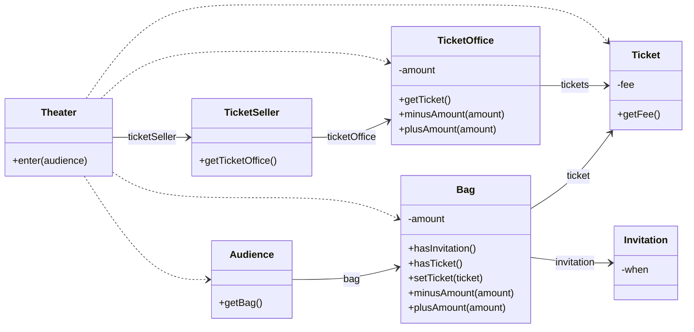
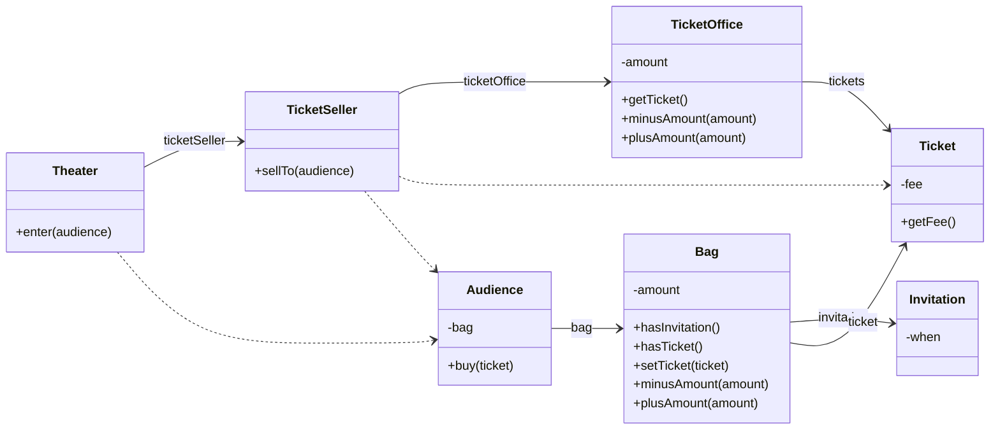
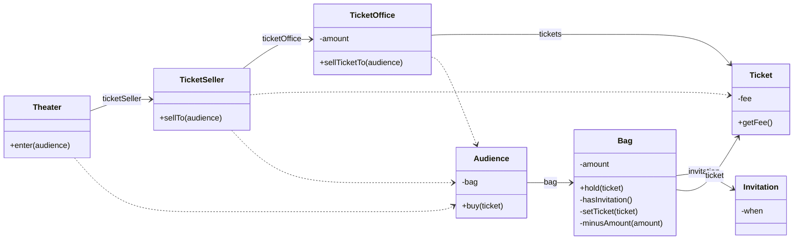

# 01 티켓 판매 애플리케이션 구현하기

> 예시 상황

- 소극장 관람 무료 초대장을 추첨 통해 발송
- 당첨 관람객은 초대장을 티켓으로 교환한 후 입장
- 미당첨 관람객은 티켓 구매 후 입장
> 



```java
public class Theater {
	private TicketSeller ticketSeller;
	
	public Theater(TicketSeller ticketSeller) {
		this.ticketSeller = ticketSeller;
	}

	public void enter(Audience audience) {
		if (audience.getBag().hasInvitation()) {
			Ticket ticket = ticketSeller.getTicketOffice().getTicket();
			audience.getBag().setTicket(ticket);
		} else {
			Ticket ticket = ticketSeller.getTicketOffice().getTicket();
			audience.getBag().minusAmount(ticket.getFee());
			ticketSeller.getTicketOffice().plusAmount(ticket.getFee());
			audience.getBag().setTicket(ticket);
		}
	}
}
```

# 02 무엇이 문제인가

클린 소프트웨어(Robert C. Martin)에서 설명한 소프트웨어 모듈의 세 가지 기능

- 제대로 동작하는 것
- 변경을 위해 존재하는 것
    - 간단히 변경 가능한 것
- 코드 읽는 사람과 의사소통 하는 것
    - 쉽게 이해할 수 있는 것

## 예상을 빗나가는 코드

### 우리의 상식과는 너무 다르게 동작함

이해 가능한 코드 = 예상에서 크게 벗어나지 않는 코드

상식)

관람객이 직접 초대장 or 돈 꺼내 지불

판매원이 티켓을 직접 관람객에게 건네고, 돈 받아 보관

현재 코드)

소극장이 관람객의 가방과 돈, 판매원의 티켓과 돈에 직접 접근하고 통제

### 기억할 세부 내용이 너무 많음

하나의 class 또는 method에서 너무 많은 세부사항을 다룸

## 변경에 취약한 코드

현재 설정한 가정 중 하나라도 깨진다면 모든 코드가 흔들리는 구조

### 의존성

의존성 = 변경에 대한 영향 암시

- 어떤 객체가 변경되면 그 객체를 의존하는 다른 객체도 함께 변경될 수 있다

### 결합도

높은 결합도 = 객체 사이의 의존성 과한 경우

- 결합도가 높을수록 함께 변경될 확률 높음

### 설계의 목표

- 기능 구현을 위한 최소한의 의존성만 유지
- 객체 사이의 결합도 낮추기

# 03 설계 개선하기

## 자율성을 높이자

Theater가 지나치게 세세한 부분까지 알고있음

→ 불필요한 정보 차단

→ 관람객과 판매원을 자율적인 존재로

### 캡슐화

개념적, 물리적으로 객체 내부의 세부 사항 감추어 결합도 낮추기

- TicketOffice 접근 코드를 모두 TicketSeller 내부로 캡슐화
- Bag 접근 코드를 모두 Audience 내부로 캡슐화

### 인터페이스와 구현

객체를 인터페이스와 구현을 나누고 인터페이스를 공개하는 것은 가장 기본적인 설계 원칙

- 인터페이스 = 어떤 메세지를 이해하고 응답할 수 있는가
- 구현 = 어떤 방법으로 동작하는가

캡슐화를 통해 Theater는 TicketOffice의 인터페이스, TicketSeller는 Audience의 인터페이스만 의존하게 됨



```java
public class Theater {
	private TicketSeller ticketSeller;
	
	public Theater(TicketSeller ticketSeller) {
		this.ticketSeller = ticketSeller;
	}

	public void enter(Audience audience) {
		ticketSeller.sellTo(audience);
	}
}
```

```java
public class TicketSeller {
	private TicketOffice ticketOffice;
	
	public TicketSeller(TicketOffice ticketOffice) {
		this.ticketOffice = ticketOffice;
	}

	public void sellTo(Audience audience) {
		ticketOffice.plusAmount(audience.buy(ticketOffice.getTicket()));
	}
}
```

## 무엇이 개선됐는가

- 의사소통 - Audience, TicketSeller가 자신의 소지품 스스로 관리 → 상식과 일치하게 됨
- 변경 용이성 - 각 소지품에 대한 변경은 Audience, TicketSeller 내부만으로 제한됨

## 어떻게 한 것인가

직관을 따르며 자기 자신의 문제를 스스로 해결하도록 변경했다

- 각 객체가 자신의 문제를 해결하기 위해 사용하는 다른 객체, 로직을 객체 내부로 옮겼다

## 캡슐화와 응집도

개선의 핵심 = 내부 상태 캡슐화, 메시지를 통한 상호작용

### 응집도

높은 응집도 = 밀접하게 연관된 작업만을 수행하는 객체

객체는 자신의 데이터를 스스로 처리하고 책임지는 자율적인 존재여야 함

## 절차지향과 객체지향

### 절차적 프로그래밍

Process와 Data를 별도의 모듈에 위치시키는 방식

- 개선 이전 Theater의 enter는 process, 그 외 객체는 data

각 객체들이 수동적인 존재가 됨 → 우리의 직관을 벗어난다

데이터의 영향을 고립시킬 수 없음 → 변경하기 어렵다

### 객체지향 프로그래밍

Process와 Data를 동일한 모듈 내부에 위치시키는 방식

- 캡슐화 → 의존성 관리 → 결합도 낮추기 ⇒ 변경에 유연한 설계

## 책임의 이동

절차지향과 객체지향의 가장 큰 차이는 process 모듈에 몰려있던 책임이 각 개별 객체로 이동한 것

객체지향의 핵심 = 적절한 객체에 적절한 책임 할당

훌륭한 객체지향 설계 = 세부사항을 캡슐화하는 자율적인 객체들이 낮은 결합도, 높은 응집도를 갖고 협력하도록 최소한의 의존성만 남기기

## 더 개선할 수 있다

- Bag의 내부 상태 캡슐화
- TicketOffice의 내부 상태 캡슐화

오히려 TicketOffice의 Audience에 대한 의존성이 추가됨



- 어떤 기능을 설계하는 방법은 한 가지 이상
- 결국 설계는 트레이드오프의 산물

## 그래, 거짓말이다!

### 의인화

현실에서는 수동적인 존재여도 객체지향 세계에서는 능동적이고 자율적인 존재일 수 있어야 함

# 04 객체지향 설계

## 설계가 왜 필요한가

> 설계란 코드를 배치하는 것이다
> 

좋은 설계

- 오늘의 요구사항 온전히 수행
- 내일의 변경을 매끄럽게 수용

변경 용이성이 중요한 이유

- 요구사항은 바뀔 수 밖에 없음
- 코드 수정은 버그 발생 가능성을 높임

## 객체지향 설계

궁극적 목표 = 변경에 유연하게 대응할 수 있는 코드

- 데이터와 프로세스의 덩어리 만들기 → 객체
- 객체 간 상호작용을 통해 기능 구현 → 메시지, 의존성
- 의존성 적절하게 조절 → 변경 용이한 설계
