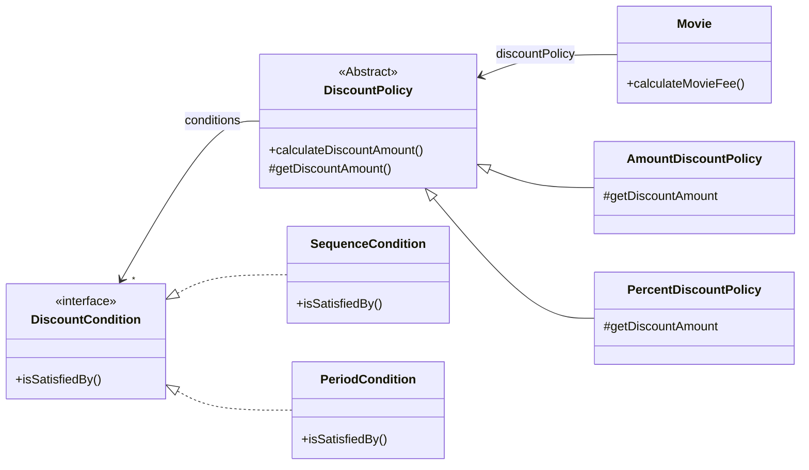

# 01 영화 예매 시스템

## 요구사항 살펴보기

- 영화: 영화에 대한 기본적인 정보
- 상영: 관객이 영화를 관람하는 사건, 예매의 실 대상
- 할인 조건: 가격의 할인 여부 결정
    - 순서 조건: 상영 순서에 따름
    - 기간 조건: 영화 상영 시작 시간이 특정 기간에 포함되는지
    - 다수의 할인 조건 함께 지정 가능, 섞는 것도 가능
- 할인 정책: 할인 요금 결정
    - 금액 할인 정책: 일정 금액 할인
    - 비율 할인 정책: 정가에서 일정 비율 금액 할인
    - 영화 당 0개 또는 하나만 할당 가능
- 할인 적용: 할인 조건 검사 후 할인 정책 적용되어 있다면 요금 할인
- 예매 정보: 사용자가 완료한 예매 정보

# 02 객체지향 프로그래밍을 향해

## 협력, 객체, 클래스

클래스 ≠ 객체

- 클래스가 아닌 객체를 먼저 고민하라
    - 클래스는 공통적인 상태, 행동을 공유하는 객체들을 추상화한 것
- 객체를 협력하는 공동체의 일원으로 봐라
    - 고립된 존재로 보지 말것
    - 훌륭한 협력 → 훌륭한 객체 → 훌륭한 클래스

## 도메인의 구조를 따르는 프로그램 구조

도메인 = 문제 해결을 위해 프로그램을 사용하는 분야

- 객체지향 패러다임을 통해 요구사항 분석부터 프로그램 구현까지 동일한 추상화 기법을 사용할 수 있음
    - 도메인 개념 → 객체, 클래스
- 클래스 이름은 대응되는 도메인 개념과 동일하거나 적어도 유사하게
- 클래스 간 관계 역시 도메인 개념 사이의 관계와 유사하게

## 클래스 구현하기

클래스 내부, 외부 경계를 잘 구분해야

- 경계 명확성 → 객체 자율성
- 프로그래머에게 구현의 자유를

### 자율적인 객체

- 캡슐화 = 객체라는 단위 내부에 데이터 + 기능을 묶는 것
- 자율적인 객체를 위해 외부 접근 최소화하고 객체가 스스로를 관리
    - 외부에서는 원하는 것을 객체에게 요청하고 믿고 기다리도록
- 캡슐화와 접근 제어를 통해 구현과 인터페이스 분리
- 상태는 숨기고 행동만 공개

### 프로그래머의 자유

- 구현 은닉 = 필요한 부분만 공개하여 영향도 걱정 없이 내부 구현 변경할 수 있도록
- 클라이언트 프로그래머는 알아야 할 지식의 양 줄어듦
- 설계는 변경을 관리하기 위함이다

## 협력하는 객체들의 공동체

- 객체를 이용해 도메인의 의미를 풍부하게 표현할 것
    - 설계의 명확성, 유연성을 높이는 첫걸음
- 협력 = 기능 구현을 위해 객체들 사이에 이뤄지는 상호작용
    - 협력 관점에서 어떤 객체가 필요한지 결정한 후 이를 클래스로 구현

## 협력에 관한 짧은 이야기

메시지 ≠ 메서드

- 객체가 다른 객체와 상호작용하는 유일한 방법은 메시지를 전송하는 것
    - 다른 객체의 인터페이스에 공개된 행동을 request 하고, response 받는다
- 메시지를 수신한 객체는 자율적으로 처리 방법(메서드) 결정
- 메시지와 메서드 구분에서 다형성의 개념이 출발

# 03 할인 요금 구하기

## 할인 요금 계산을 위한 협력 시작하기

- `Movie`는 `DiscoutPolicy`에게 할인 요금 계산 메시지를 전송할 뿐, 정책을 판단하지 않음
- 상속, 다형성, 추상화

## 할인 정책과 할인 조건

할인 정책

- 금액 할인 정책과 비율 할인 정책은 계산 방식만 조금 다름 → 공통 로직을 추상 클래스 `DiscountPolicy`로
- `DiscountPolicy`는 할인 조건 검사, 요금 계산 흐름 제어 정의하고 실제 요금 계산은 추상 메서드에게 위임
    - Template Method 패턴: 부모 클래스가 기본적인 알고리즘 구현하고 중간에 필요한 처리는 자식 클래스에게 위임

할인 조건

- `DiscountCondition` interface로 조건 만족 여부를 판단하는 method 정의
- 순서 조건은 순번을 인스턴스 변수로 가지고 판단, 기간 조건은 요일, 시작 시간, 종료 시간 인스턴스 변수로 가지고 판단

## 할인 정책 구성하기

- 하나의 영화에 할인 정책은 하나, 할인 조건은 여러 개 → 생성자 parameter로 강제
- 생성자 parameter로 올바른 상태의 객체 생성 보장

# 04 상속과 다형성

## 컴파일 시간 의존성과 실행 시간 의존성

의존성 = 어떤 클래스가 다른 클래스에 접근 경로를 갖거나 해당 클래스 객체의 메서드를 호출할 경우, 두 클래스 사이에 의존성 존재

- 코드의 의존성과 실행 시점 의존성은 다를 수 있다
- 설계가 유연해질수록 코드를 이해하고 디버깅하기 어렵다
    - 코드 의존성과 실행 시점 의존성의 간극이 커짐
- 무조건 유연한 설계, 무조건 읽기 쉬운 코드 어느 쪽도 정답이 아니다

## 차이에 의한 프로그래밍

차이에 의한 프로그래밍 = 부모 클래스에 다른 부분만 추가해서 새로운 클래스를 빠르게 만드는 방법

- 상속 관계 설정을 통해 기존 클래스의 속성, 행동을 새 클래스에 포함시킬 수 있다

## 상속과 인터페이스

업캐스팅 = 자식 클래스가 부모 클래스 대체하는 것

- 외부 객체는 자식 클래스와 부모 클래스를 동일한 타입으로 간주할 수 있다
    - 상속을 통해 부모 클래스의 인터페이스를 포함하게 되어, 부모가 수신할 수 있는 모든 메시지를 수신할 수 있기 때문
- 부모 클래스 대신 자식 클래스가 사용될 수 있다

## 다형성

다형성 = 동일한 메시지이지만 어떤 메서드가 실행될 것인지는 수신하는 객체에 따라 달라지는 것

- 구현하는 방식은 다양하지만 메시지 응답을 위한 메서드가 실행 시점에 결정된다는 공통점
    - lazy binding 또는 dynamic binding
- 상속만이 다형성을 구현하는 방법이 아니다

## 인터페이스와 다형성

인터페이스 = 구현 고려 없이 공유 가능한 외부 인터페이스만을 정의

- 인터페이스 실체화 → 다형적 협력에 참여할 수 있다

# 05 추상화와 유연성

## 추상화의 힘

추상화의 장점

- 추상화 계층만 보면 요구사항을 고수준에서 서술할 수 있다
    - 필요에 따라 세부적인 내용은 생략하고 표현의 수준을 조정할 수 있다
    - 기본적인 협력 흐름을 상위 정책으로 정의할 수 있다
- 설계가 유연해진다
    - 기존 구조 수정 없이 새 기능을 추가, 확장할 수 있다

## 유연한 설계

유연성이 필요한 곳에 추상화를 사용하라

- 추상화된 개념끼리는 특정한 세부 조건에 묶여있지 않다(context independency)

## 추상 클래스와 인터페이스 트레이드오프

- 구현과 관련된 모든 것들이 트레이드오프의 대상
- 고민하고 트레이드오프하라
    - 모든 코드에는 합당한 이유가 있어야 한다

## 코드 재사용

코드 재사용을 위해서는 상속보다는 합성(composition)

## 상속

상속의 단점

- 캡슐화를 위반한다
    - 부모 클래스의 구현이 자식에게 노출 → 캡슐화 약화
    - 부모 클래스 변경 시 자식 클래스도 변경될 확률 높음 → 변경 어려운 코드
- 설계가 유연하지 않다
    - 부모 - 자식 관계가 컴파일 시점에 결정

## 합성

합성 = 인터페이스에 정의된 메시지를 통해서만 코드 재사용하는 방법

- 구현 캡슐화
- 의존하는 인스턴스 교체가 비교적 쉬움 → 설계 유연
- 메시지를 토한 느슨한 결합

코드 재사용은 상속보단 합성을, 다형성을 위해서는 상속과 합성을 조합
