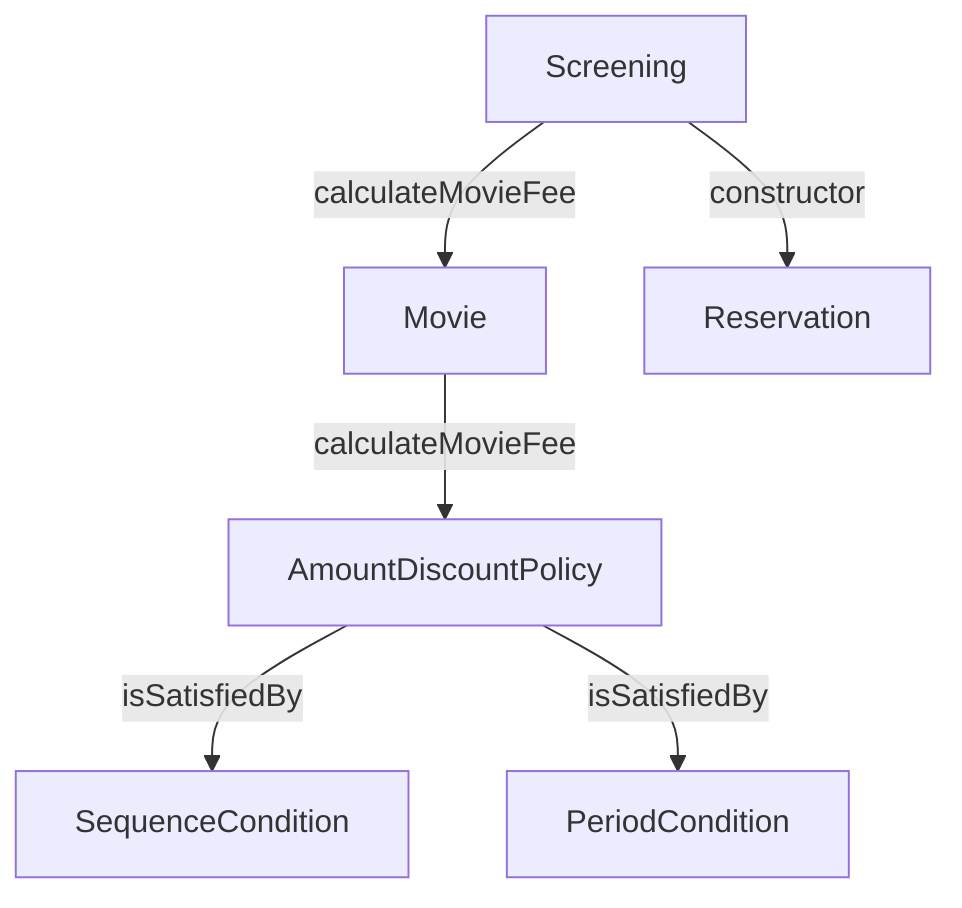
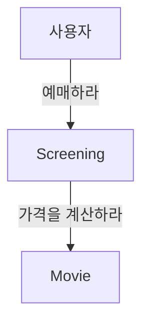
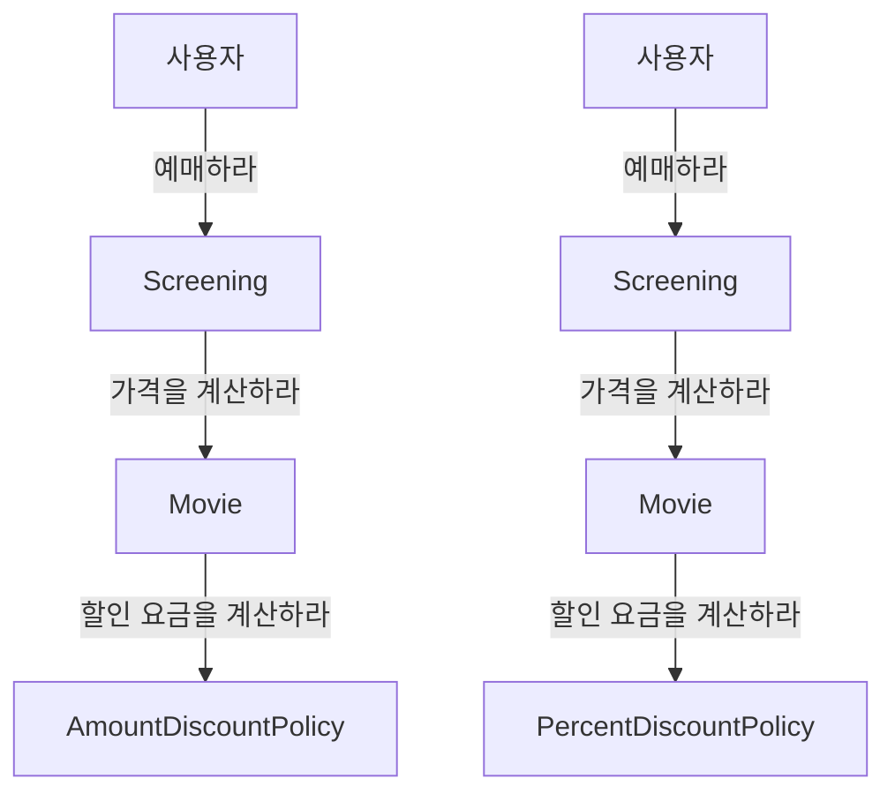
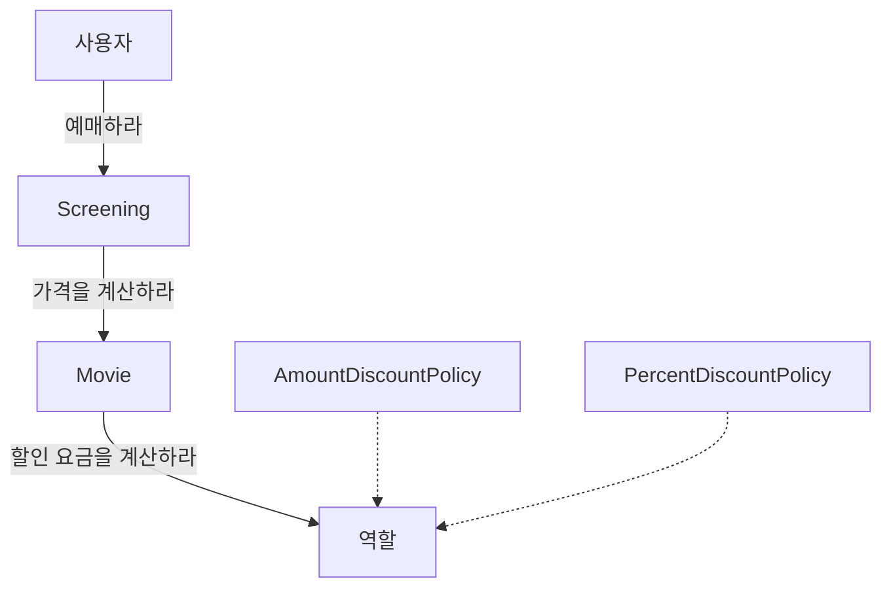
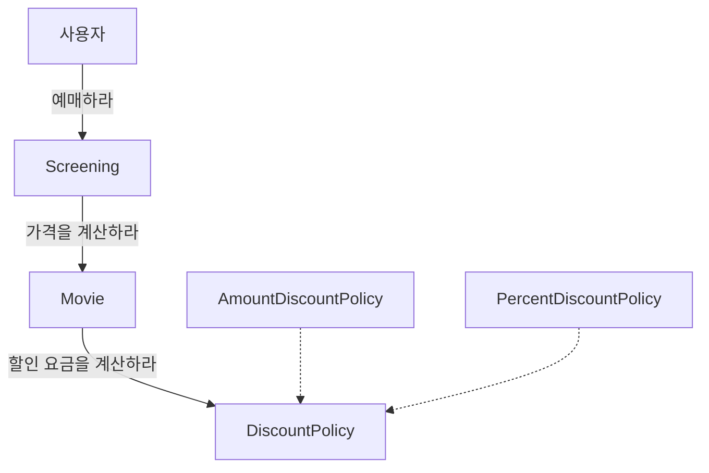
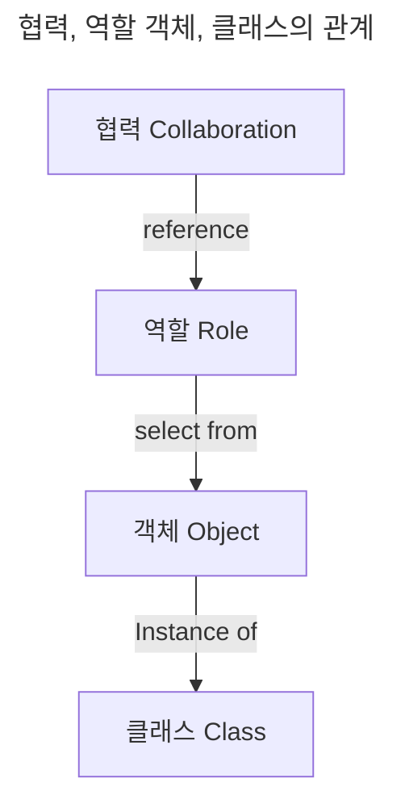
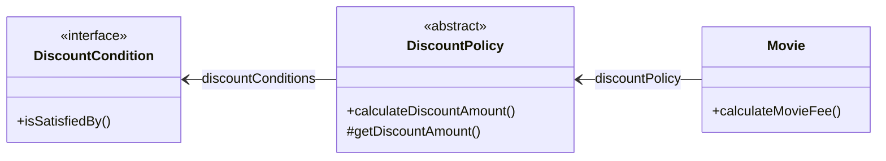

# Chapter 03 역할, 책임, 협력

- 객체지향 패러다임의 관점에서 핵심은 아래 3가지다.
1. 역할 Role
2. 책임 Responsibility
3. 협력 Collaboration

- 객체지향의 본질은 협력하는 객체들의 공동체를 창조하는 것이다.
- 객체지향 설계의 핵심은 협력을 구성하기 위해 적절한 객체를 찾고 적절한 책임을 할당하는 과정에서 드러난다.

## 1. 협력

- 객체들이 애플리케이션의 기능을 구현하기 위해 수행하는 상호작용을 **협력**이라 한다.
- 객체가 협력에 참여하기 위해 수행하는 로직은 **책임**이라고 한다.
- 객체들이 협력 안에서 수행하는 책임들이 모여 역할을 구성한다.

### 협력

- 객체는 고립된 존재가 아니라 시스템의 기능이라는 더 큰 목표를 달성하기 위해 다른 객체와 협력하는 사회적인 존재다.
    - 협력은 객체지향의 세계에서 기능을 구현할 수 있는 유일한 방법이다.
    - 협력은 하나의 객체가 다른 객체에게 도움을 요청할 때 시작된다.
    - 메시지 전송(message sending)은 객체 사이의 협력을 위해 사용할 수 있는 유일한 커뮤니케이션 수단이다.
- 객체를 자율적으로 만드는 가장 기본적인 방법은 내부 구현을 캡슐화하는 것이다.
    - 캡슐화를 통해 변경에 대한 파급효과를 제한할 수 있기 때문이다.

### 협력이 설계를 위한 문맥을 결정한다.

- 객체란 상태와 행동을 함께 캡슐화하는 실행 단위다.
    - 객체가 필요하다면 그 이유는 단 하나다. 그 객체가 어던 협력에 참여하고 있기 때문이다.
    - 그리고 그 객체가 협력에 참여할 수 있는 이유는 협력에 필요한 적절한 행동을 보유하고 있기 때문이다.
- 결과적으로 객체가 참여하는 협력이 객체를 구성하는 행동과 상태 모두를 결정한다. 따라서 협력은 객체를 설계하는 데 필요한 일종의 문맥(context)를 제공한다.

 

## 2. 책임

- 협력에 참여하기 위해 객체가 수행하는 행동을 책임이라고 부른다.
- 객체의 책임은 `무엇을 알고 있는가(knowing)`와 `무엇을 할 수 있는가(doing)`로 구성된다.
- 하는 것
    - 객체를 생성하거나 계산을 수행하는 등의 행동을 스스로 하는 것
    - 다른 객체의 행동을 시작시키는 것
    - 다른 객체의 활동을 제어하고 조절하는 것
- 아는 것
    - 사적인 정보에 관해 아는 것
    - 관련된 객체에 관해 아는 것
    - 자신이 유도하거나 계산할 수 있는 것에 관해 아는 것
- 일반적으로 책임과 메시지의 크기는 다르다. 책임은 객체가 수행할 수 있는 행동을 종합적이고 간략하게 서술하기 때문에 메시지보다 추상적이고 개념적으로도 더 크다.
    - 책임이 여러 개의 메시지로 분할되기도 한다.
    - 또한, 책임은 여러 객체들이 협력해야만 하는 커다란 책임으로 자라나는 것이 일반적이다.
- 여기서 중요한 사실은 책임의 관점에서 `아는 것`과 `하는 것`이 밀접하게 연관되어 있다는 것이다.
    - 책임을 할당하기 위한 가장 기본적인 원칙에 대한 힌트를 제공한다.
- 크레이그 라만은 "객체지향 개발에서 가장 중요한 능력은 책임을 능숙하게 소프트웨어 객체에 할당하는 것"이라는 말로 책임 할당의 중요성을 강조했다.
    - 협력이 중요한 이유는 객체에게 할당할 책임을 결정할 수 있는 문맥을 제공하기 때문이다.

> CRC 카드
> - Candidate, Responsibility, Collaboration의 첫 글자를 따서 만든 카드
> - 앨리스터 코오번은 "효과적으로 일하는 사람들은 추상적이고 가상적인 것보다는 구체적이고 실재적인 것을 사용하는 경향이 있다."고 설명한다.
> - CRC 카드는 역할을 식별하고 책임을 할당하며 협력을 명시적으로 표현하는 구체적이면서도 실용적인 설계 기법이다.

### 책임 할당

- 자율적인 객체를 만드는 가장 기본적인 방법은 책임을 수행하는 데 필요한 정보를 가장 잘 알고 있는 전문가에게 그 책임을 할당하는 것이다.
    - 이를 책임 할당을 위한 `INFORMATION EXPERT(정보 전문가)` 패턴이라고 부른다.
- 객체에게 책임을 할당하기 위해서는 먼저 협력이라는 문맥을 정의해야 한다.
    - 시스템이 사용자에게 제공하는 기능을 시스템이 담당할 하나의 책임으로 바라보는 것이다.
- 예시
    1. "예매하라"라는 메시지를 선택했다.
    2. 이 메시지를 처리할 적절한 객체인 영화 예매와 관련한 정보를 가장 많이 알고 있는 객체에게 책임을 할당한다. `Screening`으로 보인다.
    3. `Screening`도 예매 가격을 계산하는 필요한 정보가 충분치 않다. "가격을 계산하라"라는 새로운 메시지를 만들었다.
    4. 이 메시지를 처리할 정보 전문가 객체 `Movie`를 선택했다.

- 이렇게 결정된 메시지가 객체의 퍼블릭 인터페이스를 구성한다는 것을 눈여겨보기 바란다.
    - 협력을 설계하면서 객체의 책임을 식별해 나가는 과정에서 최종적으로 얻게 되는 결과물은 시스템을 구성하는 객체들의 인터페이스와 오퍼레이션 목록이다.
- 모든 책임 할당 과정이 이렇게 단순하진 않다.
    - 어떤 경우에는 응집도와 결합도의 관점에서 정보 전문가가 아닌 다른 객체에게 책임을 할당하는 것이 더 적절한 경우도 있다.

### 책임 주도 설계 Responsibility-Driven Design

- 시스템이 사용자에게 제공해야 하는 기능인 시스템 책임을 파악한다.
- 시스템 책임을 더 작은 책임으로 분할한다.
- 분할된 책임을 수행할 수 있는 적절한 객체 또는 역할을 찾아 책임을 할당한다.
- 객체가 책임을 수행하는 도중 다른 객체의 도움이 필요한 경우 이를 책임질 적절한 객체 또는 역할을 찾는다.
- 해당 객체 또는 역할에게 책임을 할당함으로써 두 객체 협력하게 한다.

### 메시지가 객체를 결정한다.

- 객체에게 책임을 할당하는 데 필요한 메시지를 먼저 식별하고 메시지를 처리할 객체를 나중에 선택했다는 것이 중요하다.
    - 객체가 메시지를 선택하는 것이 아니라 메시지가 객체를 선택하게 했다.
- 메시지가 객체를 선택하게 해야 하는 두 가지 중요한 이유가 있다.

1. 객체가 최소한의 인터페이스(minimal interface)를 가질 수 있게 된다.
- 필요한 메시지가 식별될 때가지 객체의 퍼블릭 인터페이스에 어떤 것도 추가하지 않기 때문에 객체는 애플리케이션에 크지도, 작지도 않은 꼭 필요한 크기의 퍼블릭 인터페이스를 가질 수 있다.
2. 객체는 충분히 추상적인 인터페이스(abstract interface)를 가질 수 있게 된다.
- 객체의 인터페이스는 무엇을(what) 하는지 표현해야 하지만 어떻게(how) 수행하는지를 노출해서는 안 된다.
- 메시지는 외부의 객체가 요청하는 무언가를 의미하기 때문에 메시지를 먼저 식별하면 무엇을 수행할지에 초점을 맞추는 인터페이스를 얻을 수 있다.

### 행동이 상태를 결정한다.

- 객체지향 패러다임에 갓 입문한 사람들이 가장 쉽게 빠지는 실수는 객체의 행동이 아니라 상태에 초점을 맞추는 것이다.
    - 먼저 객체에 필요한 상태가 무엇인지를 결정하고 그 후에 상태에 필요한 행동을 결정하는 실수다.
    - 이런 방식은 객체의 내부 구현이 객체의 퍼블릭 인터페이스도 함께 변경되고, 결국 객체에 의존하는 클라이언트로 변경의 영향이 전파된다.
    - 레베카 워프스브룩은 이와 같이 객체의 내부 구현에 초점을 맞춘 설계 방법을 데이터-주도 설계(Data-Driven Design)라고 불렀다.
- 캡슐화를 위반하지 않도록 구현에 대한 결정을 뒤로 미루면서 객체의 행위를 고려하기 위해서는 항상 협력이라는 문맥 안에서 객체를 생각해야 한다.
    - 다른 객체에게 무엇을 제공해야 하고 다른 객체로부터 무엇을 얻어야 하는지를 고민해야 훌륭한 책임을 수확할 수 있다.
    - 개별 객체의 상태와 행동이 아닌 시스템의 기능을 구현하기 위한 협력에 초점을 맞춰야만 응집도가 높고 결합도가 낮은 객체들을 창조할 수 있다.
    - 상태는 단지 객체가 행동을 정상적으로 수행하기 위해 필요한 재료일 뿐이다.
    - 행동이 중요하다!

 

## 3. 역할

### 역할과 협력

- 객체의 목적은 협력 안에서 객체가 맡게 되는 책임의 집합으로 표시된다.
- 이처럼 객체가 어떤 특정한 협력 안에서 수행하는 책임의 집합을 **역할**이라고 부른다.
    - 실제로 협력을 모델링할 때는 특정한 객체가 아니라 역할에게 책임을 할당한다고 생각하는 게 좋다.

### 유연하고 재사용 가능한 협력

- 역할이 중요한 이유는 역할을 통해 유연하고 재사용 가능한 협력을 얻을 수 있기 때문이다.
- 역할이라는 개념을 고려하지 않고 객체에게 책임을 할당한 예시를 확인해보자.
    - `Movie`는 금액을 계산하기 위해할인 요금이 필요하기 때문에 "할인 요금을 계산하라"라는 메시지를 전송해서 외부 객체에 도움을 요청한다.
    - 두 가지의 할인 정책이 존재하는데, 두 종류의 객체가 참여하는 협력을 개별적으로 만들면 코드 중복이다.

- 문제를 해결하기 위해선 객체가 아닌 책임에 초점을 맞춰야 한다.
    - `AmountDiscountPolicy`, `PercentDiscountPolicy` 두 객체는 모두 할인 요금 계산이라는 동일한 책임을 가지고 있다.
    - 따라서 객체라는 존재를 지우고 "할인 요금을 계산하라"라는 메시지에 응답할 수 있는 대표자를 생각하면 두 협력을 하나로 통합할 수 있다.
    - 이 대표자를 협력 안에서 두 종류의 객체를 교대로 교체할 수 있는 일종의 슬롯으로 볼 수 있다. (여기서 슬롯이 역할이다!)

- 여기서 역할이 두 종류의 구체적인 객체를 포괄하는 **추상화**라는 점을 주목하자.
    - 두 객체를 포괄할 수 있는 네이밍을 선정해 부여해야 한다!

> 역할의 구현
> - 역할을 구현하는 가장 일반적인 방법은 추상 클래스와 인터페이스를 사용하는 것이다.
> - 협력의 관점에서 추상 클래스와 인터페이스는 구체 클래스들이 따라야 하는 책임의 집합을 서술한 것이다.
> - 일단 협력 안에서 역할이 어떤 책임을 수행해야 하는지를 결정하는 것이 중요하다. 역할을 구현하는 방법은 그다음의 문제다.
> - 객체에게 중요한 것은 행동이며, 역할은 객체를 추상화해서 객체 자체가 아닌 협력에 초점을 맞출 수 있게 한다.

### 객체 대 역할

- 레베카 워프스브룩의 말을 인요하면 협력에 참여하는 후보가 여러 종류의 객체에 의해 수행될 필요가 있다면 그 후보는 역할이 되지만 단지 한 종류의 객체만이 협력에 참여할 필요가 있다면 후보는 객체가 된다.

> 객체에 관해 생각할 때 '이 객체가 무슨 역할을 수행해야 하는가'라고 자문하는 것이 도움이 된다.
> - 객체가 어떤 형태를 띠어야 하는지, 어떤 동작을 해야 하는지에 집중할 수 있게 도와준다.
> - 만약 동일한 종류의 객체가 하나의 역할을 수행한다면 둘은 동일한 것이다. 하지만 어떤 협력에서 하나 이상의 객체가 동일한 책임을 수행할 수 잇다면 역할은 서로 다른 방법으로 실행할 수 있는 책임의 집합이 된다.
> - 역할이란 프로그램이 실행될 때 소프트웨어 기계 장치에서 적절한 객체로 메워 넣을 수 있는 하나의 슬롯으로 생각할 수 있다.

- 트리그비 린스카우는 역할을 가리켜 실행되는 동안 협력 안에서 각자의 위치를 가지는 객체들에 대한 별칭이라고 정의한다.
    - 협력은 역할들의 상호작용으로 구성되고 협력을 구성하기 위해 역할에 적합한 객체가 선택되며 객체는 클래스를 이용해 구현되고 생성된다.

- 대부분의 경우 어떤 것이 역할이고 어떤 것이 객체인지가 또렷하게 드러나지 않을 것이다.
- 특히나 명확한 기준을 세우기 어렵고 정보가 부족한 설계 초반에는 결정을 내리기가 더욱 어려울 것이다.
    - 도메인 모델 안에는 개념과 객체와 역할이 어지럽게 뒤섞여 있으며 이것은 사람들이 세계를 바라보는 일반적인 관점이다.
    - 사람들은 세상을 이해할 때 무의식적으로 개념, 객체, 역할을 뒤섞는다.
    - 도메인 모델은 불완전한 사람들이 세상을 바라보는 모델에 기반하기 때문에 그 역시 동일한 불완전성을 가질 수밖에 없다.
- 설계 초반에는 적절한 책임과 협력의 큰 그림을 탐색하는 것이 가장 중요한 목표여야 하고 역할과 객체를 명확하게 구분하는 것은 그렇게 중요하지 않다는 것이다.
    - 애매하다면 단순하게 객체로 시작하고 반복적으로 책임과 협력을 정제해가면서 필요한 순간에 객체로부터 역할을 분리해내는 것이 가장 좋은 방법이다.
- 다양한 객체들이 협력에 참여한다는 것이 확실하다면 역할로 시작하라.
    - 하지만 모든 것이 안개 속이라면 구체적인 객체로 시작한다.
- 트리그비 린스카우는 역할을 설계의 중심으로 보는 역할 모델링(Role Modeling) 개념을 제안했다.
    - 상호작용하는 객체들의 협력 패턴을 역할들 사이의 협력 패턴으로 추상화함으로써 유연하고 재사용 가능한 시스템을 얻을 수 있는 방법에 관해 설명한다.
- 중요한 것은 협력을 구체적인 객체가 아니라 추상적인 역할의 관점에서 설계하면 협력이 유연하고 재사용 가능해진다는 것이다.

### 역할과 추상화

1. 추상화는 세부 사항에 억눌리지 않고도 상위 수준의 정책을 쉽고 간단하게 표현할 수 있다.
- 불필요한 세부 사항을 생략하고 핵심적인 개념을 강조할 수 있다.
- 아래처럼 할인 정책의 세부적인 객체(`NonDiscountPolicy`, `AmountDiscountPolicy`, `PercentDiscountPolicy`), 할인 조건의 세부적인 객체(`SequenceCondition`, `PeriodCondition`)을 무시한 채로 역할만 바라보면 상황을 추상화할 수 있다.
- 결과적으로 이해하기가 쉽다.

- 협력에 참여하는 할인 정책과 할인 조건의 종류는 중요하지 않다.
    - 구체적인 할인 정책과 할인 조건이 추상화된 역할을 대체할 것이라는 것만 알고 있어도 충분하다.
    - 구체적인 할인 정책과 할인 조건의 조합을 고려하지 않고도 상위 수준에서 협력을 설명할 수 있다는 것을 의미한다.

2. 추상화를 하면 설계를 유연하게 만들 수 있다.
- 역할은 다양한 환경에서 다양한 객체들을 수용할 수 잇게 해주므로 협력을 유연하게 만든다.

- 역할은 객체의 페르소나다.

 

# 참고자료

- 오브젝트, 조영호 지음
