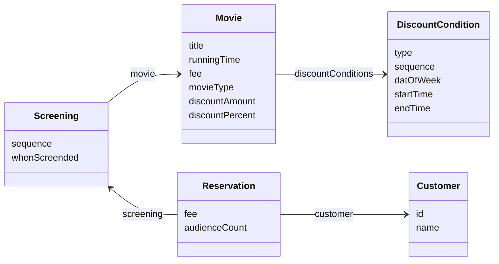
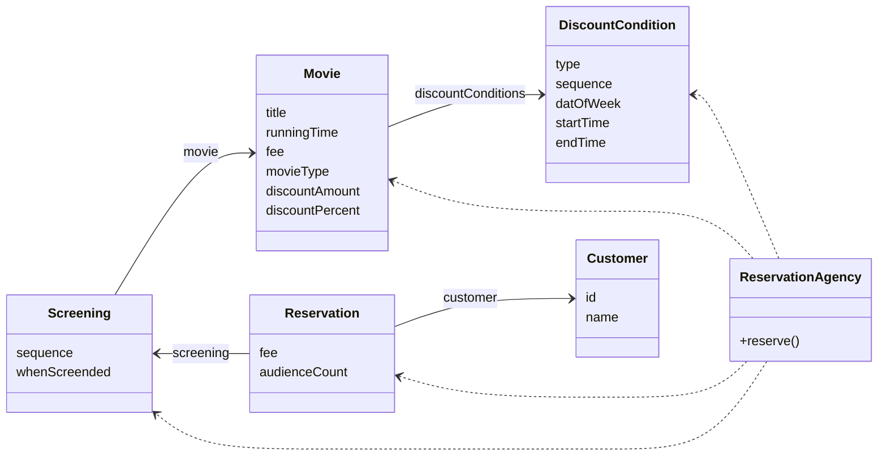
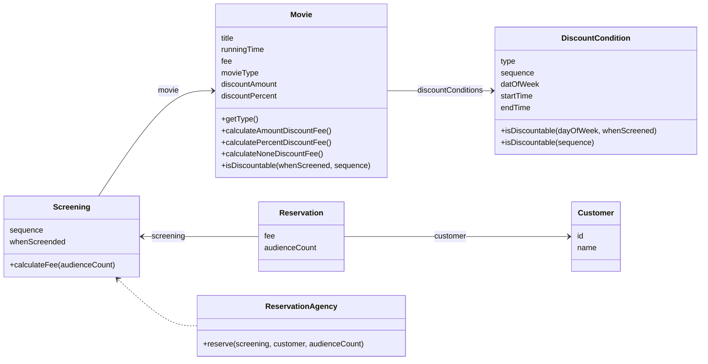

# Chapter 04. 설계 품질과 Trade-off

- 객체지향 설계의 핵심은 역할, 책임, 협력이다.
    - **협력**: 기능을 구현하기 위해 메시지를 주고받는 객체들 사이의 상호작용
    - **책임**: 객체가 다른 객체와 협력하기 위해 수행하는 행동
    - **역할**: 대체 가능한 책임의 집합
- 이 중 가장 중요한 것은 **책임**이다.
    - 객체들이 수행할 책임이 적절하게 할당되지 못한 상황에서는 원할한 협력을 기대할 수 없다.
    - 역할은 책임의 집합이기 때문에 책임이 적절하지 못하면 역할 역시 협력과 조화를 이루지 못한다.
- 결합도와 응집도를 합리적인 수준으로 유지할 수 있는 중요한 원칙이 있다.
    - 객체의 상태가 아니라 객체의 행동에 초점을 맞추느느 것이다.
    - 객체를 단순한 데이터의 집합으로 바라보는 시각은 객체의 내부 구현을 퍼블릭 인터페이스에 노출시키는 결과를 낳기 때문에 결과적으로 설계가 변경에 취약해진다.

## 01 데이터 중심의 영화 예매 시스템

- 객체지향 설계에서는 2가지 방법을 사용해 시스템을 객체로 분할할 수 있다.
    1. 상태를 분할의 중심축으로 삼는다.
    2. 책임을 분할의 중심축으로 삼는다.
- 보통 객체의 상태는 객체가 저장해야 하는 데이터의 집합이므로 `상태`와 `데이터`를 동일한 의미로 볼 수도 있다.
- 데이터 중심의 관점에서 객체는 자신이 포함하고 있는 데이터를 조작하는 데 필요한 오퍼레이션을 정의한다.
    - 객체의 상태에 초점
    - 객체를 독립된 데이터 덩어리로 본다.
- 책임 중심의 관점에서 객체는 다른 객체가 요청할 수 있는 오퍼레이션을 위해 필요한 상태를 보관한다.
    - 객체의 행동에 초점
    - 객체를 협력하는 공동체의 일원으로 본다.
- 상태를 객체 분할의 중심축으로 삼으면 구현에 대한 세부사항이 객체의 인터페이스에 스며들게 되어 캡슐화의 원칙이 무너진다.
    - 결과적으로 상태 변경은 인터페이스의 변경을 초래하며 인터페이스에 의존하는 모든 개체에게 변경의 영향이 퍼지게 된다.
    - 데이터에 초점을 맞추는 설계는 변경에 취약할 수밖에 없다.
- 객체의 책임은 인터페이스에 속한다.
    - 객체는 책임을 드러내는 안정적인 인터페이스 뒤로 책임을 수행하는 데 필요한 상태를 캡슐화함으로써 구현 변경에 대한 파장이 외부로 퍼져나가는 것을 방지한다.
    - 따라서 책임에 초점을 맞추면 상대적으로 변경에 안정적인 설계를 얻을 수 있게 된다.

### 영화 예매 데이터



- 데이터 중심으로 짠 객체들을 사용해 영화 예매 절차를 구현하는 코드다.
    - 엄청난 절차 지향 코드가 만들어졌다.

```java
public class ReservationAgency {

  public Reservation reserve(Screening screening, Customer customer, int audienceCount) {
    Movie movie = screening.getMovie();
    boolean discountable = false;
    for (DiscountCondition condition : movie.getDiscountConditions()) {
      if (condition.getType().equals(DiscountConditionType.PERIOD)) {
        discountable = screening.getWhenScreened().getDayOfWeek().equals(condition.getDayOfWeek())
            && condition.getStartTime().compareTo(screening.getWhenScreened().toLocalTime()) <= 0
            && condition.getEndTime().compareTo(screening.getWhenScreened().toLocalTime()) >= 0;
      } else {
        discountable = condition.getSequence() == screening.getSequence();
      }

      if (discountable) {
        break;
      }
    }

    Money fee;
    if (discountable) {
      Money discountAmount = Money.ZERO;
      switch (movie.getMovieType()) {
        case AMOUNT_DISCOUNT -> discountAmount = movie.getDiscountAmount();
        case PERCENT_DISCOUNT -> discountAmount = movie.getFee().times(movie.getDiscountPercent());
        case NONE_DISCOUNT -> discountAmount = Money.ZERO;
      }

      fee = movie.getFee().minus(discountAmount).times(audienceCount);
    } else {
      fee = movie.getFee();
    }

    return new Reservation(customer, screening, fee, audienceCount);
  }
}
```

<br/>

## 02 설계 트레이드오프

### 캡슐화

- 상태와 행동을 하나의 객체 안에 모으는 이유는 객체의 내부 구현을 외부로부터 감추기 위해서다.
- 객체지향이 강력한 이유는 한 곳에서 일어난 변경이 전체 시스템에 영향을 끼치지 않도록 파급효과를 적절하게 조절할 수 있는 장치를 제공하기 때문이다.
- 객체를 사용하면 변경 가능성이 높은 부분은 내부에 숨기고 외부에는 상대적으로 안정적인 부분만 공대함으로서 변경의 여파를 통제할 수 있다.
    - 변경될 가능성이 높은 부분 = `구현`
    - 상대적으로 안정적인 부분 = `인터페이스`
- 객체를 설계하기 위한 가장 기본적인 아이디어는 변경의 정도에 따라 구현과 인터페이스를 분리하고 외부에서는 인터페이스에만 의존하도록 관계를 조절하는 것이다.
- 설계가 필요한 이유는 요구사항이 변경되기 때문이고, 캡슐화가 중요한 이유는 불안정한 부분과 안정적인 부분을 분리해서 변경의 영향을 통제할 수 있기 때문이다.
    - 따라서 변경의 관점에서 설계의 품질을 판단하기 위해 캡슐화를 기준으로 삼을 수 있다.
    - 변경될 수 있는 그 어떤 것이라도 캡슐화해야 한다.

> - 유지보수성은 두려움 없이, 주저함 없이, 저항감 없이 코드를 변경할 수 있는 능력을 말한다.
> - 가장 중요한 동료는 캡슐화다. 응집도, 결합도, 중복 역시 훌륭한 코드를 규정하는 데 핵심적인 품질인 것이 사실이지만 캡슐화는 우리를 좋은 코드로 안내하기 때문에 가장 중요한 제1원리다.

### 응집도와 결합도

- 응집도와 결합도는 구조적 설계 방법이 주도하던 시대에 소프트웨어의 품질을 측정하기 위해 소개된 기준이지만 객체지향의 시대에서도 여전히 유효하다.
- **응집도**
    - 모듈에 포함된 배부 요소들이 연과되어 있는 정도.
    - 모듈 내의 요소들이 하나의 목적을 위해 긴밀하게 협력한다면 그 모듈은 높은 응집도를 가진다고 말할 수 있다.
    - 객체지향 관점에서 응집도는 객체 또는 클래스에 얼마나 관련 높은 책임들을 할당했는지를 나타낸다.
- **결합도**
    - 의존성의 정도. 다른 모듈에 대해 얼마나 많은 지식을 갖고 있는지를 나타내는 척도.
    - 어떤 모듈이 다른 모듈에 대해 너무 자세한 부분까지 알고 있다는 두 모듈은 높은 결합도를 가진다.
    - 객체지향 관점에서 결합도는 객체 또는 클래스가 협력에 필요한 적절한 수준의 관계만을 유지하고 있는지를 나타낸다.
- 변경의 관점에서 응집도란 변경이 발생할 때 모듈 내부에서 발생하는 병경의 정도로 측정할 수 있다.
    - 간단히 말해 하나의 변경을 수용하기 위해 모듈 전체가 함께 변경된다면 응집도가 높은 것이고 모듈의 일부만 변경된다면 응집도가 낮은 것이다.
    - 또한 하나의 변경에 대해 하나의 모듈만 변경된다면 응집도가 높지만 다수의 모듈이 함께 변경되어야 한다면 응집도 낮은 것이다. (이 경우에는 결합도는 높은 것이라고 볼 수 있겠다.)

<br/>

## 03 데이터 중심의 영화 예매 시스템의 문제점

- 기능적인 면만 따지만 2장의 구현한 책임 중심 설계와 완전히 동일하다.
- 하지만 설계 관점에서는 완전히 다르다. 근본적인 차이점은 캡슐화를 다루는 방식이다.
    - 데이터 중심 설계: 캡슐화를 위반하고, 객체의 내부 구현을 인터페이스의 일부로 만들었다.
    - 책임 중심 설계: 객체의 내부 구현을 안정적인 인터페이스 뒤로 캡슐화했다.
- 캡슐화의 정도가 객체의 응집도와 결합도를 결정한다는 사실을 기억하라.

### 캡슐화 위반

- `Movie` 객체는 `Money` 타입의 `fee`라는 인스턴스 변수가 존재한다는 사실을 퍼블릭 인터페이스에 노골적으로 드러낸다.
- `Movie`가 캡슐화의 원칙을 어기게 된 근본적인 원인은 객체가 수행할 책임이 아니라 내부에 저장할 데이터에 초점을 맞췄기 때문이다.
- 앨런 홀럽은 이처럼 접근자(`getter`)와 수정자(`setter`)에 과도하게 의존하는 설계 방식을 `추측에 의한 설계 전략(design-by-guessing-strategy)`이라고 부른다.
    - 이 전략은 객체가 사용될 협력을 고려하지 않고 객체가 다양한 상황에서 사용될 수 있을 것이라는 막연한 추측을 기반으로 설계를 진행한다.
    - 따라서 프로그래머는 내부 상태를 드러내는 메소드를 최대한 많이 추가해야 한다는 압박에 시달릴 수밖에 없으며 결과적으로는 대부분의 내부 구현이 퍼블릭 인터페이스에 그대로 노출될 수밖에 없다.

### 높은 결합도

- 객체 내부의 구현이 객체의 인터페이스에 드러난다는 것은 클라이언트가 구현에 강하게 결합된다는 것을 의미한다.
- 그리고 더 나쁜 소식은 단지 객체의 내부 구현을 변경했음에도 이 인터페이스가 의존하는 모든 클라이언트들도 함께 변경해야 한다는 것이다.

```java
public class ReservationAgency {

  public Reservation reserve(Screening screening, Customer customer, int audienceCount) {
    ...

    Money fee;
    if (discountable) {
      ...
      
      fee = movie.getFee().minus(discountAmount).times(audienceCount);
    } else {
      fee = movie.getFee();
    }
  }
}
```

- 위의 코드에서 fee의 타입이 `Money`에서 다른 것으로 변경된다고 가정해보자.
    - `Movie`의 `getFee()`의 반환 타입이 변경되어야 한다.
    - `ReservationAgency`가 `getFee()` 호출하는 구현이 타입에 맞게 수정되어야 한다.
- 데이터 중심의 설계는 객체의 캡슐화를 약화시키기 때문에 클라이언트가 객체의 구현에 강하게 결합된다.
- 또한 여러 데이터 객체들을 사용하는 제어 로직이 특정 객체 안에 집중되기 대문에 하나의 제어 객체가 다수의 데이터 객체에 강하게 결합된다. (결합도 증가)
    - 어떤 데이터 객체를 변경하더라도 제어 객체를 함께 변경할 수밖에 없다.
    - `ReservationAgency`를 확인해보면 너무 많은 객체를 의존한다는 것을 알 수 있다.



### 낮은 응집도

- 할인 정책이나 조건이 추가되거나 할인의 요금 계산 방식이 달라지는 경우 등 요구사항이 달라질 때, 제어 로직(`ReservationAgency`)이 변경될 수밖에 없는 구조다.
    - 응집도가 낮기 때문이다. (할인 모듈의 응집도가 높았다면 할인 모듈만 변경해도 요구사항을 충족시킬 수 있기 때문이다.)
- 낮은 응집도는 다음과 같은 문제가 있다.
    - 요구사항 변경과 아무 상관 없는 코드들이 영향을 받을 수 있다.
    - 요구사항 변경을 반영하기 위해 동시에 여러 모듈을 수정해야 한다. 응집도가 낮을 경우 다른 모듈에 위치해야 할 책임의 일부가 엉뚱한 곳에 위치하기 때문이다.

<br/>

## 04 자율적인 객체를 향해

### 캡슐화를 지켜라

- 캡슐화는 설계의 제1원리다.
    - 데이터 중심의 설계가 낮은 응집도와 높은 결합도 문제를 겪은 근본적은 이유는 캡슐화 원칙을 위반했기 때문이다.
- 객체는 스스로의 상태를 책임져야 하며 외부에서는 인터페이스에 정의된 메소드를 통해서만 상태에 접근할 수 있어야 한다.
    - 여기서 말하는 메소드란 접근자나 수정자를 의미하는 것이 아니다.
    - 객체에게 의미 있는 메소드는 객체가 책임져야 하는 무언가를 수행하는 메소드다.
    - 속성의 가시성을 private으로 설정했다고 하더라도 접근자와 수정자를 통해 속성을 외부로 제공하고 있다면 캡슐화를 위반하는 것이다.

### 스스로 자신의 데이터를 책임지는 객체

- 상태와 행동을 객체라는 단위로 묶는 이유는 객체 스스로 자신의 상태를 처리할 수 있게 하기 위해서다.
- 객체는 단순한 데이터 제공자가 아니다. 객체가 협력에 참여하면서 수행할 책임을 정의하는 오퍼레이션이 객체의 핵심이다.
- 객체를 설계할 때 "이 객체는 어떤 데이터를 포함해야 하는가?"라는 질문은 다음과 같은 2개의 개별적인 질문으로 분리해야 한다.
    1. 이 객체가 어떤 데이터를 포함해야 하는가?
    2. 이 객체가 데이터에 대해 수행해야 하는 오퍼레이션은 무엇인가?
- 객체가 스스로를 책임지게 개선하면 아래와 같은 구조로 개선 가능하다.



<br/>

## 05 하지만 여전히 부족하다.

- 본질적으로는 개선된 설계도 데이터 중심의 설계 방식에 속한다고 할 수 있다.
- 여전히 문제점이 있다.

### 캡슐화 위반

```java
public class DiscountCondition {

  private DiscountConditionType type;
  private int sequence;

  private DayOfWeek dayOfWeek;
  private LocalTime startTime;
  private LocalTime endTime;


  public DiscountConditionType getType() {
    return type;
  }

  public boolean isDiscountable(DayOfWeek dayOfWeek, LocalTime time) {
    if (!type.equals(DiscountConditionType.PERIOD)) {
      throw new IllegalArgumentException();
    }

    return this.dayOfWeek.equals(dayOfWeek)
        && this.startTime.compareTo(time) <= 0
        && this.endTime.compareTo(time) >= 0;
  }

  public boolean isDiscountable(int sequence) {
    if (!type.equals(DiscountConditionType.SEQUENCE)) {
      throw new IllegalArgumentException();
    }
    return this.sequence == sequence;
  }
}
```

- `public boolean isDiscountable(DayOfWeek dayOfWeek, LocalTime time)`를 살펴보자.
    - 이 메소드는 객체 내부에 `DayOfWeek`와 `LocalTime` 타입의 시간 정보가 포함되어 있다는 사실을 외부에 노출하고 있다.
- `public boolean isDiscountable(int sequence)`
    - 이 메소드 역시 객체가 int 타입의 순번 정보를 포함하고 있음을 외부에 노출한다.
- `getType()` 역시 객체의 필드를 그대로 노출한다.
- 만약 `DiscountCondition`의 속성을 변경해야 한다면 어떻게 될까? 아마도 `isDiscountable` 메소드의 파라미터를 수정하고 해당 메소드를 사용하는 모든 클라이언트도 함께 수정해야 할 것이다.

### 높은 결합도

- 캡슐화 위반으로 `DiscountCondition`의 내부 구현이 외부로 노출됐기 때문에 `Movie`와 `DiscountCondition` 사이의 결합도는 높을 수밖에 없다.
    - `DiscountCondition`를 변경하면 `Movie` 또한 변경해야 한다.
    - 변경의 여파는 단순히 두 개의 객체로만 한정되지 않고 현재 시스템을 구성하는 모든 객체들이 이 같은 결합도 문제가 생긴다.

### 낮은 응집도

- 할인 조건의 종류를 변경하기 위해 너무 많은 객체를 수정해야 한다.
    - `DiscountCondition`이 할인 여부를 판단하는 데 필요한 정보가 변경된다면? 파라미터가 수정되어야 한다.
    - `Movie`의 `isDiscountable()`도 변경되어야 한다.
    - `Screening`에서 `Movie`의 `isDiscountable()`를 호출하는 모든 부분을 수정해야 한다.

<br/>

## 06 데이터 중심 설계의 문제점

- 데이터 중심 설계가 변경에 취약한 이유는 아래 2가지 때문이다.
1. 데이터 중심의 설계는 본질적으로 너무 이른 시기에 데이터에 관해 결정하도록 강요한다.
2. 데이터 중심 설계에서는 협력이라는 문맥을 고려하지 않고 객체를 고립시킨 채 오퍼레이션을 결정한다.

### 데이터 중심 설계는 객체의 행동보다는 상태에 초점을 맞춘다.

- 데이터는 구현의 일부다.
- 데이터 주도 설계는 설계를 시작하는 처음부터 데이터에 관해 결정하도록 강요하기 때문에 너무 이른 시기에 내부 구현에 초점을 맞추게 한다.
- 데이터 중심 관점에서 객체는 그저 단순한 데이터의 집합체일 뿐이다.
    - 접근자와 수정자를 과도하게 추가할 수밖에 없다.
    - 데이터 객체는 절차를 분리된 별도의 객체 안에서 구현하게 된다.
    - 캡슐화가 완전히 무너질 수밖에 없다.

### 데이터 중심 설계는 객체를 고립시킨 채 오퍼레이션을 정의하도록 만든다.

- 올바른 객체지향 설계의 무게 중심은 항상 객체의 내부가 아니라 외부에 맞춰져 있어야 한다.
    - **협력이라는 문맥**
- 안타깝게도 데이터 중심 설계에서 초점은 객체의 외부가 아니라 내부로 향한다.
    - 실행 문맥에 대한 깊이있는 고민 없이 객체가 관리할 데이터의 세부 정보를 먼저 결정한다.
    - 객체의 구현이 결정되어 있는 상태에서 다른 객체와의 협력 방법을 고민하기 때문에 이미 구현된 객체의 인터페이스를 억지로 끼워맞출 수밖에 없다.

<br/>

# 참고자료

- 오브젝트, 조영호 지음
