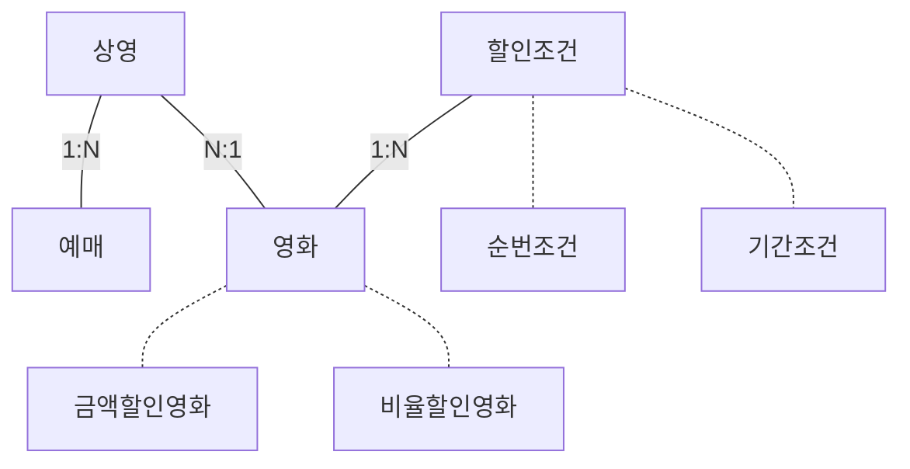
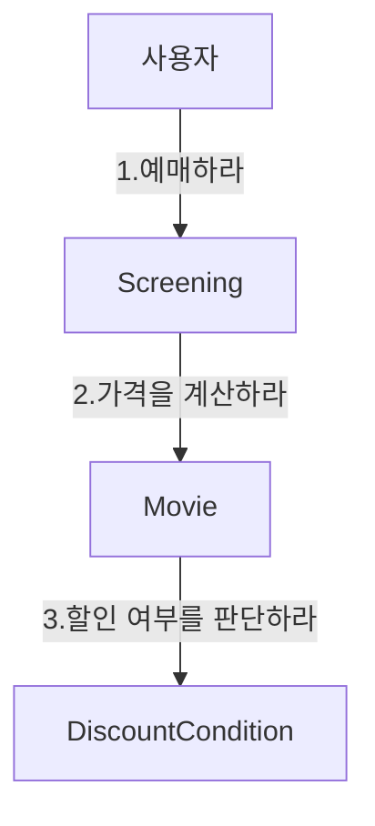
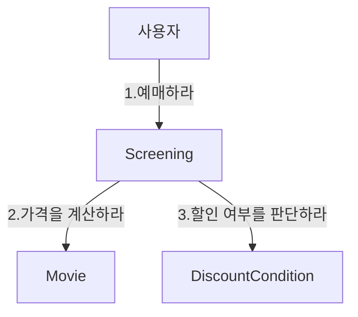
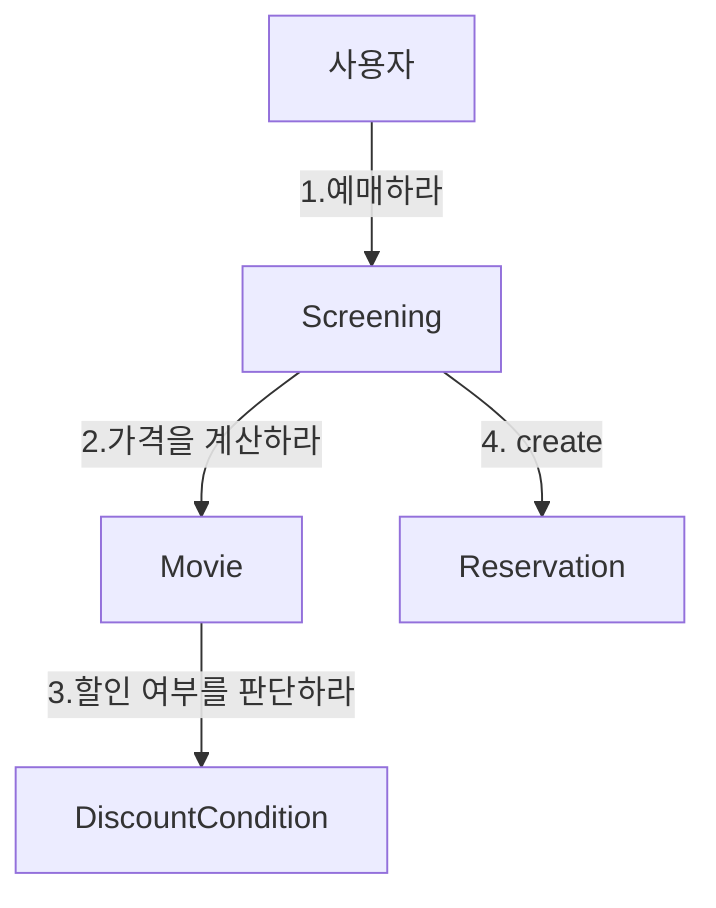
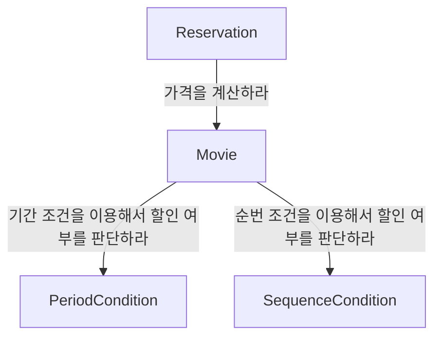
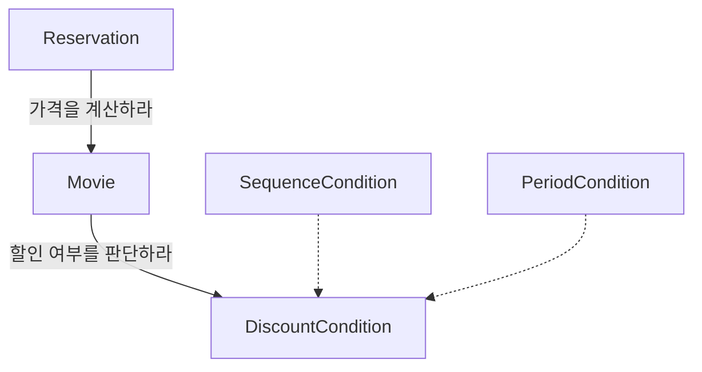
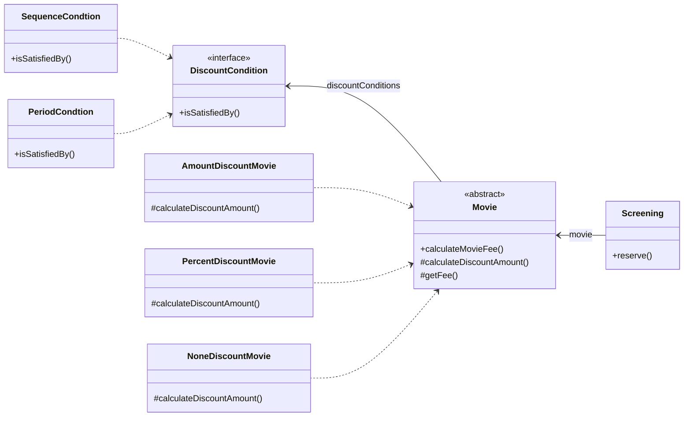

# Chapter 05 책임 할당하기

- 데이터 중심 설계로 인해 발생하는 문제점을 해결할 수 있는 가장 기본적인 방법은 데이터가 아닌 책임에 초점을 맞추는 것이다.
- 책임에 초점을 맞춰서 설계할 때 직면하는 가장 큰 어려움은 어떤 객체에게 어떤 책임을 할당할지를 결정하기가 쉽지 않다는 것이다.
    - 책임 할당 과정은 트레이드 오프 활동이다.
    - 동일한 문제를 해결할 수 있는 다양한 책임 할당 방법이 존재하며 어떤 방법이 최선인지는 상황과 문맥에 따라 달라진다.

<br/>

## 1. 책임 주도 설계를 향해

- 데이터 중심 설계에서 책임 중심의 설계로 전환하기 위해서는 다음의 두 가지 원칙을 따라야 한다.
    - 데이터보다 행동을 먼저 결정하라
    - 협력이라는 문맥 안에서 책임을 결정하라

### 데이터보다 행동을 먼저 결정하라

- 데이터는 객체가 책임을 수행하는 데 필요한 재료를 제공할 뿐이다.
- 너무 이른 시기에 데이터에 초점을 맞추면 객체의 캡슐화가 약화되기 때문에 낮은 응집도와 높은 결합도를 가진 객체들로 넘쳐나게 된다.
    - 그 결과 얻게 되는 것은 변경에 취약한 설계다.
- 우리에게 필요한 것은 객체의 데이터에서 행동으로 무게 중심을 옮기기 위한 기법이다.
    - 가장 기본적인 해결 방법은 객체를 설계하기 위한 질문의 순서를 바꾸는 것이다.
- 데이터 중심의 설계에서 질문의 순서: "이 객체가 포함해야 하는 데이터가 무엇인가?" => "데이터를 처리하는 데 필요한 오퍼레이션은 무엇인가?"
- **책임 중심의 설계에서 질문의 순서: "이 객체가 수행해야 하는 책임은 무엇인가?" => "이 책임을 수행하는 데 필요한 데이터는 무엇인가?"**
    - 즉 책임을 먼저 결정한 후에 객체의 상태를 결정한다는 것이다.

### 협력이라는 문맥 안에서 책임을 결정하라

- 객체에게 할당된 책임의 품질은 협력에 적합한 정도로 결정된다.
    - 객체에게 할당된 책임이 협력에 어울리지 않는다면 그 책임은 나쁜 것이다.
    - 책임이 조금 어색해 보이더라도 협력에 적합하다면 그 책임은 좋은 것이다.
    - **책임은 객체의 입장이 아니라 객체가 참여하는 협력에 적합해야 한다.**
- **협력에 적합한 책임이란 메시지 수신자가 아니라 메시지 전송자에게 적합한 책임을 의미한다.**
- 협력에 적합한 책임을 수확하기 위해서는 객체를 결정한 후에 메시지를 선택하는 것이 아니라 메시지를 결정한 후에 객체를 선택해야 한다.
    - 객체가 메시지를 선택하는 것이 아니라 메시지가 객체를 선택하게 해야 한다.
- 클라이언트는 어떤 객체가 메시지를 수신할지 알지 못한다. 클라이언트는 단지 임의의 객체가 메시지를 수신할 것이라는 사실을 믿고 자신의 의도를 표현한 메시지를 전송할 뿐이다.
    - 메시지를 수신하기로 결정된 객체는 메시지를 처리할 '책임'을 할당 받게 된다.
    - 메시지 전송자 관점에서 메시지 수신자가 깔끔하게 캡슐화된다.

### 책임 주도 설계

- 아래는 3장에서 설명한 책임 주도 설계의 흐름을 다시 나열한 것이다.
1. 시스템이 사용자에게 제공해야 하는 기능인 시스템 책임을 파악한다.
2. 시스템 책임을 더 작은 책임으로 분할한다.
3. 분할된 책임을 수행할 수 있는 적절한 객체 또는 역할을 찾아 책임을 할당한다.
4. 객체가 책임을 수행하는 도중 다른 객체의 도움이 필요한 경우 이를 책임질 적절한 객체 또는 역할을 찾는다.
5. 해당 객체 또는 역할에게 책임을 할당함으로써 두 객체가 협력하게 한다.

- 책임 주도 설계의 핵심은 책임을 결정한 후에 책임을 수행할 객체를 결정하는 것이다. 그리고 협력에 참여하는 객체들의 책임이 어느 정도 정리될 때까지는 객체의 내부 상태에 대해 관심을 가지지 않는 것이다.

<br/>

## 2. 책임 할당을 위한 GRASP

- General Responsibility Assignment Software Pattern (일반적인 책임 할당을 위한 소프트웨어 패턴)
- 객체에게 책임을 할당할 때 지침으로 삼을 수 있는 원칙들의 집합을 패턴 형식으로 정리한 것이다.

### 도메인의 개념에서 출발하기

- 설계를 시작하기 전에 도메인에 대한 개략적인 모습을 그려 보는 것이 유용하다.
- 도메인 안에는 무수히 많은 개념들이 존재하며 이 도메인 개념들을 책임 할당의 대상으로 사용하면 코드에 도메인의 모습을 투영하기가 좀 더 수월해진다.



- 설계를 시작하는 단계에서는 개념들의 의미와 관계가 정확하거나 완벽할 필요가 없다. 잔지 우리에게는 출발점이 필요할 뿐이다.
    - 이 단계에서는 책임을 할당받을 객체들의 종류와 관계에 대한 유용한 정보를 제공할 수 있다면 충분하다.

> 올바른 도메인 모델이란 존재하지 않는다.
> - 많은 사람들이 도메인 모델은 구현과는 무관하다고 생각하지만 이것은 도메인 모델의 개념을 오해한 것이다
> - 도메인 모델은 도메인을 개념적으로 표현한 것이지만 그 안에 포함된 개념과 관계는 구현의 기반이 돼야 한다. (구현을 염두에 둬야 한다!!)
> - 2장과 5장의 도메인 모델이 다르기 때문에 구현이 달라진다는 것을 알게될 것이다.

### 정보 전문가에게 책임을 할당하라

> GRASP: INFORMATION EXPERT Pattern
> - 객체가 자신이 소유하고 있는 정보와 관련된 작업을 수행한다는 일반적인 직관을 표현한 것이다.
> - 여기서 말하는 정보는 데이터와는 다르다는 사실에 주의하라
> - 책임을 수행하는 객체가 정보를 '알고' 있다고 해서 그 정보를 '저장'하고 있을 필요는 없다.

- 책임 주도 설계 방식의 첫 단계는 애플리케이션이 제공해야 하는 기능을 애플리케이션의 책임으로 생각하는 것이다.
    - 이 책임을 애플리케이션에 대해 전송된 메시지로 간주하고 이 메시지를 책임질 첫 번째 객체를 선택하는 것으로 설계를 시작한다.
- 기능을 만들 때 필요한 기본적인 질문은 아래 2가지이다.
    - "메시지를 전송할 객체는 무엇을 원하는가?"
    - "메시지를 수신할 적합한 객체는 누구인가?" => 이 질문에 답하기 위해서는 객체가 상태와 행동을 통합한 캡슐화의 단위라는 사실에 집중해야 한다.

```
** 영화를 예매하는 기능 **
1-1. 첫 번째 질문: "메시지를 전송할 객체는 무엇을 원하는가?" => "예매하라"
1-2. 두 번째 질문: "메시지를 수신할 적합한 객체는 누구인가?" => 정보 전문가 객체로 보이는 'Screening' 선택
2-1. "예매하라" 메시지를 수신했을 때 Screening이 수행해야 하는 작업의 흐름을 생각해본다. 
     이제부터는 외부의 인터페이스가 아닌 Screening의 내부로 들어가 메시지를 처리하기 위해 필요한 절차와 구현을 고민해보는 것이다.
     만약 스스로 처리할 수 없는 작업이 있다면 외부에 도움을 요청해야 한다. 이 요청이 외부로 전송하는 새로운 메시지가 되고 새로운 객체의 책임으로 할당된다.
     예매 가격을 계산하는 작업이 필요하다. 안타깝게도 Screening은 가격을 계산하는 데 필요한 정보를 모르기 때문에 외부 객체 도움을 요청해야 한다.
     여기서 새로운 메시지의 이름으로는 "가격을 계산하라"가 적절할 것 같다.
2-2. 이제 메시지를 책임질 객체를 선택해야 한다. 다시 한 번 강조하지만 기본 원칙은 정보 전문가에게 책임을 할당하는 것이다.
     수신할 적당한 객체는 Movie가 될 것이다.
3-1. 이제 Movie가 어떤 작업을 해야 하는지 생각해보자.
     요금을 계산하기 위해서는 먼저 영화가 할인 가능한지를 판단한 후 할인 정책에 따라 할인 요금을 제외한 금액을 계산하면 된다.
     이 중 Movie가 스스로 할 수 없는 일이 있는데 할인 가능한지에 대한 여부를 판단하는 것이다.
     "할인 여부를 계산하라" 라는 메시지를 전송해서 외부의 도움을 요청해야 한다.
3-2. "할인 여부를 계산하라" 라는 메시지에 대한 정보 전문가는 DiscountCondition이다.
      DiscountCondition에게 책임을 할당하자.
4-1. DiscountCondition은 할인 여부를 판단하는 데 필요한 모든 정보를 알고 있기 때문에 외부의 도움 없이도 할인 여부를 판단할 수 있다.
     따라서 외부에 메시지를 전송하지 않는다.
```



### 높은 응집도와 낮은 결합도

- 설계는 트레이드오프 활동이라는 것을 기억하라. 동일한 기능을 구현할 수 있는 무수히 많은 설계가 존재한다.
    - 따라서 실제로 설계르르 진행하다 보면 몇 가지 설계 중에서 한 가지를 선택해야 하는 경우가 빈번하게 발생한다.
- 올바른 책임 할당을 위해 Information Expert Pattern 외에 다른 책임 할당 패턴들을 함께 고려할 필요가 있다.
- 예를 들어 설계의 대안으로 "할인 여부를 판단하라"라는 메시지를 `Screening`에서 직접 전송해 `DiscountCondition`과 협력하게 하는 것은 어떨까?



- 위 설계는 기능적인 측면에서만 놓고 보면 `Movie`와 `DiscountCondition`이 직접 상호작용하는 앞의 설계와 동일하다.
- 차이점이라면 `DiscountCondition`과 협력하는 객체가 `Movie`가 아니라 `Screening`이라는 것이다.
- 하지만 왜 `DiscountCondition`이 `Movie`와 협력하는 방법을 선택한 것일까?
    - 그 이유는 결합도와 응집도 때문이다.
    - 높은 응집도와 낮은 결합도는 객체에 책임을 할당할 때 항상 고려해야 하는 기본 원리다.
    - 책임을 할당할 수 있는 다양한 대안들이 존재한다면 응집도와 결합도 측면에서 더 나은 대안을 선택하는 것이 좋다.
- GRASP에서는 이를 `LOW COUPLING` 패턴과 `HIGH COHESION` 패턴이라고 부른다.

> LOW COUPLING Pattern
> - 어떻게 하면 의존성을 낮추고 변화의 영향을 줄이며 재사용성을 증가시킬 수 있을까? => 설계의 전체적인 결합도가 낮게 유지되도록 책임을 할당하라
> - 낮은 결합도는 모든 설계 결정에서 염두에 둬야 하는 원리다. 다시 말해 설계 결정을 평가할 때 적용할 수 있는 평가원리다.
> - 현재의 책임 할당을 검토하거나 여러 설계 대안들이 있을 때 낮은 결합도를 유지할 수 있는 설계를 선택하라.

- 어떤 게 결합도가 낮은 방법일까?
    - 도메인 상으로 `Movie`와 `DiscountCondition`은 이미 결합돼 있기 때문에 `Movie`와 `DiscountCondition`을 협력하게 하면 설계 전체적으로 결합도를 추가하지 않고도 협력을 완성할 수 있다.
    - `Screening`이 `DiscountCondition`과 협력할 경우에는 `Screening`과 `DiscountCondition` 사이에 새로운 결합도 추가된다.
    - 따라서 첫 번째 대안이 더 나은 설계 대안이라고 볼 수 있겠다.

> HIGH COHESION Pattern
> - 어떻게 복잡성을 관리할 수 있는 수준으로 유지할 것인가? => 높은 응집도를 유지할 수 있게 책임을 할당하라.
> - 낮은 결합도처럼 높은 응집도 역시 모든 설계 결정에서 염두에 둬야 할 원리다. 다시 말해 설계 결정을 평가할 때 적용할 수 있는 평가 원리다.
> - 현재의 책임 할당을 검토하고 있거나 여러 설계 대안 중 하나를 선택해야 한다면 높은 응집도를 유지할 수 있는 설계를 선택하라.

- 그렇다면 어떤 게 응집도가 높은 방법일까?
    - 새롭게 제안된 대안에 의하면 `DiscountCondition`이 변경되면 `Screening`도 변경되어야 한다.
    - 결과적으로 `Screening`과 `DiscountCondition`이 협력하게 되면 `Screening`은 서로 다른 이유로 변경되는 책임을 짊어지게 되므로 응집도가 낮아질 수밖에 없다.
    - 반면 `Movie`의 주된 책임은 영화 요금을 계산하는 것이다. 영화 요금을 계산하기 위해 필요한 할인 조건을 판단하기 위해 `DiscountCondition`과 협력하는 것은 응집도에 아무런 해도 끼치지 않는다.

### 창조자에게 객체 생성 책임을 할당하라

- 영화 예매 협력의 최종 결과물은 `Reservation` 인스턴스를 생성하는 것이다.
    - 협력에 참여하는 어떤 객체에서는 Reservation 인스턴스를 생성할 책임을 할당해야 한다는 것을 의미한다.
- GRASP의 `CREATOR 창조자` 패턴은 이 같은 경우에 사용할 수 있는 책임 할당 패턴으로서 객체를 생성할 책임을 어떤 객체에게 할당할지에 대한 지침을 제공한다.

>  CREATOR Pattern
> - 객체 A를 생성할 때 어떤 객체에게 객체 생성 책임을 할당해야 하는가? 아래 조건을 최대한 많이 만족하는 B에게 객체 생성 책임을 할당하라.
    >   - B가 A 객체를 포함하거나 참조한다.
>   - B가 A 객체를 기록한다.
>   - B가 A 객체를 긴밀하게 사용한다.
>   - B가 A 객체를 초기화하는 데 필요한 데이터를 가지고 있다. (이 경우 B는 A에 대한 정보 전문가다.)
> - CREATOR 패턴의 의도는 어떤 방식으로든 생성되는 객체와 연결되거나 관련될 필요가 있는 객체에 해당 객체를 생ㅇ성할 책임을 맡기는 것이다.
> - 생성될 객체에 대해 잘 알고 있어야 하거나 그 객체를 사용해야 하는 객체는 어떤 방식으로든 생성될 객체와 연결될 것이다.
> - 이미 결합돼 있는 객체에게 생성 책임을 할당하는 것은 설계의 전체적인 결합도에 영향을 미치지 않는다.
> - 결과적으로 CREATOR 패턴은 이미 존재하는 객체 사이의 관계를 이용하기 때문에 설계가 낮은 결합도를 유지할 수 있게 한다.

- `Reservation`을 잘 알고 있거나 긴밀하게 사용하거나 초기화에 필요한 데이터를 가지고 있는 객체는 무엇일까? `Screening`이다.



- 대략적으로나마 영화 예매에 필요한 책임을 객체들에게 할당했다.
    - 현재까지의 책임 분배는 설계를 시작하기 위한 대략적인 스케치에 불과하다.
    - 실제 설계는 코드를 작성하는 동안 이뤄진다.
    - 협력과 책임이 제대로 동작하는지를 확인할 수 있는 유일한 방법은 코드를 작성하고 실행해 보는 것뿐이다.

<br/>

## 3. 구현을 통한 검증

**여기서 의문. 책을 보니 구현의 flow가 설계와 동일한 것을 알 수 있다. 굳이 그렇게 해야하는 이유가 있을까?**

- 먼저 예매하라 메시지에 응답을 할 수 있어야 한다. 이 메시지를 처리할 수 있는 메서드를 구현하자.

```java
public class Screening {
  public Reservation reserve(Customer customer, int audienceCount) {}
}
```

- 책임이 결정됐으므로 책임을 수행하는 데 필요한 인스턴스 변수를 결정해야 한다.

```java
public class Screening {

  private Movie movie;
  private int sequence;
  private LocalDateTime whenScreened;

  public Reservation reserve(Customer customer, int audienceCount) {}
}
```

- 이제 행위를 구현해보자


```java
public class Screening {

  private Movie movie;
  private int sequence;
  private LocalDateTime whenScreened;

  public Reservation reserve(Customer customer, int audienceCount) {
    return new Reservation(customer, this, calculateFee(audienceCount), audienceCount);
  }

  private Money calculateFee(final int audienceCount) {
    return movie.calculateMovieFee(this).times(audienceCount);
  }
}
```

### DiscountCondition 개선하기

- `DiscountCondition`의 가장 큰 문제점은 변경에 취약한 클래스라는 것이다.
- 변경에 취약한 클래스란 코드를 수정해야 하는 이유를 하나 이상 가지는 클래스다. 아래의 이유들로 인해 `DiscountCondition` 클래스는 수정될 수 있다.
1. 새로운 할인 조건 추가
2. 순번 조건을 판단하는 로직 변경
3. 기간 조건을 판단하는 로직이 변경되는 경우

> 클래스 응집도 판단하기
> - 클래스가 아래와 같은 징후로 몸살을 앓고 있다면 클래스의 응집도 낮은 것이다.
> 1. 클래스가 하나 이상의 이유로 변경돼야 한다면 응집도가 낮은 것이다. 변경의 이유를 기준으로 클래스를 분리하라.
> 2. 클래스의 인스턴스를 초기화하는 시점에 경우에 따라 서로 다른 속성들을 초기화하고 있다면 응집도가 낮은 것이다. 초기화되는 속성의 그룹을 기준으로 클래스를 분리하라.
> 3. 메소드 그룹이 속성 그룹을 사용하는지 여부로 나뉜다면 응집도가 낮은 것이다. 이들 그룹을 기준으로 클래스를 분리하라.
> - 메소드의 크기가 너무 커서 긴 코드 라인 속에 문제가 숨겨져 명확하게 보이지 않을 수도 있다. 이런 경우 긴 메소드를 응집도 높은 작은 메소드로 잘게 분해해 나가면 숨겨져 있던 문제점이 명확하게 드러나는 경우가 많다.

### 타입 분리하기

- DiscountCondition의 가장 큰 문제는 순번 조건과 기간 조건이라는 두 개의 독립적인 타입이 하나의 클래스 안에 공존하고 있다는 점이다.
    - 가장 먼저 떠오르는 해결 방법은 두 타입을 `SequenceCondtion`과 `PeriodCondition`이라는 두 개의 클래스로 분리하는 것이다.

```java
public class PeriodCondition {

  private DayOfWeek dayOfWeek;
  private LocalTime startTime;
  private LocalTime endTime;

  public PeriodCondition(final DayOfWeek dayOfWeek, final LocalTime startTime,
      final LocalTime endTime) {
    this.dayOfWeek = dayOfWeek;
    this.startTime = startTime;
    this.endTime = endTime;
  }

  public boolean isSatisfiedBy(final Screening screening) {
    return dayOfWeek.equals(screening.getWhenScreened().getDayOfWeek())
        && startTime.compareTo(screening.getWhenScreened().toLocalTime()) <= 0
        && endTime.compareTo(screening.getWhenScreened().toLocalTime()) >= 0;
  }
}
```

```java
public class SequenceCondition {

  private int sequence;

  public SequenceCondition(final int sequence) {
    this.sequence = sequence;
  }

  public boolean isSatisfiedBy(final Screening screening) {
    return sequence == screening.getSequence();
  }
}
```

- 대신 아래와 같이 각각의 목록을 따로 관리해야 한다는 단점이 있다.

```java
public class Movie {
  private List<PeriodCondition> periodConditions;
  private List<SequenceCondition> sequenceConditions;
  
  private boolean isDiscountable(final Screening screening) {
    return checkPeriodConditions(screening) || checkSequenceConditions(screening);
  }

  private boolean checkPeriodConditions(Screening screening) {
    return periodConditions.stream().anyMatch(condition -> condition.isSatisfiedBy(screening));
  }

  private boolean checkSequenceConditions(Screening screening) {
    return sequenceConditions.stream().anyMatch(condition -> condition.isSatisfiedBy(screening));
  }
}
```



1. 설계 관점에서의 전체적인 결합도가 높아졌다.
- condition 목록을 관리하는 필드가 하나 더 늘어났다.
2. 수정 후에 새로운 할인 조건을 추가하기가 더 어려워졌다.
- 할인 조건을 추가할 때마다 `Movie` 새로운 필드가 추가되어야 한다.
- 그리고 이 `List`를 사용해 할인 조건을 만족하는지 여부를 판단하는 메소드도 추가해야 한다.
- 마지막으로 `Movie`의 `idDiscountable` 메소드도 수정해야 한다.
- 클래스를 분리하고 나서 `DiscountCondition`의 응집도는 올라갔지만 변경과 캡슐화 관점에서 보면 전체적인 설계의 품질이 나빠졌다.

### 다형성을 통해 분리하기

- 사실 Movie 입장에서 보면 `SequenceCondition`와 `PeriodCondition`은 아무 차이가 없다.
    - 어차피 둘 다 할인 여부를 판단하는 동일한 책임을 수행하고 있기 때문이다.
- 이 시점이 되면 `역할`의 개념이 무대 위로 등장한다.



```java
public interface DiscountCondition {

  boolean isSatisfiedBy(Screening screening);
}
```

```java
public class SequenceCondition implements DiscountCondition {...}
```

```java
public class PeriodCondition implements DiscountCondition {...}
```

```java
public class Movie {
  private List<DiscountCondition> discountConditions;

  private boolean isDiscountable(final Screening screening) {
    return discountConditions.stream().anyMatch(condition -> condition.isSatisfiedBy(screening));
  }
}
```

- `Movie`와 `DiscountCondition` 사이의 협력은 다형적이다.
- 객체의 암시적인 타입에 따라 행동을 분기해야 한다면 암시적인 타입을 명시적인 클래스로 정의하고 행동을 나눔으로써 응집도 문제를 해결할 수 있다.
- 다시 말해 객체의 타입에 따라 변하는 행동이 있다면 타입을 분리하고 변화하는 행동을 각 타입의 책임으로 할당하라는 것이다.
- GRASP에서 이를 `POLYMORPHISM 다형성` 패턴이라고 부른다.

> POLYMORPHISM Pattern
> - 객체의 타입에 따라 변하는 로직이 있을 때 변하는 로직을 담당할 책임을 어떻게 할당해야 하는가? => 타입을 명시적으로 정의하고 각 타입에 다형적으로 행동하는 책임을 할당하라.
> - 프로그램을 if ~ else 또는 switch ~ case 등의 조건 논리를 사용해서 설계한다면 새로운 변화가 일어난 경우 조건 논리를 수정해야 한다.
    >   - 이것은 프로그램을 수정하기 어렵고 변경에 취약하게 만든다.
> - 조건적인 논리 대신 다형성의 이용하면 새로운 변화를 다루기 쉬워진다.

### 변경으로부터 보호하기

- 이제 `DiscountCondition`의 서브 클래스는 서로 다른 이유로 변경된다.
    - `SequenceCondition`: 순번 조건의 구현 방법이 변경될 경우에만 수정된다.
    - `PeriodCondtion`: 기간 조건의 구현 방법이 변경될 경우에만 수정된다.
- 새로운 할인 조건을 추가하는 경우에는 어떻게 될까?
    - `DiscountCondition`의 역할이 `Movie`로부터 `SequenceCondition`와 `PeriodCondtion`의 존재를 감춘다는 사실에 주목하라.
    - `Movie`의 관점에서 새로운 `DiscountCondtiion`이 추가되더라도 `Movie`가 영향을 받지 않는다는 것을 의미한다.
- 이처럼 변경을 캡슐화하도록 책임을 할당하는 것을 GRASP에서는 `PROTECTED VARIATIONS 변경 보호` 패턴이라고 부른다.

> PROTECTED VARIATIONS 패턴
> - 객체, 서브시스템, 그리고 시스템을 어떻게 설계해야 변화와 불안정성이 다른 요소에 나쁜 영향을 미치지 않도록 방지할 수 있을까?
> - 변화가 예상되는 불안정한 지점들을 식별하고 그 주위에 안정된 인터페이스를 형성하도록 책임을 할당하라.
> - "설계에서 변하는 것이 무엇인지 고려하고 변하는 개념을 캡슐화하라."

- 하나의 클래스가 여러 타입의 행동을 구현하고 있는 것처럼 보인다면 클래스를 분해하고 `POLYMORPHISM` 패턴에 따라 책임을 분산시켜라.
- 예측 가능한 변경으로 인해 여러 클래스들이 불안정해진다면 `PROTECTED VARIATIONS` 패턴에 따라 안정적인 인터페이스 뒤로 변경을 캡슐화하라.

### Movie 클래스 개선하기

- `Movie` 역시 `DiscountCondition`과 동일한 문제로 몸살을 앓고 있다.
    - 금액 할인 정책 영화와 비율 할인 정책 영화라는 두 가지 타입을 하나의 클래스 안에 구현하고 있기 때문에 하나 이상의 이유로 변경될 수 있다.
    - 한마디로 응집도가 낮은 것이다.
- `POLYMORPHISM` 패턴을 사용해 서로 다른 행동을 타입별로 분리하면 다형성의 혜택을 누릴 수 있다.
- 이렇게 하면 `Screening`과 `Movie`가 메시지를 통해 다형적으로 협력하기 때문에 `Movie`의 타입을 추가하더라도 `Screening`에 영향을 미치지 않게 할 수 있다.
    - 이것은 `PROTECTED VARIATIONS` 패턴을 이용해 타입의 종류를 안정적인 인터페이스 뒤로 캡슐화할 수 있다는 것을 의미한다.



- 모든 클래스의 내부 구현은 캡슐화돼 있고 모든 클래스는 변경의 이유를 오직 하나씩만 가진다.
- 각 클래스는 응집도가 높고 다른 클래스와 최대한 느슨하게 결합돼 있다.
- 클래스는 작고 오직 한 가지 일만 수행한다. 책임은 적절하게 분배돼 있다.
- 이것이 책임을 중심으로 협력을 설계할 때 얻을 수 있는 혜택이다.
- 데이터 중심의 설계는 정반대의 길을 걷는다.
    - 데이터와 관련된 클래스 내부 구현이 인터페이스에 여과 없이 노출되기 때문에 캡슐화를 지키기 어렵다.
    - 이로 인해 응집도가 낮고 결합도가 높으며 변경에 취약한 코드가 만들어질 가능성이 높다.

> 도메인의 구조가 코드의 구조를 이끈다.
> - 도메인 모델은 단순히 설계에 필요한 용어를 제공하는 것을 넘어 코드의 구조에도 영향을 미친다.
> - 변경 역시 도메인 모델의 일부다. 도메인 모델에는 도메인 안에서 변하는 개념과 이들 사이의 관계가 투영돼 있어야 한다.
> - 구현을 가이드할 수 있는 도메인 모델을 선택하라. 객체지향은 도메인의 개념과 구조를 반영한 코드를 가능하게 만들기 때문에 도메인의 구조가 코드 구조를 이끌어 내는 것은 자연스러울뿐만 아니라 바람직한 것이다.

### 변경과 유연성

- 설계가 주도하는 것은 변경이다. 개발자로서 변경에 대비할 수 있는 방법은 2가지다. (대부분은 전자가 좋은 방향)
1. 코드를 이해하고 수정하기 쉽도록 최대한 단순하게 설계하는 것이다.
2. 코드를 수정하지 않고도 변경을 수용할 수 있도록 코드를 더 유연하게 만드는 것이다.
- 현재 할인 정책을 구현하고 위해 상속을 사용하고 있기 때문에 실행 중에 영화의 할인 정책을 변경하기 위해서는 새로운 인스턴스를 생성한 후 필요한 정보를 복제해야 한다.ㄴ
- 새로운 할인 정책이 추가될 때마다 인스턴스를 생성하고, 상태를 복사하고, 식별자를 관리하는 코드를 추가하는 일은 번거롭고 오류를 만든다.
- 이 경우 코드의 복잡성이 높아지더라도 할인 정책의 변경을 쉽게 수용할 수 있게 코드를 유연하게 만드는 것이 좋다.
- 해결 방법은 상속 대신 `합성 Composition`을 사용하는 것이다.
    - `Movie` 안에서 구현된 할인 정책을 독립적인 `DiscountPolicy`로 분리한 후 `Movie`에 합성시키면 유연한 설계가 된다.
- 이제 금액 할인 정책이 적용된 영화를 비율 할인 정책으로 바꾸는 일은 Movie에 연결된 DiscountPolicy의 인스턴스를 교체하는 단순한 작업으로 바뀐다.
- 이제 2장에 소개했던 코드와 동일한 구조에 도달하게 된다.

> 코드의 구조가 도메인 구조에 대한 새로운 통찰력을 제공한다.
> - 코드의 구조가 바뀌면 도메인에 대한 관점도 함께 바뀐다.
> - 할인 정책이라는 개념을 코드 상에 명시적으로 드러냈다면 도메인 모델 역시 코드의 관점에 따라 바뀌어야 한다.
> - 도메인 모델은 단순히 도메인의 개념과 관계를 모아 놓은 것이 아니다. 도메인 모델은 구현과 밀접한 관계를 맺어야 한다.
> - 도메인 모델은 코드에 대한 가이드를 제공할 수 있어야 하며 코드의 변화에 발맞춰 함께 변화해야 한다.

<br/>

## 4. 책임 주도 설계의 대안

- 책임 주도 설계에 익숙해지기 위해서는 부단한 노력과 시간이 필요하다.
- 설계를 진행하는 동안 데이터가 아닌 책임 관점에서 사고하기 위해서는 충분한 경험과 학습이 필요하다.
- 책임과 객체 사이에서 방황할 때 돌파구를 찾기 위해 선택하는 방법은 최대한 빠르게 목적한 기능을 수행하는 코드를 작성하는 것이다.
- 아무것도 없는 상태에서 책임과 협력에 관해 고민하기보다는 일단 싱핼되는 코드를 얻고 난 후에 코드 상에 명확하게 드러나는 책임들을 올바른 위치로 이동시키는 것이다.
- 객체지향 설계에 대한 경험이 부족한 개발자들과 페어 프로그래밍을 할 때나 설계의 실마리가 풀리지 않을 때 이런 방법을 사용하는데 생각보다 훌륭한 설계를 얻게 되는 경우가 종종 있다.
- 주의할 점은 코드를 수정한 후에 겉으로 드러나는 동작이 바뀌어서는 안 된다는 것이다. 캡슐화를 항상시키도 응집도를 높이고 결합도를 낮춰야 하지만 동작은 그대로 유지해야 한다.
- 겉으로 보이는 동작은 바꾸지 않은 채 내부 구조를 변경하는 것을 리팩토링(Refactoring)이라고 부른다.

> 객체 디자인에서 가장 기본이 되는 것 중 하나는 책임을 어디에 둘지를 결정하는 것이다. 나는 십년 이상 객체를 가지고 일했지만 처음 시작할 때는 여전히 적당한 위치를 찾지 못한다. 늘 이런 점이 나를 괴롭혔지만, 이제는 이런 경우에 리팩토링을 사용하면 된다는 것을 알게 되었다.

### 메소드 응집도

- 긴 메소드는 다양한 측면에서 코드의 유지보수에 부정적인 영향을 미친다.
1. 어떤 일을 수행하는지 한눈에 파악하기 어렵기 때문에 코드를 전체적으로 이해하는 데 너무 많은 시간이 걸린다.
2. 하나의 메소드 안에서 너무 많은 작업을 처리하기 때문에 변경이 필요할 때 수정해야 할 부분을 찾기 어렵다.
3. 메소드 내부의 일부 로직만 수정하더라도 메소드의 나머지 부분에서 버그가 발생할 확률이 높다.
4. 로직의 리부만 재사용하는 것이 불가능하다.
5. 코드를 재사용하는 유일한 방법은 원하는 코드를 복사해서 붙여넣는 것뿐이므로 코드 중복을 초래하기 쉽다.
- 한 마디로 긴 메소드는 응집도가 낮아 이해하기도 어렵고 재사용하기도 어려우면 변경하기도 어렵다. 마이클 페더스는 이런 메소드를 몬스터 메소드라고 부른다.
- 응집도가 낮은 메소드는 로직의 흐름을 이해하기 위해 주석이 필요한 경우가 대부분이다.
    - 차라리 주석을 추가하는 대신 메소드를 작게 분해해서 각 메소드의 응집도를 높여라.
- 응집도가 높은 메소드가 변경되는 이규는 단 하나여야 한다. 클래스가 작고 목적이 명확한 메소드들로 구성돼 있다면 변경을 처리하기 위해 어떤 메소드를 수정해야 하는지를 쉽게 판단할 수 있다.

> 메소드로 뽑아내는 것이 코드를 더욱 명확하게 하면 새로 만든 메소드의 이름이 원래 코드의 깅리보다 길어져도 뽑아낸다.

- 객체로 책임을 분배할 때 가장 먼저 할 일은 메소드를 응집도 있는 수준으로 분해하는 것이다.
- 긴 메소드를 작고 응집도 높은 메소드로 분리하면 각 메소드를 적절한 클래스로 이동하기가 더 수월해지기 때문이다.

### 객체를 자율적으로 만들자

- 자신이 소유하고 있는 데이터를 자기 스르로 처리하도록 만드는 것이 자율적인 객체르르 만드는 지름길이다.
- 따라서 메소드가 사용하는 데이터를 저장하고 있는 클래스로 메소드를 이동시키면 된다.
- 메소드를 이동시키면서 어떤 메소드가 어떤 클래스에 위치해야 하는지에 대한 감을 잡아가면서 다양한 기능을 책임 주도 설계 방식에 따라 설계하고 구현해보자.
- 책임 주도 설계에 익숙하지 않다면 일단 데이터 중심으로 구현한 후 이를 리팩토링하더라도 유사한 결과를 얻을 수 있다.
- 처음부터 책임 주도 설계를 따르는 것보다 동작하는 코드를 작성한 후에 리팩토링하는 것이 더 훌륭한 결과물을 나을 수도 있다.

<br/>

# 참고자료

- 오브젝트, 조영호 지음
