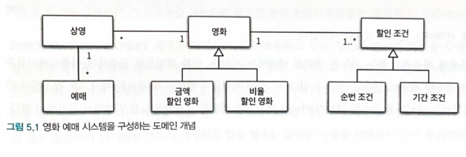

# 책임 할당하기

4장 복습 : 4장에서는 데이터 중심 접근법을 취할 경우 1) 캡슐화 위반 가능성이 높아지고 2) 결합도 높아지고, 3) 코드가 변경하기 어려워지는 문제점을 공부해봤다.

`다양한 책임 할당의 방법이 존재한다.` 어떤 방법이 최선인지는 상황과 문맥에 따라 달라진다. 올바른 설계를 위해서 다양한 관점에서 설계를 평가할 수 있어야 한다.

`GRASP`패턴을 공부해보자. 2장에서 소개한 코드의 설계 과정을 한 걸음씩 따라가면서 객체 책임 할당의 기본적인 원리를 살펴보자. 

## 01책임 주도 설계를 향해
데이터 주도 설계를 책임주도 설계로 바꿀 때 따라야하는 원칙 2가지
- 데이터보다 행동을 먼저 결정하라
- 협력이라는 문맥 안에서 책임을 결정하라.

### 데이터보다 행동을 먼저 결정하라.
협력 안에서 수행하는 책임이 객체의 존재가치임. 그럼 객체에게 어떤 책임을 할당해야하는가.

### 협력이라는 문맥 안에서 책임을 결정하라.
책임의 품질은 협력에 적합한 정도로 표현된다. 객체 입장에서 책임이 어색해보이더라도, 협력에 적합하면 괜찮다.
메세지를 먼저 결정하고 그걸 수행할 객체를 찾는다. 

## 02 책임 할당을 위한 GRASP 패턴
Craig Larman이 고안한 GRASP 패턴 : General Responsibility Assignment Software Pattern(일반적인 책임할당을 위한 소프트웨어 패턴)

### 도메인 개념에서 출발하기
설계 전에 도메인에 대한 개략적인 모습 그려보기

개념들의 관계가 정확하거나 완벽할 필요는 없다. 그냥 그려보기 - 중요한 것은 설계를 시작하는 것이지, 도메인 개념들을 완벽하게 정리하는 것이 아니다.

> 올바른 도메인 모델은 존재하지 않는다. 도메인 모델은 시스템의 모델에 영향을 미친다. 그걸 고려하면서 도메인 모델을 짜는 것이 좋다.
> 단 설계를 하다보면 재사용성과 유연성으로 말미암아 도메인 모델이 변경될 수 있다.
 
### 정보 전문가에게 책임을 할당하라
에플리케이션도 메세지를 받는 주체라고 생각하면 편하다.

메세지를 전송할 객체는 무엇을 원하는가 ? 
그 메세지는 `"예매하라"`이다.

메세지를 수신할 적합한 객체는 누구인가 ?

도메인 모델 중에서는 '상영'이 가장 적합한 객체일 것이다. 상영에게 예매를 위한 책임을 할당하자. 

상영은 가격을 계산하는 것에 대해서는 잘 모른다. 그러므로 가격 계산을 다시 메세지로 던지자. 영화 가격에 대해서 필요한 정보를 가지고 있는 객체는 '영화'이다. 

영화는 가격 계산시에 할인 조건이 맞아서 할인을 할 것인지 여부를 판단하지는 못한다. 이걸 "discountCondition"이라는 객체에 요청하자. 

### 높은 응집도와 낮은 결합도
만약 Screening이 직접 discountPolicy에게 할인이 가능한지 메세지를 요청하고 그 반환 결과값으로 movie에게 가격 계산을 요청한다면 어떻게 될까?

우리는 왜 moive를 선택한 걸까?
그 이유는 응집도와 결합도에 있다. 
> Low Coupling 관점 

영화는 이미 할인 조건을 포함하고 있다. 만약 상영에 할인조건을 추가한다면 추가적인 결합도를 높이는 것이다.

> High Cohesion

결합되어 있기 때문에, 변경시 영향을 받을 수도 있다. 

### 창조자 패턴
A를 생성해야할 때, 아래 조건이 가장 많은 객체에게 생성 책임을 할당하라!
- B가 A 객체를 포함하거나 참조한다.
- B가 A 객체를 기록한다.
- B가 A 객체를 긴밀히 사용한다.
- B가 A 객체를 초기화하는데 필요한 데이터를 가지고 있다.(이 경우 B는 A의 정보전문가다.)

이렇게 함으로써 설계가 낮은 결합도를 유지할 수 있게 한다. 

영화의 예매는 reservation이라는 객체 생성을 목표로 하는데 이에 가장 적합한 생성객체는 Screening이다. 

## 03 구현을 통한 검증

### DiscountCondition 개선하기 : 클래스 응집도 파악하기

변경에 취약한 코드가 되었음.  -> 변경에 취약하다 = 코드를 수정해야하는 이유가 하나 이상인 클래스.

DiscountCondition의 경우 변경에 취약함. 

이를 알아차리는 몇가지 팁

1) 인스턴스 변수 초기화하는 곳을 봐라. 응집도가 높으면 모든 속성을 함께 초기화한다. 하지만 응집도가 낮으면 일부만 초기화한다.
예를 들어 PeriodCondition을 사용하려면 sequence는 사용하지 않는 것이다. -> 함께 초기화되는 속성을 기준으로 코드를 분리해야한다. 

2) 메서드들이 인스턴스 변수를 사용하는 방식을 보자. 
3) 모든 메서드가 모든 속성을 사용한다면 클래스의 응집도가 높다고 볼 수 있다. 반면 메서드들이 사용하는 속성에 따라 그룹이 나뉜다면 클래스 응집도가 낮은 것이다.

### 타입 분리하기 -> 추상화하기 
타입 분리하기만 실행하면 결합도가 높아진다. 높아진 결합도는 추상화를 통해서 낮추자. 
다형성 패턴 : 타입을 분리하고, 변화하는 행동을 각 타입의 책임으로 할당해라! 

### 변경으로부터 보호하기
변경 보호 패턴 : 할인 조건이 추가되어도, 이미 캡슐화되어 있기 때문에 Movie는 변경되지 않는다. 

### Movie 클래스 개선하기 
### 변경과 유연성
설계를 주도하는 것은 변경이다. 

지금까지의 설계에서는 영화의 할인 정책을 바꾸려면 새로운 인스턴스를 생성해야만 한다. 
discountPolicy를 만들어서 좀 더 쉽게 바꿀 수 있다. 

## 04 책임 주도 설계의 대안
책임 주도 설계에 익숙해지기 위해서는 부단한 노력과 시간이 필요하다. 
돌파구를 찾는 하나의 방법은 최대한 목적한 기능을 수행하는 코드를 작성해보는 것이다. 
일단 실행되는 코드를 얻고 나서, 책임들을 올바른 위치로 이동시키는 것이다. 

긴코드는 여러 측면에서 버그를 일으킬 가능성이 높다. - `몬스터 메서드`
메서드를 작게 분해해서 응집도를 높여라. 

몬스터 메서드에서 메서드들을 잘 분리해놓으면 책임을 옮기기가 쉬워진다.  

### 객체를 자율적으로 만들자. 

## 정리
메서드를 잘게 짤라서 몬스터 메서드를 책임이 명확한 메서드들로 나눠라.
.getter()를 호출하는 부분을 그 객체에게 책임으로 넘겨라

