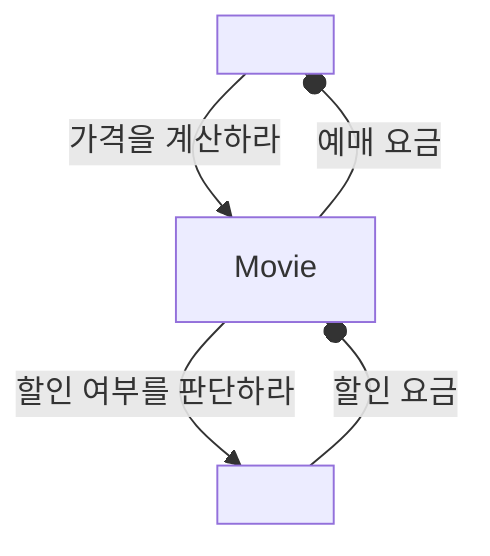

# Chapter 06 메시지와 인터페이스

- 객체지향 프로그래밍의 가장 흔한 오해는 애플리케이션이 클래스의 집합으로 구성된다는 것이다.
    - 물론 클래스는 중요하다. 하지만 클래스는 도구일 뿐이다.
    - 클래스라는 구현 도구에 지나치게 집착하면 경직되고 유현하지 못한 설계에 이를 확률이 높아진다.
- 훌륭한 객체지향 코드를 얻기 위해서는 클래스가 아니라 객체를 지향해야 한다.
    - 협력 안에서 객체가 수행하는 수행에 초점을 맞춰야 한다는 의미다.
    - 여기서 중요한 것은 책임이 객체가 수신할 수 있는 메시지의 기반이 된다는 것이다.
- 객체지향 애플리케이션의 가장 중요한 재료는 클래스가 아니라 객체들이 주고받는 메시지다.
    - 애플리케이션은 클래스로 구성되지만 메시지를 통해 정의된다는 사실을 기억하라.
- 객체가 수신하는 메시지들이 객체의 퍼블릭 인터페이스를 구성한다.

<br/>

## 1. 협력과 메시지

### 1-1. 클라이언트-서버 모델

- 협력은 어떤 객체가 다른 객체에게 무언가를 요청할 때 시작된다.
- 메시지는 객체 사이의 협력을 가능하게 하는 매개체다.
- 객체가 다른 객체에게 접근할 수 있는 유일한 방법은 메시지를 전송하는 것뿐이다.
- 두 객체 사이의 협력 관계를 설명하기 위해 사용하는 전통적인 메타포는 `클라이언트-서버 Client-Server` 모델이다.
    - 메시지를 전송하는 객체르르 클라이언트, 메시지를 수신하는 객체를 서버라고 부른다.
    - 협력은 클라이언트가 서버의 서비스를 요청하는 단방향 상호작용이다.
- 객체는 서버와 클라이언트의 역할을 동시에 수행하는 것이 일반적이다.
    - 협력의 관점에서 객체는 두 가지 종류의 메시지 집합으로 구성된다.
    1. 객체가 수신하는 메시지의 집합
    2. 외부의 객체에게 전송하는 메시지의 집합



- 객체가 독립적으로 수행할 수 있는 것보다 더 큰 책임을 수행하기 위해서는 다른 객체와 협력해야 한다는 것이다.

### 메시지와 전송

- 한 객체가 다른 객체에게 도움을 요청하는 것을 `메시지 전송 message sending` 혹은 `메시지 패싱 message passing`이라고 한다.
- 메시지를 전송하는 객체를 `메시지 전송자 message sender`라고 하고 수신하는 객체를 `메시지 수신자 message receiver`라고 한다.
- 메시지는 `오퍼레이션명 operation name`과 `인자 argument`로 구성되면 메시지 전송은 여기에 메시지 수신자를 추가한 것이다.

### 메시지와 메소드

- 메시지를 수신했을 때 실제로 실행되는 함수 또는 프로시저를 `메소드`라고 한다.
    - 중요한 것은 코드 상에서 동일한 이름의 변수에게 동일한 메시지를 전송하더라도 객체의 타입에 따라 실행되는 메소드가 달라질 수 있다는 점이다.
- 메시지 전송을 코드 상에 표기하는 시점에는 어떤 코드가 실행될 것인지를 정확하게 알 수 없다.
    - 실행 시점에 실제로 실행되는 코드는 메시지를 수신하는 객체의 타입에 따라 달라지기 때문이다.

> - 객체들로 구성된 시스템 안의 행동은 두 가지 방법으로 명세할 수 있다. 메시지와 메소드
> - 계산을 메시지와 메소드로 분리하고 실행 시간에 수신자의 클래스에 기반해서 메시지를 메소드에 바인딩하는 것은 일반적인 프로시저 호출의 관점에서 아주 작은 변화처럼 보이지만 이 작은 변화가 커다란 차이를 만든다.

- 메시지와 메소드의 구분은 메시지 전송자와 메시지 수신자가 느슨하게 결합될 수 있게 한다.
    - 메시지 전송자는 자신이 어떤 메시지를 전송해야 하는지만 알면 된다.
    - 수신자가 어떤 클래스의 인스턴스인지, 어떤 방식으로 요청을 처리하는지 모르더라도 원활한 협력이 가능하다.
- 실행 시점에 메시지와 메소드를 바인딩하는 매커니즘은 두 객체 사이의 결합도를 낮춤으로써 유연하고 확장 가능한 코드를 작성할 수 있게 만든다.

### 퍼블릭 인터페이스와 오퍼레이션

- 객체는 안과 밖을 구분하는 뚜렷한 경계를 가진다.
    - 외부의 객체는 객체가 공개하는 메시지를 통해서만 객체와 상호작용할 수 있다.
    - 이처럼 객체가 의사소통을 위해 외부에 공개하는 메시지의 집합을 `퍼블릭 인터페이스 public interface`라고 부른다.
- 퍼블릭 인터페이스에 포함된 메시지를 `오퍼레이션 operation`이라고 부른다.
    - 오퍼레이션은 수행 가능한 어떤 행동에 대한 추상화다.
- 반면 메시지를 수신했을 때 실제로 실행되는 코드는 메소드라고 부른다.

> UML에서의 공식적으로 정의한 오퍼레이션의 의미.
> - 오퍼레이션이란 실행하기 위해 객체가 호출될 수 있는 변환이나 정의에 관한 명세.
> - UML 용어로 말하자면 인터페이스의 각 요소는 오퍼레이션이다. 오퍼레이션은 구현이 아닌 추상화다.
> - 반면 UML의 메소드는 오퍼레이션을 구현한 것이다. 인용하면 메소드는 오퍼레이션에 대한 구현이다. 메소드는 오퍼레이션과 연관된 알고리즘 또는 절차를 명시한다.

- 따라서 퍼블릭 인터페이스와 메시지의 관점에서 보면 `메소드 호출`보다는 `오퍼레이션 호출`이라는 용어를 사용하는 것이 더 적절하다.

### 시그니처

- 오퍼레이션의 이름과 파라미터 목록을 합쳐 `시그니처 signature`라고 부른다.
    - 오퍼레이션은 실행 코드 없이 시그니처만을 정의한 것이다.
    - 메소드는 이 시그니처에 구현을 더한 것이다.
- 중요한 것은 객체가 수신할 수 있는 메시지가 객체의 퍼블릭 인터페이스와 그 안에 포함될 오퍼레이션을 결정한다는 것이다.
    - 객체의 퍼블릭 인터페이스가 객체의 품질을 결정하기 때문에 결국 메시지가 객체의 품질을 결정한다고 할 수 있다.

<br/>

## 2. 인터페이스와 설계 품질

- 좋은 인터페이스는 **최소한의 인터페이스**와 **추상적인 인터페이스**라는 조건을 만족해야 한다.
    - **최소한의 인터페이스**는 꼭 필요한 오퍼레이션만 인터페이스에 포함한다.
    - **추상적인 인터페이스**는 어떻게 수행하는지가 아니라 무엇을 하는지를 표현한다.
- 퍼블릭 인터페이스의 품질에 영향을 미치는 원칙과 기법들
    - 디미터 법칙
    - 묻지 말고 시켜라
    - 의도를 드러내는 인터페이스
    - 명령-쿼리 분리

### 디미터 법칙

- 협력하는 객체의 내부 구조에 대한 결합으로 인해 발생하는 설계 문제를 해결하기 위해 제안된 원칙이 바로 `디미터 법칙 Law of Demeter`이다.
    - 객체 내부 구조에 강하게 결합되지 않도록 협력 경로를 제한하라는 의미다.
    - 도트(.)를 이용해 메시지 전송을 표현하는 언어에서는 `오직 하나의 도트만 사용하라 use only one dot`라는 말로 요약된다.

> 디미터 법칙과 캡슐화
> - 디미터 법칙은 캡슐화를 다른 관점에서 표현한 것이다. 디미터 법칙이 가치 있는 이유는 클래스를 캡슐화하기 위해 따라야 하는 구체적인 지침을 제공하기 때문이다.
> - 캡슐화 원칙이 클래스 내부의 구현을 감춰야 한다는 사실을 강조한다면 디미터 법칙은 협력하는 클래스의 캡슐화를 지키기 위해 접근해야 하는 요소를 제한한다.

- 아래 코드는 전형적으로 디미터 법칙을 위반한 코드다.
    - 메시지 전송자가 수진자 내부 구조에 대해 물어보고 반환받은 요소에 대해 연쇄적으로 메시지를 전송한다.
        - 흔히 이와 같은 코드를 `기차 충돌 train wreck`이라고 부른다.
        - 메시지 수진자의 캡슐화는 무너지고 메시지 전송자가 메시지 수신자의 내부 구현에 강하게 결합된다.
- 하지만 무비판적으로 디미터 법치을 수용하면 퍼블릭 인터페이스 관점에서 객체의 응집도가 낮아질 수도 있다.

```java
screening.getMovie().getDiscountConditions();
```

### 묻지 말고 시켜라

- 디미터 법칙은 훌륭한 메시지는 객체의 상태에 관해 묻지 말고 원하는 것을 시켜야 한다는 사실을 강조한다.
- `묻지 말고 시켜라 Tell, Don't Ask`는 이런 스타일의 메시지 작성을 장려하는 원칙을 말한다.

> - 절차적인 코드는 정보를 얻은 후에 결정한다.
> - 객체지향 코드는 객체에게 그것을 하도록 시킨다.

- 묻지 말고 시켜라 원칙을 따르도록 메시지를 결정하다보면 자연스럽게 정보 전문가에게 책임을 할당하게 되고 높은 응집도를 가진 클래스를 얻을 확률이 높아진다.
- 내부의 상태를 묻는 오퍼레이션을 인터페이스에 포함시키고 있다면 더 나은 방법은 없는지 고민해 보라.
- 내부의 상태를 이용해 어떤 결정을 내리는 로직이 객체 외부에 존재하고 있다면 해당 객체가 책임져야 하는 어떤 행동이 객체 외부로 누수된 것이다.

### 의도를 드러내는 인터페이스

- 켄트 백은 그의 책 "Smalltalk Best Practice Patterns"에서 메소드를 명명하는 두 가지 방법을 설명했다.
1. 메소드가 작업을 어떻게 수행하는지를 나타내도록 이름 짓는 것이다. 이 경우 메소드의 이름은 내부의 구현 방법을 드러낸다.
    - 이런 스타일은 좋지 않다. 이유는 두 가지로 요약할 수 있다.
    1. 메소드에 대해 제대로 커뮤니케이션하지 못한다. 클라이언트 관점에서 `isSatisfiedByPeriod`와 `isSatisfiedBySequence` 모두 할인 조건을 판단하는 동일한 작업을 수행한다. 하지만 메소드의 이름이 다르기 때문에 두 메소드의 내부 구현을 정확하게 이해하지 못한다면 두 메소드가 동일한 작업을 수행한다는 사실을 알아채기 어렵다.
    2. 더 큰 문제는 메소드 수준에서 캡슐화를 위반한다는 것이다. 이 메소드들은 클라이언트로 하여금 협력하는 객체의 종류를 알도록 강요한다. `PeriodCondition`를 사용하는 코드를 `SequenceCondition`로 변경하려면 단순히 참조하는 객체를 변경하는 것뿐만 아니라 호출하는 메소드 또한 변경해야 한다. 따라서 책임을 수행하는 방법을 드러해는 메소드를 사용한 설계는 변경에 취약할 수빡에 없다.

```java
public class PeriodCondition {
  public boolean isSatisfiedByPeriod(Screening screening) {...}
}

public class SequenceCondition {
  public boolean isSatisfiedBySequence(Screening screening) {...}
}
```

2. `어떻게`가 아니라 `무엇`을 하는지를 드러내는 것이다.
    - 메소드의 구현이 한 가지인 경우에는 무엇을 하는지 드러내는 이름을 짓는 것이 어려울 수도 있다.
    - 하지만 코드를 읽고 이해하기 쉽게 만들뿐만 아니라 유연한 코드를 낳는 지름길이다.
    - `어떻게`는 내부 구현을 설명하는 이름인 반면 `무엇`을 하는지를 드러내도록 메소드의 이름 짓는 것은 객체가 협력 안에서 수행해야 하는 책임에 대해 고민하고 부여한 것이다.

```java
public interface DiscountCondition {
  boolean isSatisfiedBy(Screening screening);
}

public class PeriodCondition implements DiscountCondition {
  public boolean isSatisfiedBy(Screening screening) {...}
}

public class SequenceCondition implements DiscountCondition {
  public boolean isSatisfiedBy(Screening screening) {...}
}
```

- 이처럼 무엇을 하느냐에 따라 메소드의 이름을 짓는 패턴을 `의도를 드러내는 선택자 Intention Revealing Selector`라고 부른다.

> 하나의 구현을 가진 메시지의 이름을 일반화하도록 도와주는 간단한 훈련 방법을 소개하겠다.
> 매우 다른 두 번째 구현을 상상하라. 그러고는 해당 메소드에 동일한 이름을 붙인다고 상상해보라.
> 그렇게 하면 아마도 그 순간 여러분이 할 수 있는 한 가장 추상적인 이름을 메소드에 붙일 것이다.

- 에릭 에반스는 "도메인 주도 설계"라는 책에서 켄트 벡의 `의도를 드러내는 선택자`를 인터페이스 레벨로 확장한 `의도를 드러내는 인터페이스 Intention Revealing Interface`를 제시했다.
    - 구현과 관련된 모든 정보를 캡슐화하고 객체의 퍼블릭 인터페이스에는 협력과 관련된 의도만을 표현해야 한다는 것이다.

<br/>

## 3. 원칙의 함정

- 디미터 법칙과 묻지 말고 시켜라 스타일은 객체의 퍼블릭 인터페이스를 깔끔하고 유연하게 만들 수 있는 훌륭한 설계 원칙이지만 절대적인 법칙은 아니다.
    - 소프트웨어 설계에 법칙이란 존재하지 않는다.
    - 법칙에는 예외가 없지만 예외가 넘쳐난다.
- 설계는 트레이드오프의 산물이라는 것을 잊지 말자.
    - 초보자는 원칙을 맹목적으로 추종한다. 심지어 원칙들이 서로 충졸하는 경우에도 정당성을 부여하고 억지로 끼워 맞추려고 노력한다.
    - 결과적으로 설계는 일관성을 잃어버리고 코드는 무질서 속으로...
- 원칙이 현재 상황에 부적합하다고 판단되면 과감하게 원칙을 무시하자.
    - 아는 것보다 중요한 것은 언제 원칙이 유용하고 언제 유용하지 않은지를 판단할 수 있는 능력을 기르는 것이다.

### 디미터 법칙은 하나의 도트(.)를 강제하는 규칙이 아니다.

- 디미터 법칙은 결합도와 관련된 것이며, 결합도가 문제가 되는 것은 객체의 내부 구조가 외부로 노출되는 경우로 한정한다.
    - 하나 이상의 도트를 사용하는 모든 케이스가 디미터 위반이란 것은 아니라는 말이다.
- 디미터 법칙을 어겼는지 헷갈린다면 다음과 같이 생각하자.
    - `과연 여러 개의 도트를 사용한 코드가 객체의 내부 구조를 노출하고 있는가?`

### 결합도와 응집도

- 일반적으로 어떤 객체의 상태를 물어본 후 반환된 상태를 기반으로 결정을 내리고 그 결정에 따라 객체의 상태를 변경하는 코드는 `묻지 말고 시켜라` 스타일로 변경해야 한다.
- 하지만 `묻지 말고 시켜라`와 `디미터 법칙`을 준수하는 것이 항상 긍정적인 결과로만 귀결되진 않는다.
    - 모든 상황에서 맹목적으로 위임 메소드를 추가하면 같은 퍼블릭 인터페이스 안에 어울리지 않는 오퍼레이션들이 공존하게 된다.
    - 결과적으로 객체는 상관 없는 책임들을 한꺼번에 떠안게 되기 때문에 응집도가 낮아질 수 있다.
- 클래스는 하나의 변경 원인만을 가져야 한다.
    - 서로 상관없는 책임들이 함께 뭉쳐있는 클래스는 응집도가 낮으며 작은 변경으로도 쉽게 무너질 수 있다.
    - 따라서 `묻지 말고 시켜라`와 `디미터 법칙` 원칙을 무작정 따르면 애플리케이션은 응집도가 낮은 객체로 넘쳐날 것이다.

```java
public class PeriodCondition implements DisoucntCondition {
  public boolean isSatisfiedBy(Screening screening) {
    return screening.getStartTime().getDayOfWeek().equals(dayOfWeek)
            && startTime.compareTo(screening.getStartTime().toLocalTime) <= 0
            && endTime.compareTo(screening.getStartTime.toLocalTime()) >= 0;
  }
}
```

- 위 코드는 얼핏보기에 `Screening`의 내부 상태를 가져와 사용하기 때문에 캡슐화를 위반한 것처럼 보일 수 있다.
- 따라서 할인 여부를 판단하는 로직을 `Screening`의 `isDiscountable` 메소드로 옮기고 `PeriodCondition`이 이 메소드를 호출하도록 변경한다면 `묻지 말고 시켜라` 스타일을 준수하는 퍼블릭 인터페이스를 얻을 수 있다고 생각할 것이다.

```java
public class Screening {
  public boolean isDiscountable(DayOfWeek dayOfWeek, LocalTime startTime, LocalTime endTime) {
    return whenScreened.getDayOfWeek().equals(dayOfWeek)
            && startTime.compareTo(whenScreened.toLocalTime) <= 0
            && endTime.compareTo(whenScreened.toLocalTime()) >= 0;
  }
}

public class PeriodCondition implements DiscountCondition {
  public boolean isSatisfiedBy(Screening screening) {
    return screening.isDiscountable(dayOfWeek, startTime, endTime);
  }
}
```

- 하지만 이렇게 하면 `Screening`이 기간에 따른 할인 조건을 판단하는 책임을 떠안게 된다.
    - 이것이 과연 `Screening`이 담당해야하는 본질적인 책임인가???
    - `Screening`의 본질적인 책임은 영화를 예매하는 것이다.
- 게다가 `Screening`은 `PeriodCondtion`의 인스턴스 변수를 인자로 받기 때문에 `PeriodCondtion`의 인스턴스 변수 목록이 변경될 경우에도 영향을 받게 된다.
    - `Screening`와 `PeriodCondtion`의 결합도는 높다고 볼 수 있다.
    - 따라서 `Screening`의 캡슐화를 향상시키는 것보다 `Screening`의 응집도를 높이고 `Screening`과 `PeriodCondtion` 사이의 결합도를 낮추는 것이 전체적인 관점에서 더 좋은 방법이다.
- 가끔씩 묻는 것 외에 다른 방법이 존재하지 않는 경우도 존재한다.
    - 로버트 마틴은 "클린 코드"에서 디미터 법칙의 위반 여부는 묻는 대상이 객체인지, 자료 구조인지에 달려있다고 설명한다.
    - 객체는 내부 구조를 숨겨야 하므로 디미터 법칙을 따르는 것이 좋지만 자료 구조라면 당연히 내부를 노출해야 하므로 디미터 법칙을 적용할 필요가 없다.
- 원칙을 맹신하지 마라. 원칙이 적절한 상황과 부적절한 상황을 판단할 수 있는 안목을 길러라. 설계는 트레이드오프의 산물이다.

<br/>

## 4. 명령-쿼리 분리 원칙

- 어떤 절차를 묶어 호출 가능하도록 이름을 부여한 기능 모듈을 `루틴 routine`이라고 부른다.
- 루틴은 다시 `프로시저 procedure`와 `함수 function`로 구분할 수 있다.
    - `프로시저`는 부수효과를 발생시킬 수 있지만 값을 반환할 수 없다.
    - `함수`는 값을 반환할 수 있지만 부수효과를 발생시킬 수 없다.
- `명령 Command`과 `쿼리 Query`는 객체의 인터페이스 측면에서 프로시저와 함수를 부르는 또 다른 이름이다.
    - 객체를 **수정하는 오퍼레이션을 명령**이라고 부른다.
    - 객체와 관련된 **정보를 반환하는 오퍼레이션을 쿼리**라고 부른다.

> 부수효과를 발생시키지 않는 것만을 함수로 제한함을서 소프트웨어에서 말하는 '함수'의 개념이 일반 수학에서의 개념과 상충되지 않게 한다. 객체를 변경하지만 직접적으로 값을 반환하지 않는 명령(command)과 객체에 대한 정보를 반환하지만 변경하지는 않는 쿼리(query) 간의 명확한 구분을 유지할 것이다.

- 명령-쿼리 원칙은 객체들을 독립적인 기계로 보는 객체지향의 오랜 전통에 기인한다.
    - 버트란드 마이어는 "Object-Oriented Software Construction"에서 명령-쿼리 분리 원칙을 설명할 때 기계 메타포를 이용한다.
    - 이 관점에서 객체는 브랙박스이며 객체의 인터페이스는 객체의 관찰 가능한 상태를 보기 위한 인터페이스를 사용함으로써 객체의 캡슐화와 다양한 문맥에서의 재사용을 보장할 수 있다.
- 마틴 파울러는 명령-쿼리 분리 원칙에 따라 작성된 객체의 인터페이스를 `명령-쿼리 인터페이스 Command-query Interface`라고 부른다.

### 반복 일정의 명령과 쿼리 분리하기

- 명령과 쿼리가 두 가지 역할을 동시에 수행하게 되면 버그를 찾기 더 어려워진다.
- 예를 들어 `isSatisfied`라는 메소드가 개념적으로 쿼리인데 실제로는 부수효과를 가진다고 해보자.
    - 대부분의 사람들은 isSatisfied 메소드가 부수효과를 가질 것이라고 예상하지 못할 것이다.
    - 사실 `isSatisfied` 메소드가 처음 구현됐을 때는 쿼리였는데, 새로운 요구사항이 추가되었다고 해보자. 어떤 프로그래머가 이 기능을 별다른 생각 없이 `isSatisfied`에 추가해버린다면 그 순간 참사가 발생한다.
- 명령과 쿼리를 뒤섞으면 실행 결과를 예측하기가 어려워질 수 있다. 명령과 쿼리는 명확하게 분리하는 것이 좋다.

### 명령-쿼리 분리와 참조 투명성

- 명령과 쿼리를 분리함으로써 명령형 언어의 틀 안에서 `참조 투명성 referential transparancy`의 장점을 제한적이나마 누릴 수 있게 된다.
    - 버그가 적고, 디버깅이 용이하며, 쿼리의 순서에 따라 실행 결과가 변하지 않는 코드를 작성할 수 있다.
- `참조 투명성`이란 어떤 표현식 e가 있을 때 e의 값으로 e가 나타나는 모든 위치를 교체하더라도 결과가 달라지지 않는 특성을 말한다.
- 참조 투명성을 만족하는 식은 우리에게 두 가지 장점을 제공한다.
    1. 모든 함수를 이미 알고 있는 하나의 결괏값으로 대체할 수 있기 때문에 쉽게 계산할 수 있다.
    2. 모든 곳에서 함수의 결괏값이 동일하기 때문에 식의 순서를 변경하더라도 각 식의 결과는 달라지지 않는다.
- 객체지향 패러다임이 객체의 상태 변경이라는 부수효과를 기반으로 하기 때문에 참조 투명성은 예외에 가깝다.
    - 객체지향의 세상에 발을 내딛는 순간 견고하다고 생각했던 바닥에 심각한 균열이 생기기 시작했다는 것을 알게 된다.
    - 명령-쿼리 분리 원칙을 사용하면 균열을 조금이나마 줄일 수 있다.

> 명령형 프로그래밍과 함수형 프로그래밍
> - 부수효과를 기반으로 하는 프로그래밍을 `명령형 프로그래밍 imperative programming`이라고 한다.
> - `함수형 프로그래밍 functional programming`은 부수효과가 존재하지 않는 수학적인 함수에 기반한다.

### 책임에 초점을 맞춰라

- 디미터 법칙을 준수하고 묻지 말고 시켜라 스타일을 따르면서도 의도를 드러내는 인터페이스를 설계하는 아주 쉬운 방법이 있다.
- **메시지를 먼저 선택하고 그 후에 메시지를 처리할 객체를 선택하는 것이다.**
- 우리에게 중요한 것은 협력에 적합한 객체가 아니라 협력에 적합한 메시지다.

> 계약에 의한 설계 Design By Contract
> - 협력을 위해 클라이언트가 서버가 준수해야 하는 제약을 코드 상에 명시적으로 표현하고 강제할 수 있는 방법

<br/>

# 참고자료

- 오브젝트, 조영호 지음
