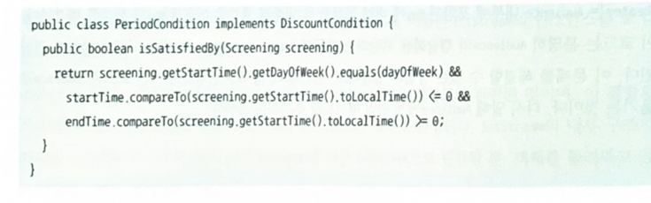
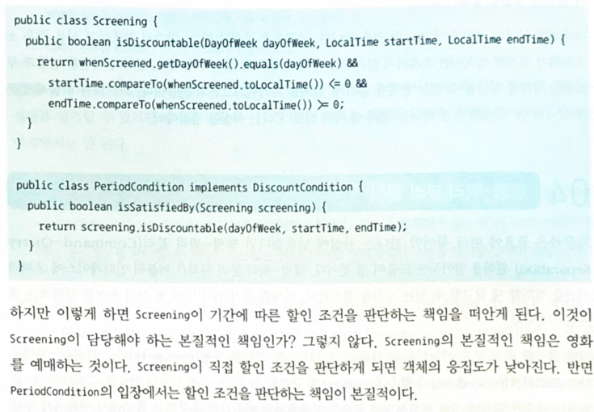

# 메시지와 인터페이스
훌륭한 객체지향 설계를 얻기 위해서는 클래스가 아니라 객체를 지향해야 한다.
즉, 협력안에서 객체가 수행하는 책임에 초점을 맞추어야 한다.

`에플리케이션은 클래스로 구성되지만, 메세지로 정의된다.`

적합한 public interface 설계 + 유연한 설계가 합쳐져야 한다.

## 01 협력과 메세지
### 클라이언트 - 서버 모델
협력은 어떤 객체가 다른 객체에게 무언가를 요청할 때 시작된다.

두 협력관계를 설명하는 가장 전통적인 메타포는 **클라이언트-서버 모델**이다.

객체는 협력 속에서 클라이언트와 서버의 역할을 겸직할 수 있다.(예시 : screening -> movie -> discountPolicy에서 movie)

요점 : 객체가 독립적인 책임보다 더 큰 책임을 수행하기 위해서는 협력해야한다는 것.
객체들은 메세지라는 매게체를 통해서 서로 협력한다.

### 메시지와 메시지 전송
- 메시지 : 객체들이 협력하기 위한 의사소통 수단
- 메시지 전송자, 클라이언트 -> (메시지 전송, 패싱) -> 메시지 수신자, 서버
- 메시지 수신자.오퍼레이션명(인자) 예시: `condition.isSatisfiedBy(screening)`

### 메시지와 메서드
- 메서드 : 메시지를 수신했을 때, 실제로 실행되는 함수
- 추상화를 사용한 경우, 메시지 작성 시점에 어떤 메서드가 실행될지는 모를 수 있다. 객체 타입에 따라서 달라지기 때문이다.
- 이로서 결합도가 낮아져, 유연하고 확장 가능한 코드가된다.

### 퍼블릭 인터페이스와 오퍼레이션
객체는 캡슐화 되어 있다. 
- 오퍼레이션 : 실행되기 위해 객체가 호출될 수 있는 정의에 대한 명세
- 메서드 : 오퍼레이션이 구현된 절차, 알고리즘
- `퍼블릭 인터페이스와 메시지 관점`에서는 `메서드 호출`보다는 `오퍼레이션 호출`이 더 맞다.

###  시그니처
- 시그니처 : 오퍼레이션의 이름에 파라미터를 더한 것. 코드의 형태

## 02 인터페이스와 설계 품질
최소한의 인터페이스, 추상적인 인터페이스
- 디미터의 법칙
- 묻지 말고 시켜라(Tell don't ask)
- 의도를 드러내는 인터페이스
- 명령-쿼리 분리

### 디미터의 법칙
객체의 내부 구조에 강하게 결합되지 않게 협력 경로를 제한하라는 것.
오직 하나의 도트(.)만을 사용하라.
this, this의 속성 혹은 메서드의 매게변수 에만 메세지를 전송해라.

잘못된 예시 : `screening.getMovie().getDiscountConditions`
이는 클래스의 내부 구현이 외부로 드러난다.

잘된 예시 : `screening.calculateFee(audienceCount)`

디미터의 법칙은 객체가 자신의 정보를 책임지는 자율적인 존재여야함을 강조한다.

하지만 너무 많이 사용하면, 객체의 응집도가 낮아질 수 있다.? - 원칙의 함정을 읽어봐라.

### 묻지말고 시켜라(Tell, Don't Ask)
객체의 상태를 묻지 말고, 원하는 것을 시켜라.
이 원칙을 따르다보면 자연스럽게 정보전문가에게 요청하게 되고, 응집도가 높아진다.

### 의도를 드러내는 인터페이스
메서드 명명 방법은 두가지가 있다.
하나는 어떻게 구현한 것인가이고
다른 하나는 무엇을 구현하는가 이다.

전자를 선택하면 캡슐화를 위반하고, 동일한 메시지를 수행하는 메서드가 같음을 알아채기가 어렵다.
결과와 목적만을 포함하도록 메서드 명을 정해라.
이런 구현방식을 `의도를 드러내는 선택자`라고 한다.

## 03 원칙의 함정
설계는 트레이드 오프의 산물이다. 디미터의 법칙과 tell Don't ask가 만능은 아니다.

### 디미터의 법칙은 하나의 도트(.)를 강제하는 규칙이 아니다.
디미터의 법칙은 결합도와 관련된 것이다.
java의 stream의 경우에는 자기 자신 객체를 반환하기 때문에, 결합도상으로 문제가 없다. 즉 디미터의 법칙을 위배하지 않는다.

### 결합도와 응집도의 충돌
tell don't ask를 지키다보면, 전혀 상관없는 오퍼레이션이 서로 같이 있는 경우가 생길수도 있다.-> 결합도는 낮아지지만 응집도도 낮아진다.

묻는 대상이 객체가 아니라 자료구조라면 디미터의 법칙을 위반해도 괜찮다. 오히려 묻는 것이 당연하다.

객체에게 시키는 것이 매번 가능하지는 않다. 가끔씩은 물어야 한다.

## 04 명령 쿼리 분리 법칙
가끔식은 필요에 따라 물어야 한다는게 납득이 갔다면, **명령 쿼리 분리 법칙**을 알아두는 것이 도움이 될 것이다.

이는 퍼블릭 인터페이스에 오퍼레이션을 정의할 때, 참고할 규칙을 알려준다.

- 루틴: 어떤 절차를 묶어 호출가능하도록 한 기능 모듈
- 프로시저 : 정해진 절차에 따라 내부의 상태를 변경하는 루틴, 부수효과를 일으키지만 값을 반환하지 않는다.
- 함수 : 어떤 절차에 따라 필요한 값을 계산해서 반환하는 루틴, 값을 반환할 수 있지만 부수효과를 일으킬 수 없다.

오퍼레이션은 부수효과를 발생시키는 명령이거나, 부수효과를 발생시키지 않는 쿼리 중 하나여야한다. 

명령인 동시에 쿼리여서는 안된다. - 예상치 못한 영향도를 최소화하기 위해서이다. 

쿼리 속에 명령이 포함되어 있다면 부수효과로 인한 버그 찾는데 엄청난 시간이 걸릴지도 모른다.
인터페이스는 더 복잡해보일지 모르지만, 분리를 통해서 얻는 이점이 더 크다. 

### 명령 쿼리 분리와 참조 투명성
참조투명성 : 어떤 표현식 e가 e의 값으로 대체되어도 결과가 달라지지 않는 특성

