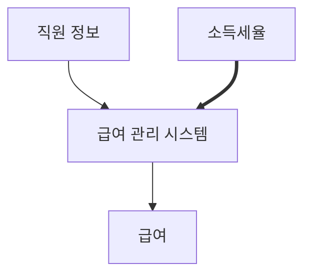

# Chapter 07 객체 분해

- 인지 과부하를 방지하는 가장 좋은 방법은 단기 기억 안에 보관할 정보의 양을 조절하는 것이다.
- 한 번에 다뤄야 하는 정보의 수를 줄이기 위해 본질적인 정보만 남기고 불필요한 세부 사항을 걸러내면 문제를 단순화할 수 있다.
    - 이처럼 불필요한 정보를 제거하고 현재의 문제 해결에 필요한 핵심만 남기는 작업을 **추상화**라고 부른다.
- 가장 일반적인 추상화 방법은 한 번에 다뤄야 하는 문제의 크기를 줄이는 것이다.
    - 이처럼 큰 문제를 해결 가능한 작은 문제로 나누는 작업을 `분해 decomposition`라고 부른다.

## 1. 프로시저 추상화와 데이터 추상화

- 모든 프로그래밍 패러다임은 추상화와 분해의 관점에서 설명할 수 있다.
- 현대적인 프로그래밍 언어를 특정 짓는 중요한 두 가지 추상화 매커니즘은 `프로시저 추상화 Procedure abstraction`
  와 `데이터 추상화 data abstraction`다.
- `프로시저 추상화`는 소프트웨어가 무엇을 해야 하는지를 추상화한다.
- `데이터 추상화`는 소프트웨어가 무엇을 알아야 하는지를 추상화한다.
- 소프트웨어는 데이터를 이용해 정보를 표현하고 프로시저를 이용해 데이터를 조작한다.

- 시스템을 분해하는 방법을 결정하려면 먼저 프로시저 추상화를 중심으로 할 것인지, 데이터 추상화를 중심으로 할 것인지를 결정해야 한다.
    - 프로시저 추상화 = `기능 분해 functional decomposition` = `알고리즘 분해 algorithm decomposition`
    - 데이터 추상화는 또 두 가지 갈림길이 있다.
        1. `타입 추상화 type abstraction` = `추상 데이터 타입 Abstract Data Type`
        2. 데이터를 중심으로 `프로시저 추상화 procedure abstraction` = `객체지향 Object-Oriented`

 

## 2. 프로시저 추상화와 기능 분해

### 메인 함수로서의 시스템

- 프로시저는 반복적으로 실행되거나 거의 유사하게 실해되는 작업들을 하나의 장소에 모아놓음으로써 로직을 재사용학 중복을 방지할 수 있는 추상화 방법
- 프로시저를 추상화라고 부르는 이유는 내부의 상세한 구현 내용을 모르더라도 인터페이스만 알면 프로시저를 사용할 수 있기 때문이다.
    - 하지만 프로시저만으로는 효과적인 정보은닉 체계를 구축하는 데 한계가 있다.
- 전통적인 기능 분해 방법은 `하향식 접근법 Top-Down Approach`를 따른다.

### 급여 관리 시스템

- 예시의 급여 관리 시스템은 최상위 문장을 기술함으로써 점차 하위의 문장을 파생시킴
- 하위의 문장으로 갈수록 추상화 수준이 낮아진다.
- 급여 관리 시스템은 입력을 받아 출력을 생성하는 커다란 하나의 메인 함수로 간주하고 기능 분해를 시작했다.
- 기능 분해 방법에서는 기능을 중심으로 필요한 데이터를 결정한다. 기능 분해라는 무대의 주연은 기능이며 데이터는 기능을 보조하는 조연의 역할에 머무른다.
- 기능이 우선이고 데이터는 기능의 뒤를 따른다.
- 기능 분해를 위한 하향식 접근법은 먼저 필요한 기능을 생각하고 이 기능을 분해하고 정제하는 과정에서 필요한 데이터의 종류와 저장 방식을 식별한다.

### 하향식 기능 분해의 문제점

- 겉으로는 이상적인 방법으로 보일 수 있으나 실제로 설계에 적용하다 보면 다음과 같은 다양한 문제에 직면한다.

1. 시스템은 하나의 메인 함수로 구성돼 있지 않다.
2. 기능 추가나 요구사항 변경으로 메인 함수를 빈번하게 수정해야 한다.
3. 비즈니스 로직이 사용자 인터페이스와 강하게 결합된다.
4. 하향식 분해는 너무 이른 시기에 함수들의 실행 순서를 고정시키기 때문에 유연성과 재사용성이 저하된다.
5. 데이터 형식이 변경될 경우 파급효과를 예측할 수 없다.

- 하향식 접근법과 기능 분해가 가지는 근본적인 문제점은 변경에 취약한 설계를 낳는다는 것이다.

#### 하나의 메인 함수라는 비현실적인 아이디어

- 어떤 시스템도 최초에 릴리스됐던 당시의 모습을 그대로 유지하지 않는다.
    - 어느 시점에 이르면 유일한 메인 함수라는 개념은 의미가 없어지고 여러 개의 동등한 수준의 함수 집합으로 성장하게 된다.
- 이 때 전체의 시스템 중 하나를 골라 전체 기능을 트리로 정리하기란 쉽지 않다.

#### 메인 함수의 빈번한 재설계

- 기능 분해는 새로운 기능을 추가할 때마다 매번 메인 함수를 수정해야 한다는 단점이 있다.
- 기존 코드를 수정하는 것은 항상 새로운 버그를 만들어낼 확률을 높인다.

#### 비즈니스 로직과 사용자 인터페이스이 결합

- 기능 분해 방식은 코드 안에서 비즈니스 로직과 사용자 인터페이스 로직이 밀접하게 결합된다.
- 문제는 비즈니스 로직과 사용자 인터페이스가 변경되는 빈도가 다르다는 것이다.
- 사용자 인터페이스는 시스템 내에서 가장 자주 변경되는 부분인데 이 때문에 비즈니스 로직까지 변경의 영향을 받게 된다.

#### 성급하게 결정된 실행 순서

- 기능 분해는 설계를 시작하는 시점부터 시스템이 무엇을 해야 하는지가 아니라 어떻게 동작해야 하는지에 집중하도록 만든다.
- 실행 순서나 조건, 반복과 같은 제어 구조를 미리 결정하지 않고는 분해를 진행할 수 없기 때문에 기능 분해 방식은 중앙집중 제어 스타일의 형태를 띨 수밖에 없다.
    - 결과적으로 모든 중요한 제어 흐름의 결정이 상위 함수에서 이뤄지고 하위 함수는 상위 함수의 흐름에 다라 적절한 시점에 호출된다.
    - 문제는 중요한 설계 결정사항인 함수의 제어 구조가 빈번한 변경의 대상이라는 점이다. => 기능이 추가될 때마다 기존에 결정된 함수의 제어 구조를 변경하도록 만듦
- 하향식 접근법을 통해 분해한 함수들은 재사용하기도 어렵다.
    - 재사용성이라는 개념이 `일반성`을 기반에 둔 반면, 하향식 접근법으로 만든 함수는 `문맥`에 종속적이다. (여기서 일반성이란 상위 함수보다 포괄적인 개념이다.)
    - 현재의 문백에 강하게 결합된 시스템은 현재 문맥을 떠나 다른 문맥으로 옮겨갔을 때 재사용하기 어렵다.

#### 데이터 변경으로 인한 파급효과

- 어떤 데이터를 어떤 함수가 사용하고 있는지를 추적하기 어렵다.
- 따라서 데이터 변경으로 인해 어떤 함수가 영향을 받을지 예상하기 어렵다.
- 데이터 변경으로 인한 영향은 데이터를 직접 참조하는 모든 함수로 퍼져나간다. 스파게티처럼 얽히고설킨 대규모 시스템에서 데이터를 참조하는 함수들을 찾아 정상적으로 동작하는지 여부를 테스트하는 것은 기술보다는 운의 문제다.

### 언제 하향식 분해가 유용한가?

> 하향식은 이미 완전히 이해된 사실을 서술하기에 적합한 방법이다.
> 그러나 하향식은 새로운 것을 개발하고 설계하고 발견하는 데는 적합한 방법이 아니다.

- 하향식 분해 방식으로 설계된 소프트웨어는 하나의 함수에 제어가 집중되기 때문에 확장이 어렵다.
- 과도하게 함수에 집중하게 만들어 소프트웨어의 중요한 다른 측면인 데이터에 대한 영향도를 파악하기 어렵게 만든다.
- 또한 재사용하기도 어렵다.

 

## 3. 모듈

### 정보 은닉과 모듈

- 모듈은 시스템의 변경을 관리하는 기본적인 전략과 함께 변경되는 부분을 하나의 구현 단위로 묶고 퍼블릭 인터페이스를 통해서만 접근하도록 만드는 것이다.
- 즉 기능을 기반으로 시스템을 분해하는 것이 아니라 변경의 방향에 밪춰 시스템을 분해하는 것이다.

> 모듈은 서브 프로그램이라기보다는 책임의 할당이다. 모듈화는 개별적인 모듈에 대한 작업이 시작되기 전에 정해져야 하는 설계 결정들을 포함한다.
> 분할된 모듈은 다른 모듈에 대해 감춰야 하는 설계 결정에 따라 특징 지어진다. 해당 모듈 내부의 작업을 가능한 한 적게 노출하는 인터페이스 또는 정의 선택한다.
> 어려운 설계 결정이나 변화할 것 같은 설계 결정들의 목록을 사용해 설계를 시작할 것을 권장한다. 이런한 결정이 외부 모듈에 대해 숨겨지도록 각 모듈을 설계해야 한다.

- 정보 은닉은 외부에 감춰야 하는 비밀에 따라 시스템을 분할하는 모듈 분할 원리다.
- 모듈은 변경될 가능성이 있는 비밀을 내부로 감추고 잘 정의되고 쉽게 변경되지 않을 퍼블릭 인터페이스를 외부에 제공해서 내부의 비밀에 함부로 접근하지 못하게 한다.
- 모듈과 기능 분해는 상호 배타적인 관계가 아니다.
    - 시스템을 모듈로 분해한 후에는 각 모듈 내부를 구현하기 위해 기능 분해를 적용할 수 있다.
    - 모듈 분해는 감춰야 하는 비밀을 선택하고 비밀 주변에 안정적인 보호막을 설치하는 보존의 과정이다.
    - 비밀을 결정하고 모듈을 분해한 후에는 기능 분해를 이용해 모듈에 필요한 퍼블릭 인터페이스를 구현할 수 있다.
- 모듈은 아래 두 가지 비밀을 감춰야 한다.
1. 복잡성: 모듈이 너무 복잡하면 이해하고 사용하기 어렵다. 외부에 모듈을 추상화할 수 있는 간단한 인터페이스를 제공해서 모듈의 복잡도를 낮출 수 있다.
2. 변경 가능성: 변경 가능한 설계 결정이 외부에 노출될 경우 실제로 변경이 발생했을 때 파급효과가 커진다. 변경 발생 시 하나의 모듈만 수정하면 되도록 변경 가능한 설계 결정을 모듈 내부로 감추고 외부에는 쉽게 변경되지 않을 인터페이스르 제공한다.

### 모듈의 장점과 한계

#### 모듈의 장점

1. 모듈 내부의 변수가 변경되더라도 모듈 내부에만 영향을 미친다.
2. 비즈니스 로직과 사용자 인터페이스에 대한 관심사를 분리한다.
3. 전역 변수와 전역 함수를 제거함으로써 `네임스페이스 오염 namespace pollution`을 방지한다.

- 각 모듈은 외부에 감춰야 하는 비밀과 관련성 높은 데이터와 함수의 집합니다. 따라서 모듈 내부는 높은 응집도를 유지할 수 있다.
- 반면 모듈과 모듈 사이에는 퍼블릭 인터페이스를 통해서만 통신해야 한다. 따라서 낮은 결합도를 유지한다.

#### 모듈의 단점

- 모듈이 프로시저 추상화보다는 높은 추상화 개념을 제공하지만 태생적으로 변경을 관리하기 위한 구현 기법이기 때문에 추상화 관점에서의 한계점이 명확하다.
- **가장 큰 단점은 인스턴스를 제공하지 않는다는 것이다.**
    - 다수의 인스턴스가 존재하는 추상화 매커니즘이 필요하다는 의미!

 

## 4. 데이터 추상화와 추상 데이터 타입

### 추상 데이터 타입

- 프로그래밍 언어에서 `타입 type`이란 변수에 저장할 수 있는 내용물의 종류와 변수에 적용될 수 있는 연산의 가짓수를 의미한다.
- 리스코프는 프로시저 추상화의 한계를 이진하고 이를 보완하기 위해 `데이터 추상화 data abstraction`의 개념을 제안했다.

> 안타깝게도 프로시저만으로 충분히 풍부한 추상화의 어휘집을 제공할 수 없다.
> 이것은 언어 설계에서 가장 중요한 `추상 데이터 타입 Abstract Data Type`의 개념으로 우리를 인도했다. 추상 데이터 타입은 추추상 객체의 클래스를 정의한 것으로 추상 객체에 사용할 수 있는 오퍼레이션을 이용해 규정된다. 이것은 오퍼레이션을 이용해 추상 데이터 타입을 정의할 수 있음을 의미한다.
> 추상 데이터 객체를 사용할 때 프로그래머는 오직 객체가 외부에 제공하는 행위에만 관심을 가지며 행위가 구현되는 세부적인 사항에 대해서는 무시한다.
> 객체가 저장소 내에서 어떻게 표현되는지와 같은 구현 정보는 오직 오퍼레이션을 어떻게 구현할 것인지에 집중할 때만 필요하다. 객체의 사용자는 이 정보를 알거나 제공받을 필요가 없다.

- 추상 데이터 타입을 구현하려면 다음과 같은 특성을 위한 프로그래밍 언어의 지원이 필요하다.
1. 타입 정의를 선언할 수 있어야 한다.
2. 타입의 인스턴스를 다루기 위해 사용할 수 있는 오퍼레이션의 집합을 정의할 수 있어야 한다.
3. 제공된 오퍼레이션을 통해서만 조작할 수 있도록 데이터를 외부로부터 보호할 수 있어야 한다.
4. 타입에 대해 여러 개의 인스턴스를 생성할 수 있어야 한다.

 

## 5. 클래스

### 클래스는 추상 데이터 타입인가?

- 대부분의 프로그래밍 서적은 클래스를 추상 데이터 타입으로 설명한다. 클래스와 추상 데이터 타입 모두 데이터 추상화를 기반으로 시스템을 분해하기 때문에 이런 설명이 꼭 틀린 것만은 아니다.
    - 두 메커니즘 모두 외부에서는 객체의 내부 속성에 직접 접근할 수 없으며 오직 퍼블릭 인터페이스를 통해서만 외부와 의사소통할 수 있다.
- 그러나 명확한 의미에서 추상 데이터 타입과 클래스는 동일하지 않다. 가장 핵심적인 차이는 클래스는 상속과 다형성을 지원하는 데 비해 추상 데이터 타입은 지원하지 못한다는 점이다.
- 상속과 다형성을 지원하는 `객체지향 프로그래밍 Object-Oriented Programming`과 구분하기 위해 상속과 다형성을 지원하지 않는 추상 데이터 타입 기반의 프로그래밍 패러다임을 `객체기반 프로그래밍 Object-Based Programming`이라고 부르기도 한다.
- 윌리엄 쿡의 설명
    - `추상 데이터 타입`은 타입을 추상화한 것(type abstraction)
    - `클래스`는 절차를 추상화한 것(procedural abstraction)

#### 예시로 보는 차이점

|      오퍼레이션       |             정규 직원             |                  아르바이트 직원                  |
|:----------------:|:-----------------------------:|:------------------------------------------:|
|  calcaultePay()  | basePay - (basePay * taxRate) | (basePay * timeCard) - ((basePay * timeCard) * taxRate) |
| monthlyBasePay() |            basePay            |                     0                      |

- 추상 데이터 타입은 오퍼레이션을 기준으로 타입을 묶는다. (표의 row로 묶음)
    - 오퍼레이션을 기준으로 타입들을 추상화한다.
- 반면 클래스는 타입을 기준으로 오퍼레이션을 묶는다. (표의 column으로 묶음)
    - 타입을 기준으로 절차들을 추상화한다.

### 변경을 기준으로 선택하라

- 단순히 클래스를 구현 단위로 사용한다는 것이 객체지향 프로그래밍을 한다는 것을 의미하지는 않는다.
- 타입을 기준으로 절차를 추상화하지 않았다면 그것은 객체지향 분해가 아니다.
- 클래스가 추상 데이터 타입의 개념을 따르는지를 확인할 수 이는 가장 간단한 방법은 클래스 내부에 인스턴스의 타입을 표현하는 변수가 있는지를 살펴보는 것이다.
- 객체지향에서는 타입 변수를 이용한 조건문을 다형성으로 대체한다.
    - 클라이언트가 객체의 타입을 확인한 후 적절한 메소드를 호출하는 것이 아니라 객체가 메시지를 처리할 적절한 메소드를 선택한다.
    - `객체지향이란 조건문을 제거하는 것`이라는 다소 편협한 견해가 널리 퍼진 이유가 바로 이 때문이다.
- 기존 코드에 아무런 영향도 미치지 않고 새로운 객체 유형과 행위를 추가할 수 있는 객체지향의 특성을 `개방-폐쇄 원칙 Open-Closed Principle`이라고 부른다.
- 추상 데이터 타입과 객체지향 설계의 유용성은 설계 요구되는 변경의 압력이 `타입 추가`인지 `오퍼레이션 추가`에 관한 것인지에 따라 달라진다.
    - `타입 추가`라는 변경의 압력이 강한 경우: 객체 지향을 손을 들어줘야.
    - `오퍼레이션 추가`의 압력이 강한 경우: 추상 데이터 타입의 승리를 선언해야.

### 협력이 중요하다.

- 객체지향에서 가장 중요한 것은 역할, 책임, 협력이다.
- 객체지향은 기능을 수행하기 위해 객체들이 협력하는 방식에 집중한다.
- 객체가 참여할 협력을 결정하고 협력에 필요한 책임을 수행하기 위해 어떤 객체가 필요한지에 관해 고민하라.
    - 그 책임을 다양한 방식으로 수행해야 할 때만 타입 계층 안에 각 절차를 추상화하라.
    - 타입 계층과 다형성은 협력이라는 문맥 안에서 책임을 수행하는 방법에 관해 고민한 결과물이어야 하며 그 자체가 목적이 되어서는 안된다.

 

# 참고자료

- 오브젝트, 조영호 지음

