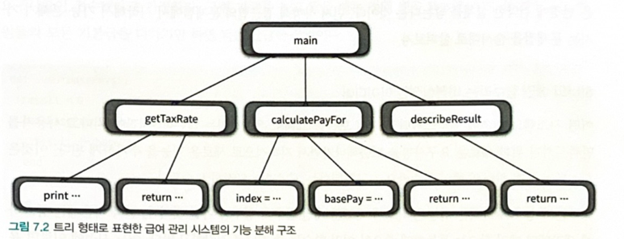

# 객체 분해
(사람의)인지 과부화 -> 추상화 -> 분해

## 01 프로시저 추상화와 데이터 추상화

시스템을 `분해`하는 방법 2가지 

`프로시저 추상화`: 무엇을 해야하는지 추상화함
`데이터 추상화`: 소프트웨어가 무엇을 알아야 하는지 추상화함.

### 프로시저 추상화 
-> `기능분해(=알고리즘 분해)`

### 데이터 추상화
- 데이터를 중심으로 타입을 추상화 : `추상 데이터 타입`

- 데이터를 중심으로 프로시저를 추상화 : `객체지향` 

---
## 02 프로시저 추상화와 기능 분해
### 메인 함수로서의 시스템
처음에는 `기능 분해, 알고리즘 분해`를 먼저 시도했음. 
시스템을 프로시저 단위로 분해함.
(하지만,프로시저만으로 효과적인 정보 은닉 체계를 만드는 것은 한계가 있음.) 

기능분해 관점에서 시스템은 `하나의 커다란 함수`임.(입력값에 대한 출력을 반환함)

`하향식 접근법`을 사용함. 시스템을 구성하는 가장 최상위 기능을 정의하고, 이 최상위 기능을 좀 더 작은 단계의 하위 기능으로 분해해나가는 식임.

### 예시 : 급여 관리 시스템
급여 = 기본급 - (기본급 * 소득세율)

직원의 급여를 계산한다.
- 사용자로부터 소득 세율을 입력 받는다
  - "세율을 입력하세요 : "라는 문장을 화면에 출력한다
  - 키보드를 통해 세율을 입력 받는다.
- 직원의 급여를 계산한다
  - 전역 변수에 저장된 직원의 기본급 정보를 얻는다.
  - 급여를 계산한다
- 양식에 맞게 결과를 출력한다
  - "이름 : {직원명}, 급여 : {계산된 금액}" 형식에 따라 출력 문자열을 생성한다.

기능 분해의 결과는 최상위 기능을 수행하는데 필요한 절차들을 `실행 시간 순서`에 따라서 나열한 것이다.

### 급여 관리 시스템 구현

### 하향식 기능 분해의 문제점
#### 시스템은 하나의 메인 함수로 구성돼 있지 않다.
소프트웨어는 지속적으로 새로운 기능이 추가된다. 이것은 하나의 메인 함수로만 구현된다는 개념과는 완전히 모순된다.

실제 시스템에 정상(top)이란 존재하지 않는다.
#### 메인함수의 빈번한 재설계
기능 추가나 요구사항 변경으로 인해 메인 함수를 빈번하게 수정해야 한다. 기존 코드 수정은 새로운 버그를 일으킬 가능성을 높인다. -> 이는 결국 변경에 대한 두려움으로 발전한다.
#### 비즈니스 로직과 사용자 인터페이스의 결합
`"사용자로부터 소득세율을 입력받아 급여를 계산한 후, 계산된 결과를 화면에 출력한다"`
라는 하나의 메인함수에 대한 정의에는 비즈니스 로직이 사용자 인터페이스와 강하게 결합된다. 로직이 한데 썩여있기 때문에, 
비즈니스 로직과 사용자 인터페이스의 변경이 서로 영향을 끼친다. 
`관심사의 분리`를 실천하기가 어려운 아키텍처가 된다.

#### 성급하게 결정된 실행 순서
하향식 분해는 너무 이른 시기에 함수들의 실행 순서를 고정시키기 때문에 유연성과 재사용성이 저하된다.
결과적으로 기능을 추가하거나 변경하는 작업은 매번 기존에 결정된 함수의 제어구조를 변경하도록 만든다.

하향식 접근법에서 함수는 상위 함수의 문맥에 종석적이다. 이는 재사용과는 거리가 멀어진다. 
하향식 설계와 관련된 모든 문제의 원인은 `결합도`에 있다.

#### 데이터 변경으로 인한 파급효과
데이터 형식이 변경될 경우 파급효과를 예측할 수 없다. 가장 큰 문제점은 어떤 데이터를 어떤 함수가 사용하고 있는지를 추적하기 어렵다는 것이다.
따라서 데이터 변경시 어떤 함수가 영향 받을지 예측하기 어렵다. 

데이터 변경으로 인한 영향을 최소화하려면 데이터와 함께 변경되는 부분과 그렇지 않은 부분을 명확하게 분리해야 한다. 
즉 잘 정의된 퍼블릭 인터페이스를 통해 데이터에 대한 접근을 통제해야 하는 것이다. 

이것이 바로 의존성 관리의 핵심이다. 변경에 대한 영향을 최소화하기 위해 영향을 받는 부분과 받지 않는 부분을 명확하게 분리하고 잘 정의된 퍼블릭 인터페이스를 통해 변경되는 부분에 대한 접근을 통제하라. 
이를 위해 정보 은닉과 모듈이라는 개념을 제시하기에 이른다. 

### 언제 하향식 분해가 유용한가?
완전히 이해된 사실을 서술하기에 적합한 방식이다. 

## 03 모듈
### 정보 은닉과 모듈
시스템 변경을 관리하는 기본적인 전략은 함께 변경되는 부분을 하나의 구현단위로 묶고 퍼블릭 인터페이스를 통해서만 접근하도록 만드는 것이다. 

정보은닉 : 시스템에서 잘 변경되는 부분을 상대적으로 덜 변경되는 안정적인 인터페이스 뒤로 감춰야 한다는 것

모듈을 통해서 이를 구현할 수 있다.

### 모듈의 장점과 한계
#### 모듈 내부의 변수가 변경되더라도 모듈 내부에만 영향을 미친다
#### 비즈니스 로직과 사용자 인터페이스에 대한 관심사를 분리한다.
#### 전역 변수와 전역 함수를 제거함으로써 네임스페이스 오염을 방지한다.(같은 이름의 충돌을 방지한다.)

모듈 내부는 높은 응집도를 유지한다. 모듈과 모듈 사이에는 낮은 결합도를 유지한다.

모듈에 있어 핵심은 데이터다. 모듈은 데이터와 함수가 통합된 한 차원 높은 추상화를 제공하는 설계 단위이다. 

모듈의 가장 큰 단점은 인스턴스의 개념을 제공하지 않는다는 점이다. 직원관리를 예로 들면 개별 직원 하나하나에 해당하는 인스턴스를 생성할 필요가 있다.

이를 만족시키기 위해 등장한 개념이 바로 추상 데이터 타입이다. 

## 04 데이터 추상화와 추상 데이터 타입
### 추상 데이터 타입
기능 분해 시대의 절차형 언어들은 적은 내장 타입과 타입 추가가 불가능했다.

"사람들은 직원의 급여를 계산한다" 라는 하나의 커다란 절차를 이용해 사고하기 보다는 '직원'과 '급여'라는 추상적인 객체들을 머릿속에 떠올린 후 이들을 이용해 '계산'에 필요한 절차를 생각하는데 익숙하다.

추상 데이터 타입으로 표현된 데이터를 이용해서 기능을 구현하는 핵심 로직은 추상 데이터 타입 외부에 존재한다.

## 05 클래스
### 클래스는 추상 데이터 타입인가 ? 
추상 데이터 타입은 오퍼레이션을 기준으로 타입을 묶는다. 반면, 객체지향은 타입을 기준으로 오퍼레이션을 묶는다.

### 추상 데이터 타입에서 클래스로 전환하기

### 변경을 기준으로 선택하라
타입을 기준으로 절차를 수행하라.
객체지향에서는 타입변수를 이용한 조건문을 다형성으로 대체한다.
조건문을 기피하게 된 이유는 '변경'때문이다. 변경하려면 조건문이 사용된 곳을 모두 찾아서 수정해야한다.

개방 -폐쇠 원칙

새로운 타입을 빈번히 추가해야한다면 객체지향을 선택하라.

새로운 오퍼레이션을 많이 추가해야한다면 추상객체타입을 고려해라.
변경의 축을 찾아라. 객체지향적인 접근법이 항상 정답은 아니다.

