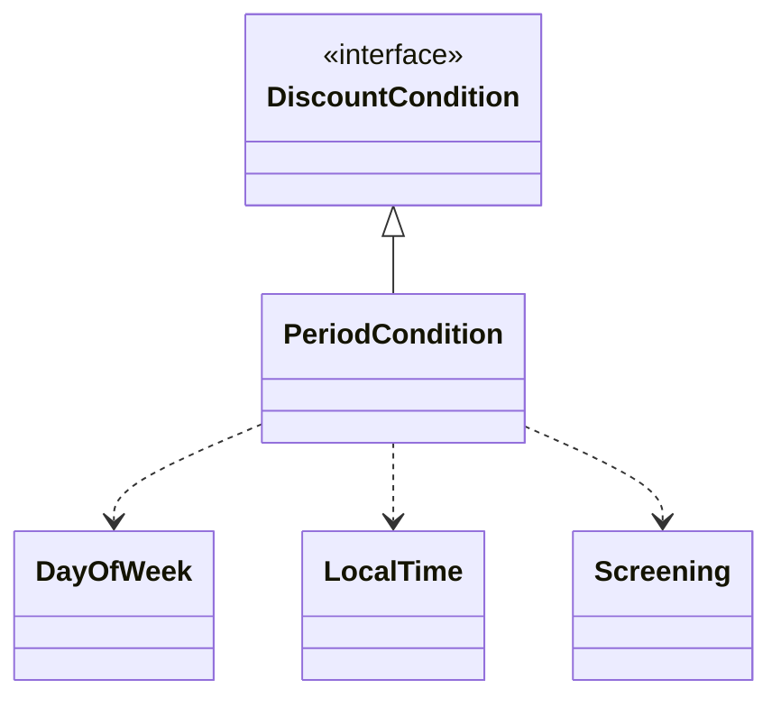
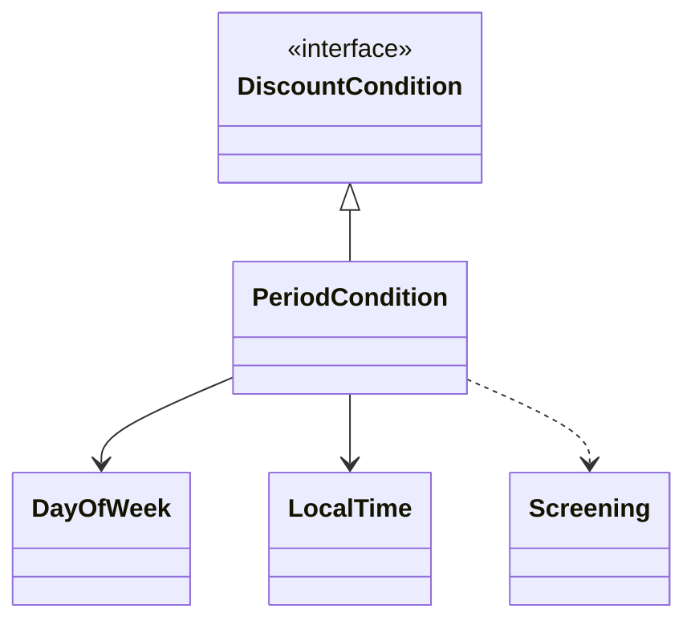
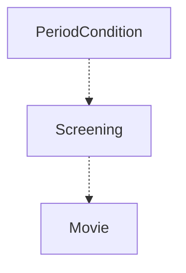

# Chapter 08 의존성 관리하기

- 작고 응집도 높은 객체 = 책임의 초점이 명확하고 한 가지 일만 잘 하는 객체를 의미
    - 하지만 그 모든 일은 혼자 할 수는 없다. => 다른 객체에 도움을 요청해야 한다.
    - 과도한 협력 => 설계를 곤경에 빠뜨림
- 객체지향 설계란 의존성을 관리하는 것이고 객체가 변화를 받아들일 수 있게 의존성을 정리하는 기술

## 1. 의존성 이해하기

- 의존성은 실행 시점과 구현 시점에 서로 다른 의미를 가진다.
    - 실행 시점: 의존하는 객체가 정상적으로 동작하기 위해서는 실행 시에 의존 대상 객체가 반드시 존재해야 한다.
    - 구현 시점: 의존 대상 객체가 변경될 경우 의존하는 객체도 함께 변경
- 의존성은 변경에 의한 영향의 전파 가능성 암시

```java
public class PeriodCondition implements DiscountCondition {
  private DayOfWeek dayOfWeek;
  private LocalTime startTime;
  private LocalTime endTime;
  
  ...
  
  public boolean isSatisfiedBy(Screening screening) {
    return screening.getStartTime().getDayOfWeek().equals(dayOfWeek)
        && startTime.compareTo(screening.getStartTime().toLocalTime()) <= 0
        && endTime.compareTo(screening.getStartTime().toLocalTime()) >= 0;
  }
}
```

- 위의 `PeriodCondition`은 `DayOfWeek`, `LocalTime`, `Screening`에 대해 의존성을 가진다.
- `DayOfWeek`의 클래스명을 변경한다고 가정? => 인스턴스 변수 타입 선언도 함께 수정해야 한다.
    - 다른 타입도 마찬가지다.



- `Screening`은 메소드 인자로 사용되기 때문에 의존성 종류를 구분 가능하도록 아래와 같이 표현하는 것이 유용하다.
    - 의존성을 다른 방식으로 표기하더라도 의존성이 가지는 근본적인 특성은 동일하다.



> UML과 의존성
> - 위에서 보여준 예시는 실제 UML에서 정의하는 의존 관계와는 다르다.
> - UML에서는 두 요소 사이의 관계 아래와 같이 여러 관계로 나눈다.
> 1. 실체화 관계 realization
> 2. 연관 관계 association
> 3. 의존 관계 dependency
> 4. 일반화/특수화 관계 generalization/specialization
> 5. 합성 관계 composition
> 6. 집합 관계 aggregation

### 의존성 전이 Transitive Dependency

- 의존성은 전이될 수 있다.
- `PeriodCondition`에 `Screening`이 존재할 경우, `Screening`이 의존하는 대상에 대해서도 자동적으로 의존하게 된다는 것이다.
- 의존성 전이에 의해 잠재적으로 `PeriodCondition`은 `Movie`에 의존한다.



- 의존성은 함께 변경될 수 있는 가능성을 의미하기 때문에 모든 경우에 의존성이 전이되는 것은 아니다.
    - 실제로 전이될지 여부는 `변경의 방향`과 `캡슐화의 정도`에 따라 달라진다.
    - `Screening`이 내부 구현을 효과적으로 캡슐화하고 있다면 `PeriodCondition`까지는 변경이 전파되지 않을 거라는 의미다!

#### 직접 의존성 direct dependency

- 한 요소가 다른 요소에 직접 의존하는 경우
- 의존성이 명시적으로 드러남
- ex) 위의 코드 예시에 `PeriodCondition`이 `Screening`에 의존하는 경우

#### 간접 의존성 indirect dependency

- 직접적인 관계는 존재하지 않지만 의존성 전이에 의해 영향이 전파되는 경우

### 런타임 의존성과 컴파일타임 의존성

- 런타임 의존성의 주인공 => 객체. 객체 사이의 의존성을 다룸
- 컴파일타임 의존성의 주인공 => 클래스. 클래스 사이의 의존성을 다룸
- 어떤 클래스가 인스턴스가 다양한 클래스의 인스턴스와 협력하기 위해서는 인스턴스의 구체적인 클래스를 알아서는 안 된다.
    - 실제로 협력할 객체가 어떤 것인지는 런타임에 해결해야 한다.

> - 객체지향 프로그램의 실행 구조는 소스코드 구조와 일치하지 않는 경우가 종종 있다.
> - 코드 구조는 컴파일 시점에 확정되는 것이고 이 구조에는 고정된 상속 클래스 관계들이 포함된다.
> - 그러나 프로그램의 실행 시점 구조는 협력하는 객체에 따라서 달라질 수 있다.
> - 컴파일 시점의 구조와 실행 시점 구조 사이에 차이가 있기 때문에 코드 자체가 시스템의 동작 방법을 모두 보여줄 수 없다.

### 컨텍스트 독립성

- 구체적인 문맥은 컴파일타임 의존성을 어떤 런타임 의존성으로 대체하느냐에 따라 달라진다.
- 클래스가 특정한 문맥에 강하게 결합될수록 다른 문맥에서 사용하기는 더 어려워진다.
- 클래스가 사용될 특정한 문맥에 대해 최소한의 가정만으로 이뤄져 있다면 다른 문맥에서 재사용하기가 더 수월해진다. 이를 **컨텍스트 독립성**이라고 부른다.

> - 컨텍스트 독립적이라는 말은 각 개체가 해당 객체를 실행하는 시스템에 관해 아무것도 알지 못한다는 의미다.

- 클래스가 실행 컨텍스트에 독립적인데도 어떻게 런타임에 실행 컨텍스트에 적절한 객체들과 협력할 수 있을까?

### 의존성 해결하기

- 컴파일타임 의존성을 실행 컨텍스트에 맞는 적절한 런타임 의존성으로 교체하는 것을 **의존성 해결**이라고 부른다.
- 의존성을 해결하기 위해 아래 3가지 방법을 사용한다.

#### 1. 객체를 생성하는 시점에 생성자를 통해 의존성 해결

#### 2. 객체 생성 후 setter 메소드를 통해 의존성 해결

- 실행 시점에 의존 대상을 변경할 수 있기 때문에 설계를 좀 더 유연하게 만들 수 있다.
- 단점은 객체가 생성된 후에 협력에 필요한 의존 대상을 설정하기 때문에 객체를 생성하고 의존 대상을 설정하기 전까지는 객체의 상태가 불완전할 수 있다는 점이다.
- 더 좋은 방법은 생성자 방식과 setter 방식을 혼합하는 것이다.

#### 3. 메소드 실행 시 인자를 이용해 의존성 해결

- 객체가 의존해야 할 객체의 세부 정보까지 알 필요가 없고 특정 정보만 일시적으로 알아도 무방하다면 메소드 인자를 이용해 의존성을 해결하는 것이 좋다.
- 메소드가 실행될 때마다 의존 대상이 매번 달라져야 하는 경웨 유용하다.
    - 하지만 대부분의 경우 매번 동일한 객체를 인자로 전달하고 있다면 생성자를 이용하는 방식이나 setter를 이용해 의존성을 지속적으로 유지하는 방식으로 변경하는 것이 좋다.

## 2. 유연한 설계

### 의존성과 결합도

- 의존성은 객체들의 협력을 가능하게 만드는 매개체라는 관점에서는 바람직한 것이다.
    - 하지만 의존성이 과하면 문제가 될 수 있다.
    - **문제는 의존성의 존재가 아니라 의존성의 정도다.**
- 바람직한 의존성이란 무엇인가?
    - **재사용성**과 관련이 있다.
    - 어떤 의존성이 다양한 환경에서 클래스를 재사용할 수 없도록 제한한다면 그 의존성은 바람직하지 못한 것이다.
    - 컨텍스트 독립적인 의존성이 바람직한 의존성이다.
- 컨텍스트에 강하게 의존하는 클래스를 다른 컨텍스트에서 재사용할 수 있는 유일한 방법은 구현을 변경하는 것뿐이다.

### 지식이 결합을 낳는다.

- 결합도의 정도는 한 요소가 자신이 의존하고 있는 다른 요소에 대해 알고 있는 정보의 양으로 결정된다.
- 결합도를 느슨하게 유지하려면 협력하는 대상에 대해 더 적게 알아야 한다 -> 추상화를 하면 된다.

### 추상화에 의존하라.

- 추상화란 어떤 양상, 세부사항, 구조를 좀 더 명확하게 이해하기 위해 특정 절차나 물체를 의도적으로 생략하거나 감춤으로써 복잡도를 극복하는 방법이다.
    - 지식의 양을 줄여 결합도를 느슨하게 유지한다!
- 일반적으로 추상화와 결합도의 관점에서 의존 대상을 다음과 같이 구분하는 것이 유용하다. 목록에서 아래쪽으로 갈수록 클라이언트가 알아야 하는 지식의 양이 적어지기 때문에 결합도가 느슨해진다.
    - 구체 클래스 의존성 concrete class dependency
    - 추상 클래스 의존성 abstact class dependency
    - 인터페이스 의존성 interface dependency

- 추상 클래스의 클라이언트는 여전히 협력하는 대상이 속한 클래스의 상속 계층이 무엇인지에 대해 알고 있어야 한다는 단점이 있다!
- 인터페이스 의존성은 협력하는 객체가 어떤 메시지를 수신할 수 있는지에 대한 지식만을 남기기 때문에 추상 클래스 의존성보다 결합도가 낮다.

### 명시적인 의존성

- 아래 코드는 `DiscountPolicy`라는 추상화된 타입에 의존하기 때문에 유연하고 재사용 가능할 것처럼 보인다.
    - 하지만 생성자를 보면 그렇지 않다는 사실을 알 수 있다.
    - 결과적으로는 구체 클래스인 `AmountDiscountPolicy`의 인스턴스를 직접 생서해서 대입하고 있다.
    - 따라서 추상 클래스인 `DiscountPolicy`뿐만 아니라 `AmountDiscountPolicy`에도 의존하게 된다.

```java
public class Movie {
  
  ...
  private DiscountPolicy discountPolicy;
  
  public Movie(String title, Duration runningTime, Money fee) {
    ...
    this.discountPolicy = new AmountDiscountPolicy(...);
  }
  
}
```

- 결합도를 느슨하게 하려면 구체 클래스에 대한 모든 의존성을 제거해야만 한다.

```java
public class Movie {
  
  ...
  private DiscountPolicy discountPolicy;
  
  public Movie(String title, Duration runningTime, Money fee, DisoucntPolicy disoucntPolicy) {
    ...
    this.discountPolicy = discountPolicy;
  }
  
}
```

- 생성자를 통해 인자를 선언하는 방법, setter 메소드를 사용하거나 메소드 인자를 사용해 의존성을 해결하는 경우 `명시적인 의존성 explicit dependency`이라고 부른다.
    - 의존한다는 사실을 퍼블릭 인터페이스에 드러냈기 때문이다.
- 반면 의존성이 퍼블릭 인터페이스에 표현되지 않는 경우를 `숨겨진 의존성 hidden dependency`라고 한다.
    - 의존성이 명시적이지 않으면 의존성을 파악하기 위해 내부 구현을 직접 살펴볼 수밖에 없다.
    - 다른 컨텍스트를 위해 내부 구현을 직접 변경해야 한다. => 버그 발생 가능성 내포
- 의존성은 명시적으로 표현되어야 한다.

### new는 해롭다.

1. new 연산자를 사용하기 위해서는 구체 클래스의 이름을 직접 기술해야 한다. 따라서 new를 사용하는 클라이언트는 추상화가 아닌 구체 클래스에 의존할 수밖에 없기 때문에 결합도가 높아진다.
2. new 연산자는 생성하려는 구체 클래스뿐만 아니라 어떤 인자를 이용해 클래스의 생성자를 호출해야 하는지도 알아야 한다. 따라서 new를 사용하면 클라이언트가 알아야 하는 지식의 양이 늘어나기 때문에 결합도가 높아진다.

- 따라서 의존성을 맺기 위해 생성자 안에서 new를 사용하는 행위를 최대한 자제하자.
- 사용과 생성의 책임을 분리해 결합도를 낮추면 설계를 유연하게 할 수 있다. 생성의 책임을 객체 안으로 가져오는 게 아니라 클라이언트로 옮김으로써 설계를 유연하게 만들 수 있다.

### 까끔은 생성해도 무방하다.

- 클래스 안에서 객체의 인스턴스를 직접 생성하는 방식이 유용한 경우도 있다.
- 주로 협력하는 기본 객체를 설정하고 싶은 경우가 여기에 속한다.
    - 예를 들어 `Movie`가 `AmountDiscounPolicy`만 주로 쓰고 가끔씩만 `PercentDiscountPolicy`를 사용하고 싶을 때.
    - 만약 이런 경우 모든 생성 책임을 클라이언트가 가지고 있다면 클라이언트 사이에 중복 코드가 늘어날 것이고 객체의 사용성도 나빠질 것이다.
- 이 문제를 해결하는 방법은 기본 객체를 생성하는 생성자를 추가하고 이 생성자에서 `DiscountPolicy`의 인스턴스를 인자로 받는 생성자를 체이닝하는 것이다.

```java
public class Movie {
  ...
  private DiscountPolicy discountPolicy;
  
  public Movie(String title, Duration runningTime) {
    this(title, runningTime, new AmountDiscountPolicy(...));
  }
  
  public Movie(String title, Duration runningTime, Money fee, DiscountPolicy discountPolicy) {
    ...
    this.discountPolicy = discountPolicy;
  }
}
```

- 이 방법은 메소드를 오버로딩하는 경우에도 사용할 수 있다.

```java
public class Movie {
  
  public Money calculateMovieFee(Screening screening) {
    return calculateMovieFee(screening, new AmountDiscountPolicy(...));
  }

  public Money calculateMovieFee(Screening screening, DiscountPolicy discountPolicy) {
    return fee.minus(discountPolicy.calculateDiscountAmount(screening));
  }
}
```

- 이런 설계는 설계가 트레이드오프라는 사실을 다시 한 번 상기시킨다.
    - 여기서 트레이드오프의 대상은 결합도와 사용성이다.
    - 구체 클래스에 의존하게 되더라도 클래스의 사용성이 더 중요하다면 결합도를 높이는 방향으로 코드를 작성할 수 있다.

### 표준 클래스에 대한 의존은 해롭지 않다.

- 의존성이 불편한 이유는 그것이 항상 변경에 대한 영향을 암시하기 때문이다.
- 변경될 확률이 거의 없는 클래스라면 의존성이 문제가 되지 않는다.
    - ex) JDK에 포함된 표준 클래스
    - 이런 클래스들에 대해서는 구체 클래스에 의존하거나 직접 인스턴스를 생성하더라도 문제가 없다.

```java
public abstract class DiscountPolicy {
  private List<DiscountCondition> conditions = new ArrayList<>();
  
  ...
}
```

### 컨텍스트 확장하기

- 코드 내부적으로 예외 케이스를 만들기보다는 기존의 객체가 협력하던 방식을 따르도록 만드는 것이 좋다.
    - 다형성을 활용

### 조합 가능한 행동

- 유연하고 재사용 가능한 설계는 어떻게 하는지 장황하게 나열하지 않고도 객체들의 조합을 통해 무엇을 하는지를 표현하는 클래스들로 구성된다.
- 따라서 클래스의 인스턴스를 생성하는 코드를 보는 것만으로 객체가 어떤 일을 하는지를 쉽게 파악할 수 있다.
- 코드에 드러난 로직을 해석할 필요 없이 객체가 어떤 객체와 연결됐는지를 보는 것만으로도 객체의 행동을 쉽게 예상하고 이해할 수 있기 때문이다.
- 다시 말해 선언적으로 객체의 행동을 정의할 수 있는 것이다.

<br/>

# 참고자료

- 오브젝트, 조영호 지음
