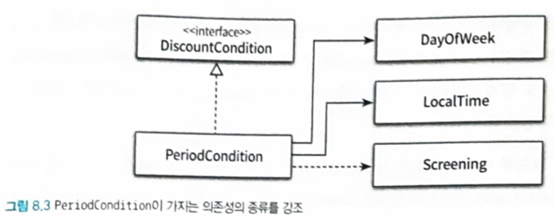

# 의존성 관리하기
잘 설계된 객체지향 프로그램은 작고 응집도 높은 객체들로 구성된다.
이로 인해서 객체 사이의 협력이 필수적이게 된다. 
-> 협력하기 위해서 객체 사이의 의존성이 생긴다.
좋은 객체지향 설계는 변경을 방해하는 의존성을 제거해야한다.

## 01 의존성 이해하기
- 구현시점 : 의존하는 객체가 변경되면 다른 객체도 변경되야한다.
- 실행시점 : 의존하는 객체가 반드시 존재해야한다.

의존성 설명을 위한 periodCondition 객체 예시
```java
public class PeriodCondition implements DiscountCondition {

  private DayOfWeek dayOfWeek;
  private LocalTime startTime;
  private LocalTime endTime;

  ...

  @Override
  public boolean isSatisfiedBy(final Screening screening) {
    return screening.getStartTime().getDayOfWeek().equals(dayOfWeek)
        && startTime.compareTo(screening.getStartTime().toLocalTime()) <= 0
        && endTime.compareTo(screening.getStartTime().toLocalTime()) >= 0;
  }
}
```

실행시점에 PeriodCondition이 정상 작동하기 위해서는 Screening 인스턴스가 존재해야 한다.
즉 PeriodCondition이 Screening(인자), DayOfWeek, LocalTime(인스턴스 변수), DiscountCondition(인터페이스)에 의존한다. 


의존성은 변경에 의한 여파 전파 가능성을 의미한다. 

### 의존성 전이
Screening이 가지고 있는 의존성이 PeriodCondition에도 전이가능하다는 말임.


하지만 잘 캡슐화하고 있다면 상관없다. 

### 런타임 의존성, 컴파일 타임 의존성
컴파일 타임이란 작성한 코드 그 자체를 의미한다. 컴파일 타임 의존성이라함은 코드 자체에서 보이는 의존성을 말한다.

컴파일 타임 의존성 != 런타임 의존성

Movie의 경우 컴파일 타임 의존성은 DiscountPolicy에, 런타임 의존성은 그 하위 구현 객체에 연결된다.\

다양한 클래스의 인스턴스와 협력하기 위해서는 구체적인 클래스를 알아서는 안된다.

### 컨텍스트 독립성
클래스가 사용될 문맥에 대한 최소한의 가정만으로 이뤄진다면 재사용하기 편해진다.
이를 컨텍스트 독립성이라고 한다. 

### 의존성 해결하기
컴파일 타임의 (모호한)의존성을 런타임에 구체적인 클래스로 교체하는 것.

- 객체 생성시점에 생성자로 의존성 해결

```java
Movie starWars = new Movie("스타워즈", 
        Duration.ofMinutes(120), 
        Money.wons(11000), 
        new PerioidCondition(...));
```
- 객체 생성 후 setter로 의존성 해결
```java
Movie avartar = new Movie(...);
avartar.setDiscountPolicy(new AmountDiscountPolicy(...));
```
이 방식은 객체 생성 후에 의존성 변경시에 유용하다. 
단, 의존성 주입 전에 이를 사용하는 메서드 실행시 NullPointException이 발생할 수 있다.

> 가장 선호되는 방식은 이 둘을 같이 사용하는 것이다.
- 메서드 실행시 인자로 의존성 해결
Movie가 항상 알 필요없고, 일시적으로만 알면 된다면 인자로 전달해도 된다.
```java
public Movie calculateMovieFee(Screening screening, DiscountPolicy discountPolicy){
    return fee.minus(discountPolicy.calculateDiscountAmount(screening));
};
```

## 02 유연한 설계
의존성 관리의 몇가지 기법과 원칙을 알아보자.
### 의존성과 결합도
`재사용성`: 협력하는 객체의 관점에서 의존성은 필수적이다. 하지만 구체적인 것에 의존하는 것- 변경에 용의하지 않는 의존성은 바람직하지 않다.
다른 환경에서 재사용하기 위해 내부 구현을 변경하도록 하는 의존성은 모두 바람직하지 않은 의존성이다.

이를 좀 더 세련되게 말하면 결합도라고 한다.

### 지식이 결합을 낳는다.
한 요소가 다른 요소에 대해서 더 적게 알 수록 결합도가 낮아진다.

movie가 percentageDiscountPolicy에 의존하면 비율 할인 정책에 따라 할인 금액을 계산할 것을 알 수 있다.
반면 discountPolicy에 의존한다면 의존하는 것은 알지만, 구체적으로 어떻게 하는 것은 모른다.

### 추상화에 의존하라.
인터페이스 의존성 -> 추상 클래스 의존성 -> 구체 클래스 의존

### 명시적인 의존성
인스턴스 변수 타입은 추상화 하고, 의존성 해결할 때는 추상클래스 상속받거나, 인터페이스 구현한 구체 클래스로 전달하는 것이다.
```java
public class Movie{
    private DiscountPolicy discountPolicy;
    
    public Movie(String title,... , DiscountPolicy discountPolicy){
        this.discountPolicy = discountPolicy;
    }
}
```

이처럼 의존성이 public 인터페이스에 노출되는 것을 명시적 의존성이라고 한다.

반면에 드러나지 않는 것을 숨겨진 의존성이라고 한다. 숨겨진 의존성을 사용하면 재사용하기 위해서 내부 구현을 변경해야한다. 

그러므로 명시적인 의존성을 사용하자.

### new 는 결합도를 높이므로 해롭다. 
사용과 생성의 책임을 분리해라. movie의 경우에는 사용만 하도록 하자. 객체를 생성하는 책임은 객체 내부가 아니라, 클라이언트로 옮기자.

### 가끔은 생성해도 괜찮다.
하지만 percentageDiscountPolicy를 주로 사용하고, periodDiscountPolicy는 정말 가끔 사용한다면, 내부에서 생성해서 넣어주고, 생성자 체이닝 하는 것이 도움이 될 수도 있다.
```java
public class Movie{
    private DiscountPolicy discountPolicy;
    public Movie(String title, Duration runningTime, Money fee) {
        this(title, runningTime, fee, new AmountDiscountPolicy(...));
    }
    
    public Movie(String title, Duration runningTime, Money fee, DiscountPolicy discountPolicy){
        ...
        this.discountPolicy = discountPolicy;
    }
}
```

첫번째 생성자 내부에서 두번째 생성자를 호출하고 있다. 

이는 메서드에서도 사용할 수 있다.
```java
public Movie{
    public Money calculateFee(Screening screening){
        this.calculateFee(screening, new AmountDiscountPolicy);
    }
    public Money calculateFee(Screening screening, DiscountPolicy discounyPolicy){
        return fee.minus(discountPolicy.calculateDiscountAmount(screening));
    }
}
```

이는 다시한번 설계는 트레이드오프의 산물이라는 것을 상기시킨다. 구체 클래스에 의존하더라도 결합도와 사용성 사이에서 선택할 수 있는 것이다.

종종 모든 결합도가 모이는 새로운 클래스를 추가함으로써 사용성과 유연성이라는 두마리 토끼를 다 잡을 수 있다.
Facade, Factory 메서드가 그것이다.

### 표준클래스에 대한 의존에 해롭지 않다.
의존성이 불편한 이유는 그것이 변경의 위험을 암시하기 때문이다.
하지만 표준 클래스처럼 안정화된 것에 대한 의존은 나쁘지 않다. 

### 컨텍스트 확장하기 


## 느낀점
- 가끔은 생성해도 괜찮다에서 역시 트레이드 오프라는 느낌이 들었다.  


