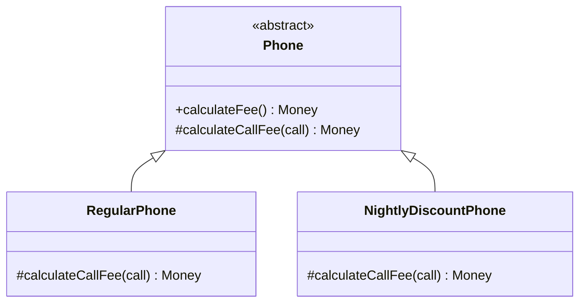
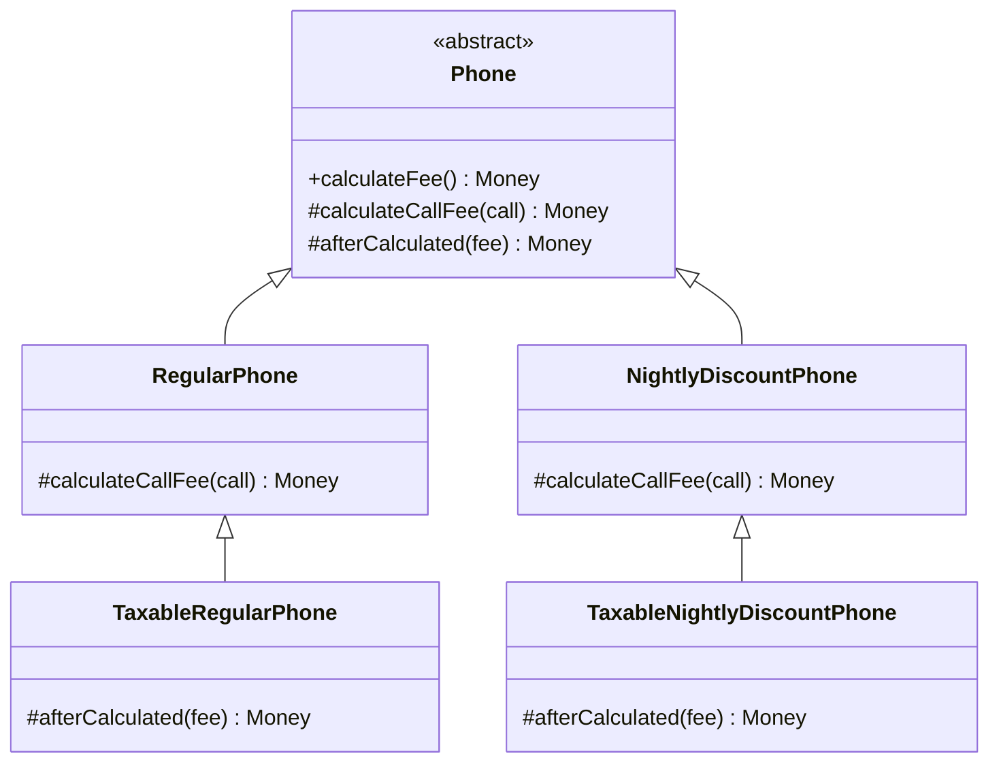
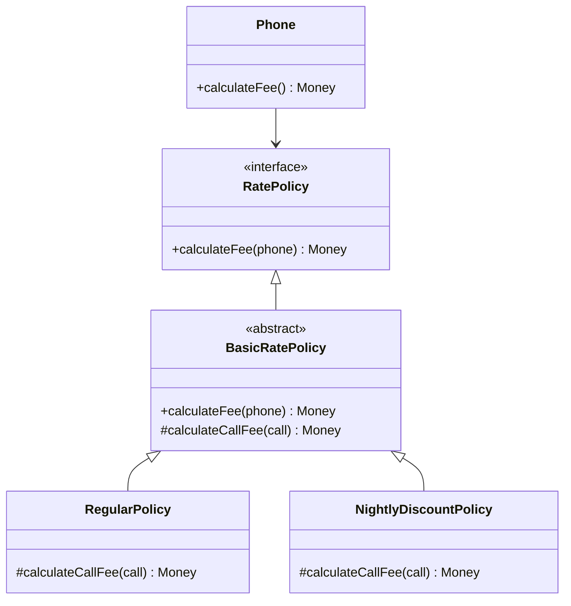
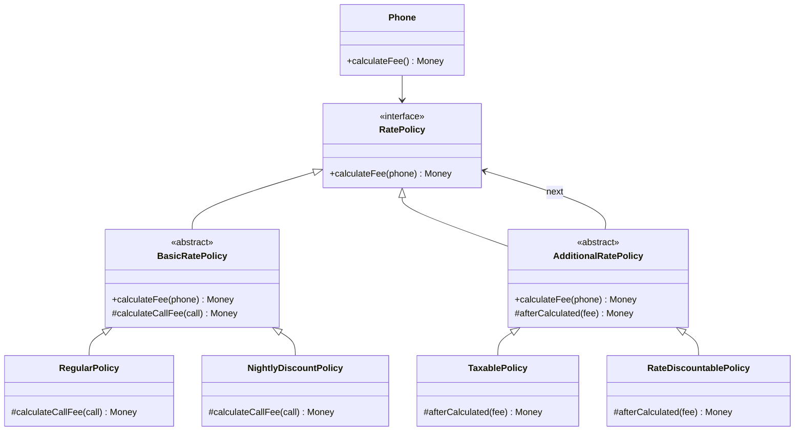
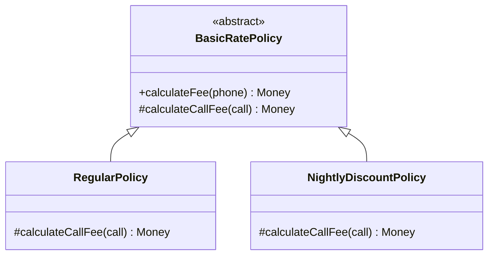
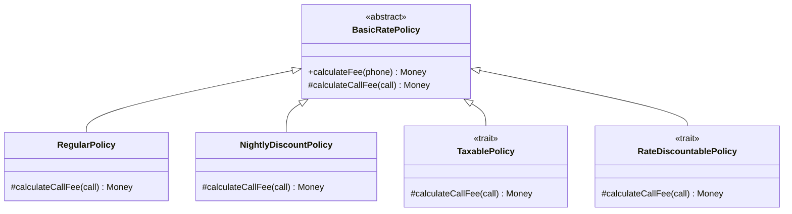

상속

- is-a
- 컴파일타임에 정해지는 의존성(정적인 관계)
- 구현에 의존(화이트박스 재사용)
- 높은 결합도

합성

- has-a
- 런타임에 정해지는  의존성(동적인 관계)
- 인터페이스에 의존(블랙박스 재사용)
- 낮은 결합도

코드 재사용을 위해서는 객체 합성이 클래스 상속보다 더 좋은 방법이다

# 01 상속을 합성으로 변경하기

상속으로 인한 세 가지 문제

- 불필요한 인터페이스 상속 문제
- 메서드 오버라이딩의 오작용 문제
- 부모 클래스와 자식 클래스의 동시 수정 문제

상속을 합성으로 변경해 문제점 해결

1. 자식 클래스에 선언된 상속 관계 제거
2. 부모 클래스 인스턴스를 자식 클래스 인스턴스 변수로 선언

→ 상속으로 인한 변경에 불안정한 코드를 안정적으로

## 불필요한 인터페이스 상속 문제

자식 클래스에 부적합한 부모 클래스의 오퍼레이션이 상속되어 자식 클래스 인스턴스 상태가 불안정해지는 문제

합성 사용 시

- 클라이언트에게 객체에서 직접 정의한 오퍼레이션만 제공
    - 객체 규칙 어길 위험성 X
- 조합된 객체의 내부 구현 지식 없이 인터페이스로 협력

## 메서드 오버라이딩의 오작용 문제

자식 클래스가 부모 클래스의 메서드를 오버라이딩할 때 자식 클래스가 부모 클래스의 메서드 호출 방법에 영향을 받는 문제

합성 사용 시

- 구현 결합도 제거
    - + 더 상위의 인터페이스 상속 → 퍼블릭 인터페이스는 유지

포워딩

- 오퍼레이션 구현에서 내부 인스턴스에게 동일한 메서드 호출을 그대로 전달하는 것
    - 포워딩 메서드: 포워딩을 위해 추가된 메서드
- 기존 인터페이스 그대로 제공하면서 구현 결합 없이 일부 작동 방식 변경할 때 유용

## 부모 클래스와 자식 클래스의 동시 수정 문제

부모 클래스와 자식 클래스 사이의 개념적인 결합으로 인해 부모 클래스 변경 시 자식 클래스도 함께 변경해야 하는 문제

합성 사용 시

- 내부 구현 변경 시 파급 효과 캡슐화
- 여전히 함께 수정하더라도 구현이 아닌 인터페이스에 결합하여 영향도 낮음

# 02 상속으로 인한 조합의 폭발적인 증가

상속의 높은 결합도 → 작업량 증가

- 하나의 기능 추가, 수정을 위해 불필요하게 많은 수의 클래스 추가, 수정
- 단일 상속만 지원하는 경우 상속으로 인해 오히려 코드량 증가

## 기본 정책과 부가 정책 조합하기

핸드폰 요금제 요구사항

- 기본 정책 - 일반 요금제, 심야 할인 요금제
- 부가 정책 - 세금 할인, 기본 요금 할인 정책
    - 기본 정책의 계산 결과에 적용
    - 선택적으로 적용
    - 조합 가능
    - 임의 순서로 적용 가능

## 상속을 이용해서 기본 정책 구현하기



## 기본 정책에 세금 정책 조합하기



훅 메서드

- 부모 클래스에 추상메서드 추가할 경우 모든 자식 클래스들이 메서드 오버라이딩해야 함
- 여러 클래스에 중복되는 기본 구현이 있을 경우 편의를 위해 부모 클래스에서 기본 구현 제공할 수 있음(훅 메서드)

## 중복 코드의 덫에 걸리다

위 설계의 문제점

- 부가 정책 조합 경우의 수 마다 새로운 클래스 추가해야 함
    - 클래스 폭발(조합의 폭발): 상속 남용으로 기능 추가를 위해 많은 수의 클래스 추가해야 하는경우
- 같은 부가 정책, 다른 기본 정책인 경우 중복 코드 발생
    - 기능 수정 시 작업량 많아지고 버그 발생 가능성 높음

# 03 합성 관계로 변경하기

합성은 런타임에 동적으로 의존성 변경

- 구현 시점에 관계 고정되지 않고, 실행 시점에 유연하게 변경 가능
- 상속은 조합 결과를 개별 클래스로 구현, 합성은 조합 구성 요소를 개별 클래스로 구현한 후 실행 시점에 조립

## 기본 정책 합성하기



## 부가 정책 적용하기

부가 정책 구현 제약 사항

- 부가 정책은 다른 정책과 합성될 수 있어야 함
- Phone은 기본 정책인지 부가 정책인지 몰라야 함 (동일한 인터페이스 제공)



## 기본 정책과 부가 정책 합성하기

원하는 정책의 인스턴스 생성한 후 의존성 주입

- 조합, 사용 방식 일관성

## 새로운 정책 추가하기

- 추가 → 추가할 정책 클래스 하나만 추가한 후 조합
- 변경 → 하나의 클래스 수정
    - 단일 책임 원칙 준수

## 객체 합성이 클래스 상속보다 더 좋은 방법이다

상속

- 구현 재사용, 강결합 → 코드 진화 방해

합성

- 인터페이스 재사용, 건전한 결합

상속은 나쁜가?

- 지금까지의 단점들은 구현 상속에 국한
- 인터페이스 상속은 다르다

# 04 믹스인

믹스인: 객체 생성 시 코드 일부를 클래스 안에 섞어 재사용하는 기법

- 컴파일 시점에 필요한 코드 조각 재사용
- is-a가 아님, 클래스 간 관계 고정 X
- 합성처럼 유연, 상속처럼 구체 코드 쉽게 재사용
- 언어 차원에서 직접 지원하기도(flavors, scala의 trait)

## 기본 정책 구현하기



## 트레이트로 부가 정책 구현하기



```scala
trait TaxablePolicy extends BasicRatePolicy {
	def taxRate: Double
	
	override def calculateFee(phone: Phone): Money = {
		val fee = super.calculateFee(phone)
		return fee + fee * taxRate
	}
}
```

trait의 extends?

- 상속 개념 X
- BasicRatePolicy의 자손만 해당 trait를 믹스인 할 수 있다는 의미
    - 앞으로 추가되는 BasicRatePolicy의 자손에게 믹스인 될 수 있다
    - 관계 고정 X, 사용 문맥 제한할 뿐
- super 참조 대상이 런타임에 결정
    - 정적 X, 동적

## 부가 정책 트레이트 믹스인하기

트레이트 조합: with 키워드로 클래스 또는 다른 트레이트에 믹스인

```scala
class TaxableAndRateDiscountableRegularPolicy(
		amount: Money,
		seconds: Duration,
		val discountAmount: Money,
		val taxRate: Double)
	extends RegularPolicy(amount, seconds)
	with RateDiscountablePolicy
	with TaxablePolicy
```

선형화(linearization): 인스턴스 생성 시 클래스 자신, 조상, 트레이트를 일렬로 나열해서 순서 정하는 것

- 항상 맨 앞에 구현한 클래스 자신 위치
- 오른쪽에서부터 왼쪽 방향으로 가면서 순서대로 위치
- 위 예시의 경우 TaxableAndRateDiscountableRegularPolicy → TaxablePolicy → RateDiscountablePolicy → RegularPolicy 순
- 메시지 수신 시 순서대로 메서드 찾아 실행
    - super일 경우 바로 다음 단계에서부터 순서대로 찾아 실행

## 쌓을 수 있는 변경

추상 서브클래스

- 항상 확장한 클래스(상속 계층의 부모 클래스)보다 하위에 위치
    - 대상 클래스의 자식처럼 사용됨

쌓을 수 있는 변경(stackable modification): 특정 클래스에 대한 변경 or 확장을 독립적으로 구현한 후 필요할 때 차례로 추가할 수 있다

- 트레이트는 super 동적 바인딩 → 변경 위에 변경 쌓아올릴 수 있다
